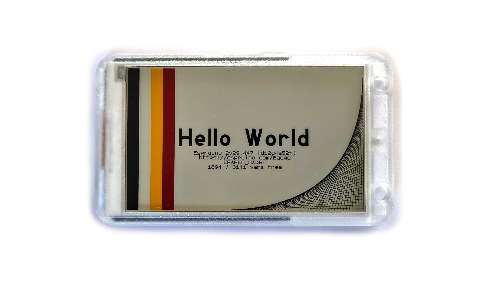

<!--- Copyright (c) 2026 Gordon Williams, Pur3 Ltd. See the file LICENSE for copying permission. -->
ePaper Badge
=============

:warning: **Please view the correctly rendered version of this page at https://www.espruino.com/Badge. Links, lists, videos, search, and other features will not work correctly when viewed on GitHub** :warning:

* KEYWORDS: Espruino,Official Board,ESP32,ESP32C3,Board,Bluetooth,BLE,Bluetooth LE,Graphics,WiFi,Wi-Fi,Badge,epaper,e-paper

**The ePaper Badge is an Open Source JavaScript-powered ePaper Display**

Contents
--------

* APPEND_TOC

Features
--------

* ESP32C3 with 320MHz RISC-V processor, Bluetooth LE and 2.4GHz WiFi
* 900kB available flash storage
* 3.97 inch 800x480 4 color (black/white/red/yellow) ePaper display
* 3 Axis Accelerometer
* Temperature and Humidity sensor ()
* 250mAh battery
* 110 x 65 x 10 mm case
* On-board Qwiic connector for adding Qwiic I2C devices
* Can be disassembled with just 1 screw

Errors
-------

If you got your badge at a Conference, it may ship with a firmware designed for that conference,
which will look for certain WiFi access points and/or servers. After the conference, it may show an error
message, which will point back to https://espruino.com/Badge

There's nothing to worry about though - you can easily boot up the badge and connect
with the IDE to program it. Just remember that the pre-loaded firmwares often put
the badge to deep sleep very soon after power on - so you must power on, connect with the IDE
and then type `reset()` as soon as possible to avoid the badge disconnecting itself.

Uploading Apps
--------------

The badge can be programmed directly using the Espruino Web IDE at https://www.espruino.com/ide/

However there are a bunch of pre-made apps available at https://espruino.github.io/BadgeApps/

Simply go to the website, connect with the Badge turned on, and upload the app of your choice!

Power Consumption
-----------------

* Idle - 44mA
* Light Sleep (`ESP32.lightSleep`) - 0.5mA
* Deep Sleep (`ESP32.deepSleep`) - 0.1mA

Information
------------

### Variables

`Badge.i2c` is the I2C instance used for the accelerometer and humidity sensor, but **also** the Qwiic connector

`Badge.spi` is the SPI instance used for ePaper

`Badge.led_rgb` is a `Uint8Array(30)` with RGB for the 10 LEDs

`Badge.epaperBusy` is try when the ePaper is currently busy writing something

`Badge.rev` shows the badge revision - 1.2 in production badges

### API Calls

`Badge.showTestScreen()` shows a simple test screen

`Badge.showError(e)` shows a screen displaying the error given - can be a string or an `Error` object

`Badge.getTemperature() => Promise({temperature,humidity})` gets temperature and humidity

`Badge.getAccel() => Promise([x,y,z])` gets current acceleration on the Badge

`Badge.setLEDs(r,g,b)` can be used with rgb values, or `Badge.setLEDs("#0f0")`

`Badge.setLEDArray([r,g,b,r,g,b,....])` Set LEDs individually. Supply 30-element RGB array, or 'undefined' uses Badge.led_rgb

`Badge.i2c` is the I2C object used for the accelerometer/temp sensor, but also the on-board Qwiic connector

`Badge.epaperBusy` is true if the ePaper is being written to

`Badge.getGraphics()` returns a 400x240 2bpp graphics instance with `.flip()` method that will write the output to the display

`Badge.showRendering(gfxCallback)` calls `gfxCallback(gfx)` repeatedly in order to render multiple slices of the ePaper display (as it won't all fit into RAM). It returns a Promise.

`Badge.dumpRendering(gfxCallback)` works as `Badge.showRendering`, but dumps the image to the console as a URLencoded BMP file, which the Web IDE can interpret. You can do `Badge.showRendering = Badge.dumpRendering` and
then run `showRendering` code in order to get a screenshot.

`Badge.showImageFile(fn)` load a raw 800x480x2 image file from storage, return a Promise

`Badge.showImageFileRendering(fn, sliceHeight, gfxCallback)` load a raw 800x480x2 image file from storage, but call `gfxCallback(gfx)` with a `Graphics` instance on the first `800 x sliceHeight` slice, return a Promise

`Badge.showRaw(rawCallback)` show raw image data on the ePaper. `rawCallback(data,done)` is called. `data` should be called with 800*480*2bpp = 96000bytes (over multiple calls) and finally `done` is called at the end.

`Badge.sleep()` puts the badge to sleep, waiting to restart on a button press. The button can be read with `ESP32.getWakeupPin()`

`Badge.connectWiFi()` Connect to wifi using details in wifi.json ({"ssid":"--","options":{"password":"---"}},"backup_ssid":..,"backup_options":{}). Returns a promise which completes on success or rejects on failure

### Qwiic Connector

The badge contains a Qwiic connector on the PCB. It is 3.3v, with I2C pins which can be accessed using the `Badge.i2c` interface.

Note these pins are shared with the Accelerometer/Humidity sensor so must be used for 3.3v I2C and not as Generic IO pins.

Notes on making apps
--------------------

* The badge doesn't have enough memory to store the full-resolution picture in RAM, so you have two options:
  * Use `Badge.getGraphics()` returns a 400x240 2bpp graphics instance with `.flip()` method that will write the output to the display
  * USe `Badge.showRendering(gfxCallback)` which calls `gfxCallback(gfx)` repeatedly in order to render multiple slices of the ePaper display. It returns a Promise.
* The ePaper screen is paletted such that `0=black, 1=white, 2=yellow, 3=red`
* Espruino's [Images](https://www.espruino.com/Graphics#images-bitmaps) only support a maximum width and height of 255px in binary mode.
When using https://www.espruino.com/Image+Converter for images bigger than this, you'll need to export as `Image Object` which allows arbitrary width and height.
* It's recommended to use https://www.espruino.com/Image+Converter with `Colours: ePaper: 2 bit (4 color) BWYR` and `Diffusion: Atkinson` for the best result

Firmware Updates
------------------

Firmware updates on the badge can be done by USB. Right now firmwares are not being built automatically,
but when they are they can be flashed from the https://www.espruino.com/Espressif+Flash webpage.

Troubleshooting
---------------

* **I can't connect** - the pre-loaded firmwares often put
the badge to deep sleep very soon after power on - so you must power on, connect with the IDE
and then type `reset()` as soon as possible to avoid the badge disconnecting itself.

Other Official Espruino Boards
------------------------------

* APPEND_KEYWORD: Official Board
