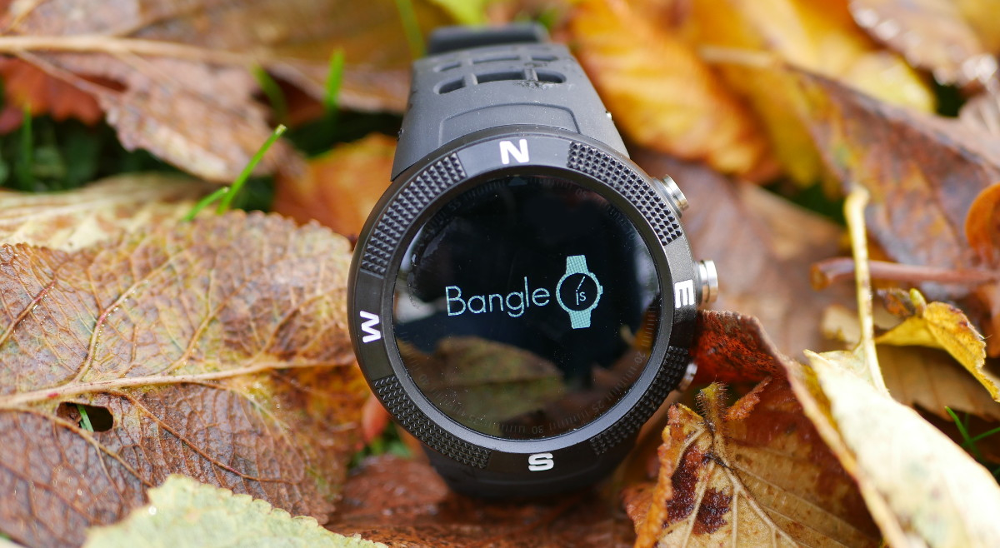

<!--- Copyright (c) 2019 Gordon Williams, Pur3 Ltd. See the file LICENSE for copying permission. -->
Bangle.js
==========

<span style="color:red">:warning: **Please view the correctly rendered version of this page at https://www.espruino.com/Bangle.js. Links, lists, videos, search, and other features will not work correctly when viewed on GitHub** :warning:</span>

* KEYWORDS: Espruino,Official Board,nRF52832,nRF52,Nordic,Board,Bluetooth,BLE,Bluetooth LE,Graphics,Bangle.js,Bangle,Banglejs,Smartwatch,Watch

[](https://shop.espruino.com/banglejs)

* BUYFROM: £47,,https://shop.espruino.com/banglejs

**Bangle.js is an open, hackable smartwatch**

You can easily install new apps from the web or develop your own using JavaScript or a graphical programming language (Blockly). All you need is a Web Browser (Chrome, Edge or Opera) and you can upload apps or write code to run on your watch wirelessly! Bangle.js is waterproof and AI enabled and comes with bluetooth low energy, GPS, a heart rate monitor, accelerometer and more.

**Just got your Bangle.js? Check out [The Bangle.js 'Getting Started' page](/Bangle.js Getting Started)**

Contents
--------

* APPEND_TOC

Features
--------

* IP68 Waterproof: up to 10m underwater
* Nordic 64MHz nRF52832 ARM Cortex-M4 processor with Bluetooth LE
* 64kB RAM 512kB on-chip flash, 4MB external flash
* 1.3 inch 240x240 16 bit LCD display with 2 zone touch
* GPS/Glonass receiver (UBlox)
* Heart rate monitor
* 3 Axis Accelerometer (with Pedometer and Tap detect)
* 3 Axis Magnetometer
* Vibration motor
* 350mAh battery, 1 week standby time
* 5 x 5 x 1.7 cm case, plastic with stainless steel ring
* Can be disassembled with just 4 screws


Power Consumption
-----------------

* Idle, accelerometer on - 0.7mA
* BLE Connected in high bandwidth mode - 0.5mA
* Compass on - 2mA
* Heart rate monitor on - 2.5mA
* 100% CPU usage running JavaScript - 7mA
* GPS on - 30mA
* LCD on - 40mA
* Turned off - 0.08mA (0.6mA if turned off via Bootloader)

This means that when idle (in the normal power-on state) you can expect around 20 days of battery life.


Charging
--------

The supplied charge cable connects to a USB port to charge Bangle.js (there is
no data connection, it is power only).

You must connect the cable the right way around or it won't work: With Bangle.js
facing away from you (so you're looking at the shiny back) and the `CE Rohs` text
the right way up, the USB cable should exit from the **left** side of the watch.

**The cable is magnetic and the wires are connected directly to USB power.** Do
not leave your cable plugged in or it might attract itself to the nearest
magnetic (probably conductive) object and short out.


Powering off
------------

* Press the middle button `BTN2` when at the watch face
* Scroll down with `BTN3` until you get to `Settings`
* Press `BTN2` to select
* Scroll down with `BTN3` to `Turn Off`
* Press `BTN2` to select it


Powering off if firmware is broken
-----------------------------------

This method uses Bangle.js's bootloader to turn off as a last
resort. However, the bootloader is not as good at entering a
low power state as the Espruino firmware, and so the battery
may drain faster than if you could use the main Bangle.js 'off' functionality.

* Long-press `BTN1` + `BTN2` for about 6 seconds until the screen goes blank
* Keep pressing them while `====` goes across the screen
* Watch will start vibrating
* Release both buttons
* Your watch may restart if it hasn’t been turned off since the last firmware update. If so, repeat the process again.


Resetting
----------

* Long-press `BTN1` + `BTN2` for about 6 seconds until the screen goes blank
* Release both buttons
* Bangle.js will boot as if it just turned on normally (although the current time will be lost)

If you release the buttons too late you'll enter bootloader mode, in
which case you need to press `BTN1` to exit.


Resetting without loading any code
-----------------------------------

If you uploaded some code that runs at startup and breaks Bangle.js you may need to do this.

It won’t delete anything, so unless you fix/remove the broken code (see "Deleting all Code") Bangle.js will remain broken next time it restarts.

* Long-press `BTN1` + `BTN2` for about 6 seconds until the screen goes blank
* Release `BTN2` but keep pressing `BTN1` while `====` goes across the screen
* Keep holding `BTN1` while Bangle.js boots
* Release it - you should have the Bangle.js logo, version, and MAC address

**Note:** In the 2v05 version shipped with Bangle.js KickStarter devices, Bangle.js would still load
some parts of the bootloader. If you had turned off Bluetooth in Settings and then broke your Bangle's
firmware you would be unable to connect in order to correct the problem. If this happens, [install the latest firmware](https://www.espruino.com/Bangle.js#firmware-updates) and follow these steps again, and you will then be able to connect.


Deleting all code
-----------------

You can do this either while your watch is connectable, or
if you have reset it without loading any code (above).

### Either:

* Go to https://banglejs.com/apps
* Click `About -> Install default apps`

This will erase everything and install just the default apps.

### Or:

* Go to https://banglejs.com/apps
* Go to `About -> Remove All Apps`
* Re-install `Bootloader` and a `Clock` from `Library`


Deleting apps
-------------

* If you can access the menus on your device and the `App Manager` app is installed, you can delete apps using the `App Manager`
* You can go to https://banglejs.com/apps and click `Connect`. Under `My Apps` your installed apps are listed, and you can click the 'Bin' icon next to them to remove them
* If you hit any issues with installed apps and can't access the menus on your device, then follow the instructions above for "Resetting without loading any code" above.


Tutorials
--------

* For general help with Bangle.js, see the [Bangle.js Getting Started Guide](/Bangle.js+Getting+Started)
* To get your computer connected, check out the [Espruino Getting Started Guide](/Quick+Start+BLE#banglejs)
* To get started with development see the [Bangle.js Development page](/Bangle.js+Development)
* There is more technical information below about using the [LCD](#lcd) and [onboard peripherals](#onboard)

Tutorials using Bangle.js:

* APPEND_USES: Bangle.js

Tutorials using Bluetooth LE:

* APPEND_USES: Only BLE,-Bangle.js

Tutorials using Bluetooth LE and functionality that may not be part of Bangle.js:

* APPEND_USES: BLE,-Only BLE,-Bangle.js

There are [many more tutorials](/Tutorials) that may not be specifically for
you device but will probably work with some tweaking. [Try searching](/Search)
to find what you want.

Information
-----------

* For detailed technical information about Bangle.js, check out [the Bangle.js Technical Information page](/Bangle.js+Technical)
* There's a [Bangle.js API reference here](https://banglejs.com/reference)
* Links to [CE](/files/Bangle.js-CE.pdf), [FCC ID 2AILG-F18](/files/Bangle.js-FCC.pdf) and [RoHS](/files/Bangle.js-RoHS.pdf) Certifications


<a name="lcd"></a>LCD Screen
---------------------------------

Bangle.js displays the REPL (JavaScript console) by
default, so any calls like `print("Hello")` or `console.log("World")` will output
to the LCD when there is no computer connected via Bluetooth or [Serial](#serial-console).
Any errors generated when there is no connection will also be displayed on the LCD.

### Graphics

You can output graphics on Bangle.js's display via the global variable `g`
that is an instance of the [Graphics class](/Reference#Graphics). By default the display
is unbuffered, so any changes will take effect immediately.

```
// Draw a pattern with lines
g.clear();
for (i=0;i<64;i+=7.9) g.drawLine(0,i,i,63);
g.drawString("Hello World",30,30);
```

### Screen buffering

Bangle'js's screen is 240 x 240 x 16 bits - which uses substantially more
memory than the microcontroller has RAM. As such, draw commands go straight
to the screen (and `g.getPixel` will not work).

Drawing straight to the screen can cause flicker, so for applications that
need to update the screen constantly we'd suggest using [`Bangle.setLCDMode(...)`](https://banglejs.com/reference#l_Bangle_setLCDMode)
to set the screen to a buffered mode. In a buffered mode, draw commands will not
be visible until you call `g.flip()`.

Available options for `Bangle.setLCDMode` are:

* `Bangle.setLCDMode("doublebuffered")` - The drawable area is 240x160 16 bit, terminal and vertical scrolling will not work.
* `Bangle.setLCDMode("120x120")` - The drawable area is 120x120 8 bit, `g.getPixel` and full scrolling work.
* `Bangle.setLCDMode("80x80")` - The drawable area is 80x80 8 bit, `g.getPixel` and full scrolling work.

You can also call `Bangle.setLCDMode()` to return to normal, unbuffered mode.

### Menus

Bangle.js comes with a built-in menu library that can be accessed with the [`E.showMenu()`](/Reference#l_E_showMenu) command.

```
// Two variables to update
var boolean = false;
var number = 50;
// First menu
var mainmenu = {
  "" : {
    "title" : "-- Main Menu --"
  },
  "Beep" : function() { Bangle.beep(); },
  "Buzz" : function() { Bangle.buzz(); },
  "Submenu" : function() { E.showMenu(submenu); },
  "A Boolean" : {
    value : boolean,
    format : v => v?"On":"Off",
    onchange : v => { boolean=v; }
  },
  "A Number" : {
    value : number,
    min:0,max:100,step:10,
    onchange : v => { number=v; }
  },
  "Exit" : function() { E.showMenu(); },
};
// Submenu
var submenu = {
  "" : {
    "title" : "-- SubMenu --"
  },
  "One" : undefined, // do nothing
  "Two" : undefined, // do nothing
  "< Back" : function() { E.showMenu(mainmenu); },
};
// Actually display the menu
E.showMenu(mainmenu);
```

See http://www.espruino.com/graphical_menu for more detailed information.

### Terminal

Bangle.js's LCD acts as a VT100 Terminal. To write text to the LCD regardless of
connection state you can use `Terminal.println("your text")`. Scrolling
and simple VT100 control characters will be honoured.

You can even move the JavaScript console (REPL) to the LCD while connected
via Bluetooth, and use your bluetooth connection as a simple keyboard using
the following commands:

```
Bluetooth.on("data",d=>Terminal.inject(d));
Terminal.setConsole();
```

<a name="onboard"></a>On-device Peripherals
------------------------------------------------------

Most peripherals on the device are accessible via fields
and events on the [Bangle](https://banglejs.com/reference#t_Bangle) object.

### LED

There are no LEDs on Bangle.js. There are two 'fake' LED variables called
`LED1` and `LED2` that create red and green fake LEDs at the top of the watch
screen - these serve no purpose other than to allow tutorials for existing
Espruino boards to be used.

### Vibrate

`Bangle.buzz()` will make Bangle.js's vibration motor turn on. It takes optional
time and strength arguments, and returns a promise. [See the reference](http://www.espruino.com/Reference#l_Bangle_buzz).

For example:

```
Bangle.buzz().then(()=>{
  return new Promise(resolve=>setTimeout(resolve,500)); // wait 500ms
}).then(()=>{
  return Bangle.buzz(1000);
}).then(()=>{
  console.log("Done");
});
```

Will do a short buzz followed by a long buzz and will print `Done` when finished.

### Sound

You can use `Bangle.beep()` in much the same way as `.buzz` above to make sounds. [See the reference](http://www.espruino.com/Reference#l_Bangle_beep).

To output an entire scale of notes, you could do:

```
Bangle.beep(200,207.65*8).then(
()=>Bangle.beep(200,220.00*8)).then(
()=>Bangle.beep(200,246.94*8)).then(
()=>Bangle.beep(200,261.63*8)).then(
()=>Bangle.beep(200,293.66*8)).then(
()=>Bangle.beep(200,329.63*8)).then(
()=>Bangle.beep(200,369.99*8)).then(
()=>Bangle.beep(200,392.00*8)).then(
()=>Bangle.beep(200,440.00*8));
```

**Note:** The majority of Bangle.js devices do not contain a piezo speaker,
but instead use the vibration motor for sound. If you received your device
and it doesn't make a noise when using `Bangle.beep();`, please update
the `Bootloader` app via the App Loader.

### Buttons

There are 5 buttons on Bangle.js. The 3 physical buttons on the right are (top to bottom) `BTN1`, `BTN2` and `BTN3`, and the screen has two touch areas, on the left (`BTN4`) and right (`BTN5`).

* `BTN1` - ‘Up/Previous’ in menus
* `BTN2` - ‘Select’ in menus, or bring up menu when in Clock
* `BTN3` - Down/Next in menus
* `BTN4` - Left-hand side of touchscreen. Used for some games, but not in menus
* `BTN5` - Right-hand side of touchscreen. Used for some games, but not in menus


* You can access a button's state with `digitalRead(BTN1)` or `BTN1.read()`
(the two commands are identical). `BTN` is also defined, and is the same as `BTN1`.
* Polling to get the button state wastes power, so it's better to use `setWatch`
to call a function whenever the button changes state:

```
setWatch(function() {
  console.log("Pressed");
}, BTN, {edge:"rising", debounce:50, repeat:true});
```


### Accelerometer

The accelerometer runs all the time and produces `accel` events on the
`Bangle` object.

```
Bangle.on('accel', function(acc) {
  // acc = {x,y,z,diff,mag}
});
```

See [the reference](https://banglejs.com/reference#t_l_Bangle_accel) for
more information.

#### Gestures

When a sudden movement is detected, the accelerations in it are recorded
and a [`gesture` event](https://banglejs.com/reference#l_Bangle_gesture)
is created.

If `.tfmodel` and `.tfnames` files are created in storage, Tensorflow
AI will be run on the model with the gesture information and an
[`aiGesture`](https://banglejs.com/reference#l_Bangle_aiGesture) event
will be created with the name of the detected gesture.

### Compass

The compass can be turned on with `Bangle.setCompassPower(1)` and when
enabled, `mag` events are created 12.5 times a second:

```
Bangle.setCompassPower(1)
Bangle.on('mag', function(mag) {
  // mag = {x,y,z,dx,dy,dz,heading}
});
```

See [the reference](https://banglejs.com/reference#t_l_Bangle_mag) for
more information.

### GPS

The GPS can be turned on with `Bangle.setGPSPower(1)` and when
enabled, `GPS` events are created once a second:

```
Bangle.setGPSPower(1)
Bangle.on('GPS', function(gps) {
  // gps = {lat,lon,alt,speed,etc}
});
```

`GPS-raw` events are also created containing a String for each
NMEA line that comes from the GPS receiver. These contain far more
detailed information from the GPS.

See [the reference](https://banglejs.com/reference#l_Bangle_GPS) for
more information.

It's also possible to write data to the GPS to configure it. Check
out the [Bangle.js technical specs page](/Bangle.js+Technical#GPS)
for more info.

### Heart rate

You can turn on the heart rate monitor with `Bangle.setHRMPower(1)`, which
will cause `HRM` events to be generated roughly every second:

```
Bangle.setHRMPower(1);
Bangle.on('HRM',function(hrm) {
  /*hrm is an object containing:
    { "bpm": number,             // Beats per minute
      "confidence": number,      // 0-100 percentage confidence in the heart rate
      "raw": Uint8Array,         // raw samples from heart rate monitor
   */
}
});
```

Beats per minute is calculated using [autocorrelation](https://en.wikipedia.org/wiki/Autocorrelation).

See [the reference](https://banglejs.com/reference#l_Bangle_setHRMPower) for
more information.

You can also access the heart rate detection hardware manually with:

```
Bangle.ioWr(0x80,0); // turn HRM on

var a = analogRead(D29); // read the raw PPG value
```


Firmware Updates
------------------

  * Long-press `BTN1` + `BTN2` for about 6 seconds until the screen goes blank
  * Release `BTN2`
  * Release `BTN1` a moment later while `====` is going across the screen
  * The watch should now be in Dfu mode
* Install the Nordic Semiconductor NRF Toolbox App for Android or iOS
* Download the latest stable distribution zip from the [Espruino site](https://www.espruino.com/Download#banglejs) or the latest bleeding edge nightly build from [here](http://www.espruino.com/binaries/travis/master/).
* Open the NRF Toolbox app
* Tap the DFU icon
* Tap Select File, choose Distribution Packet (ZIP), and choose the ZIP file you downloaded
* If a Select scope window appears, choose All
* Tap Select Device and choose the device called `DfuTarg`
* Now tap Upload and wait
* It will take around 90 seconds to complete
* Once complete, long-press `BTN3` to go to the Clock
* You should still have the original apps you installed


Troubleshooting
---------------

Check out:

* [Bangle.js Troubleshooting](Troubleshooting+Bangle.js)
* [Bluetooth Espruino Troubleshooting](Troubleshooting+BLE)
* [General Espruino Troubleshooting](/Troubleshooting)


Other Official Espruino Boards
------------------------------

* APPEND_KEYWORD: Official Board
