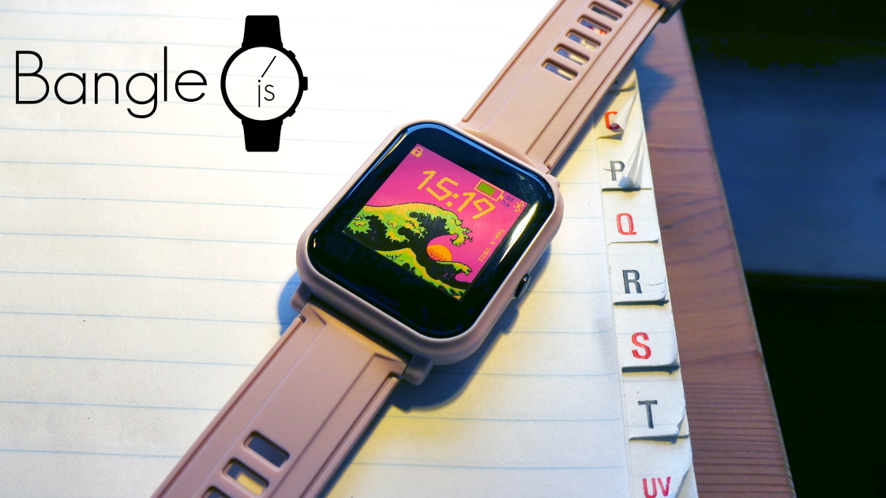
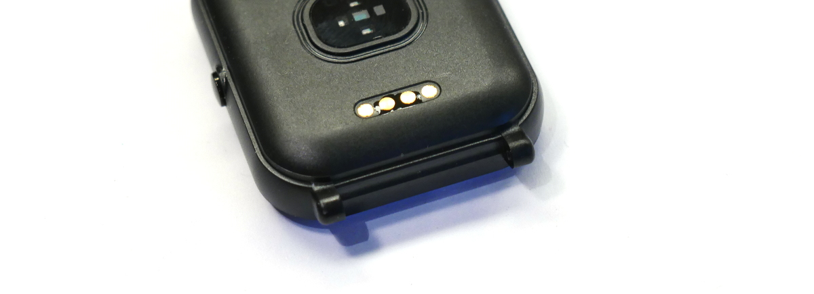
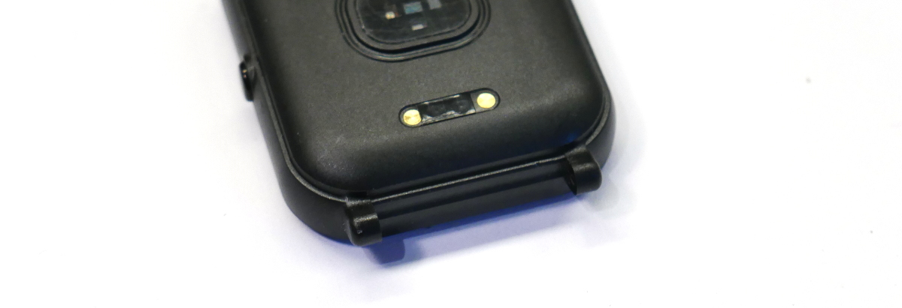

<!--- Copyright (c) 2021 Gordon Williams, Pur3 Ltd. See the file LICENSE for copying permission. -->
Bangle.js 2
============

<span style="color:red">:warning: **Please view the correctly rendered version of this page at https://www.espruino.com/Bangle.js2. Links, lists, videos, search, and other features will not work correctly when viewed on GitHub** :warning:</span>

* KEYWORDS: Espruino,Official Board,nRF52832,nRF52,Nordic,Board,Bluetooth,BLE,Bluetooth LE,Graphics,Bangle.js,Bangle,Banglejs,Smartwatch,Watch

Bangle.js is the successor to [Bangle.js](/Bangle.js), and is based on the
[SMA Q3](https://hackaday.io/project/175577-hackable-nrf52840-smart-watch).

[](https://www.kickstarter.com/projects/gfw/banglejs-2-the-open-smart-watch)

* BUYFROM: £64,£51,https://shop.espruino.com/banglejs2,/Order#banglejs2

**Bangle.js 2 is an open, hackable smartwatch**

You can easily install new apps from the web or develop your own using JavaScript or a graphical programming language (Blockly). All you need is a Web Browser (Chrome, Edge or Opera) and you can upload apps or write code to run on your watch wirelessly! Bangle.js is waterproof and AI enabled and comes with Bluetooth Low Energy, GPS, a heart rate monitor, accelerometer and more.

Contents
--------

* APPEND_TOC

Features
--------

* IP67 Water Resistant (everyday use, **not swimming or baths**)
* Nordic 64MHz nRF52840 ARM Cortex-M4 processor with Bluetooth LE
* 256kB RAM 1024kB on-chip flash, 8MB external flash
* 1.3 inch 176x176 always-on 3 bit colour LCD display (LPM013M126)
* Full touchscreen
* GPS/Glonass receiver (AT6558)
* Heart rate monitor (Vcare VC31 / VC31B)
* 3 Axis Accelerometer (Kionix KX023)
* 3 Axis Magnetometer
* Air Pressure/Temperature sensor (Bosch BMP280 / Goertek SPL06)
* Vibration motor
* 200mAh battery, 4 weeks standby time
* 36mm x 43mm x 12mm watch body, with standard 20mm watch straps

Quick Usage Notes
-----------------

Check out the [Bangle.js 2 Getting Started Guide](https://banglejs.com/start2)

There are a few things to know that'll help you get started quickly:

* Long-pressing the button (~2 seconds) will take you back to the default clock app
* When the lock symbol is displayed in the top left hand corner, the touchscreen is not active. Unlocking can be configured in several ways via the settings app, but by default pressing the button will unlock the Bangle and allow you to use the touchscreen.
* In the default [App Launcher](https://github.com/espruino/BangleApps/wiki#glossary) (which you get to by pressing the button while on the clock), drag the screen to scroll through apps, and tap the icon you want to launch
* **In text menus, you don't need to tap on the text line to select it.** Instead, drag your finger up and down to change the selected entry, and then **tap anywhere** to select.

This video shows you how to get started using the menu and App Loader:

[[http://youtu.be/EfwjPPZNKJc]]

Please check out [The Bangle.js Wiki](https://github.com/espruino/BangleApps/wiki) for more hints and common questions.


Contact Corrosion / Skin Irritation
-----------------------------------

Bangle.js 2 has 4 contacts on the rear. The two on the ends are used for charging
and are not powered, however the middle two are SWD debug/programming pins connected
straight to the CPU. One has a weak resistor connecting it to 3.3v. At most, 0.0001A of
current at 3.3v can be provided, however if exposed to salty water (eg sweat) or other
conductive conditions, the contacts will corrode and it is possible that in extreme
cases there could be some skin irritation.


Bangle.js 2 devices sold since the KickStarter campaign ship with a small
piece of tape covering the contacts to prevent any problems. If you have
a watch without this tape we would strongly advise you apply some paint,
tape, a sticker or laquer over the middle two contacts as shown in the
images below:






Charging
--------

The supplied charge cable connects to a USB port to charge Bangle.js (despite there
being 4 wires, those are for SWD programming and there is no USB data connection).

**Do not force the cable on to your Bangle.js** If the cable does not pull itself on
to the Bangle it's probably the wrong way around. Forcing it to make contact in this
case could damage your Bangle.

**The cable is magnetic and the wires are connected to USB power.** While the cable in
Bangle.js 2 does have short circuit protection, please do not leave your cable plugged in
or it might attract itself to the nearest magnetic (probably conductive) object and short out.

**DO NOT CONNECT A BANGLE.JS 1 CHARGE CABLE TO BANGLE.JS 2** - there are a different
number of pins and connecting it could cause damage to your device.

We'll be selling new/replacement Bangle.js charge cables on shop.espruino.com soon, however
until then (or if you need a cable next day) you can use:

* [Amazon US Compatible cable](https://www.amazon.com/gp/product/B08R9GLMJD/ref=ppx_od_dt_b_asin_title_s00)
* [Amazon DE Compatible cable](https://www.amazon.de/dp/B077RFZJ8Z/ref=cm_sw_r_apan_glt_i_6ZH025Y98QRKS0HJK3A7)


Apps
----

Apps are provided by the [same Bangle.js app loader](https://banglejs.com/apps) as for Bangle.js 1,
you just need to select `Bangle.js 2` when prompted (or from the drop-down in the top left).

For iPhone users, web bluetooth is not supported by default with Safari. You will need a browser
that has support for web bluetooth such as [WebBLE](https://apps.apple.com/us/app/webble/id1193531073).
If your Bangle is paired for notifications, you will need to disconnect from the device for it to
show up when you press the "Connect" button. This is due to an issue with the WebBLE browser, and
there is an [open issue](https://github.com/daphtdazz/WebBLE/issues/49) for it.


Powering off
------------

* Enter the launcher by pressing the button to unlock, then pressing it again to enter the launcher (while showing a clock)
* Tap on `Settings`
* Select item `Utilities`
* Scroll down to `Turn off` and tap again


Resetting
----------

* Long-press the button for about 6 seconds until the screen displays some pixellated text on the top line
* Release the button
* Bangle.js will boot as if it just turned on normally

If you release the button too late you'll enter bootloader mode, in
which case you need to wait for 30 seconds for the watch to
automatically exit.


Resetting without loading any code
-----------------------------------

If you uploaded some code that runs at startup and breaks Bangle.js you may need to do this.

It won’t delete anything, so unless you fix/remove the broken code (see "Deleting all Code") Bangle.js will remain broken next time it restarts.

* Hold the button down. After around 6 seconds the screen goes blank and displays some pixellated text
* Keep pressing the button while `====` goes across the screen
* Keep holding the button while Bangle.js boots
* You should now have the Bangle.js logo, version, and MAC address on screen, and you can release the button


Deleting all code
-----------------

You can do this either while your watch is in its normal state, or
if you have reset it without loading any code (above).

### Either

* Go to https://banglejs.com/apps
* Click `More... -> Install default apps`

This will erase everything and install just the default apps.

### Or

* Go to https://banglejs.com/apps
* Go to `More... -> Remove All Apps`
* Re-install `Bootloader` and a `Clock` from `Library`


Deleting apps
-------------

* If you can access the menus on your device and the `App Manager` app is installed, you can delete apps using the `App Manager`
* You can go to https://banglejs.com/apps and click `Connect`. Under `My Apps` your installed apps are listed, and you can click the 'Bin' icon next to them to remove them
* If you hit any issues with installed apps and can't access the menus on your device, then follow the instructions above for "Resetting without loading any code" above.


Tutorials
--------

In general, most tutorials related to Bangle.js 1 should work on Bangle.js 2,
as long as you're aware that you only have one button and the screen resolution
is different - see below under `Information`.

Upon release, specific Bangle.js 2 tutorials will be added here.

* For general help with Bangle.js, see the [Bangle.js Getting Started Guide](/Bangle.js+Getting+Started)
* To get your computer connected, check out the [Espruino Getting Started Guide](/Quick+Start+BLE#banglejs)
* To get started with development see the [Bangle.js Development page](/Bangle.js+Development)
* There is more technical information below about using the [LCD](#lcd) and [onboard peripherals](#onboard)

Tutorials using Bangle.js:

* APPEND_USES: Bangle.js

Tutorials using Bluetooth LE:

* APPEND_USES: Only BLE,-Bangle.js

Tutorials using Bluetooth LE and functionality that may not be part of Bangle.js:

* APPEND_USES: BLE,-Only BLE,-Bangle.js

There are [many more tutorials](/Tutorials) that may not be specifically for
you device but will probably work with some tweaking. [Try searching](/Search)
to find what you want.

Information
-----------

* For detailed technical information about Bangle.js 2, check out [the Hackaday project page](https://hackaday.io/project/175577-hackable-nrf52840-smart-watch)
* The Espruino board file for Bangle.js [can be found here](https://github.com/espruino/Espruino/blob/master/boards/BANGLEJS2.py) and contains pinouts and other configuration info
* There's a [Bangle.js 2 API reference here](https://espruino.com/ReferenceBANGLEJS2)
* Links to [CE/RED report](/files/Bangle.js2-RED.pdf) and [FCC ID 2AKUO-10](/files/Bangle.js2-FCC.pdf) Certifications
* Links to shipping documentation: [Battery UN38.3](/files/Bangle.js2-UN38.3.pdf)


Power Consumption
-----------------

* Idle, accelerometer on 12.5Hz - 0.3mA
* Idle, accelerometer on 1.25Hz (`Bangle.setPollInterval(800)`) - 0.15mA (default if not moved for ~120s)
* Idle, clock ([`s7clk`](https://banglejs.com/apps/#s7clk)) updating once a second - 0.5mA
* BLE Connected in high bandwidth mode - 0.75mA
* Compass on, 12.5Hz - 5.5mA (+5mA)
* Compass on, 1.25Hz (`Bangle.setPollInterval(800)`) - 0.9mA (+0.6mA)
* Heart rate monitor on - 1.0mA (+0.7mA) (KickStarter version = ~1.5mA)
* 100% CPU usage running JavaScript - 4mA (+3mA)
* GPS on - 26mA (+25mA)
* LCD touchscreen enabled (unlocked) - 2.8mA (+2.5mA)
* LCD backlight on - 17mA (+16mA)
* Turned off (Bangle.off - no RTC) - 0.02mA
* Turned off (Bangle.softOff) - 0.03mA

Right now you can expect around 1 month of battery life with a clock that
updates once a minute, using the latest firmware.

A clock that updates once a second all the time (like [`s7clk`](https://banglejs.com/apps/#s7clk))
will reduce the battery life to 2 weeks, and more complicated clocks can increase the power
draw further.


<a name="lcd"></a>LCD Screen
---------------------------------

Bangle.js displays the REPL (JavaScript console) if `Debug Info: show` has
been set in settings. If enabled, any calls like `print("Hello")` or `console.log("World")` will output
to the LCD when there is no computer connected via Bluetooth. Any errors generated when there is no
connection will also be displayed on the LCD.

### Graphics

You can output graphics on Bangle.js's display via the global variable `g`
that is an instance of the [Graphics class](/Reference#Graphics). Unlike Bangle.js 1,
the display is buffered so changes to the display will only take effect when you call
`g.flip()` *or* your code finishes executing and Bangle.js returns to idle.

```JS
// Draw a pattern with lines
g.clear();
for (i=0;i<64;i+=7.9) g.drawLine(0,i,i,63);
g.drawString("Hello World",30,30);
```

### Menus

Bangle.js comes with a built-in menu library that can be accessed with the [`E.showMenu()`](/Reference#l_E_showMenu) command.

[`E.showPrompt()`](/Reference#l_E_showPrompt) and [`E.showMessage()`](/Reference#l_E_showMessage) can also be used for simple
prompts and full-screen messages.

```JS
// Two variables to update
var boolean = false;
var number = 50;
// First menu
var mainmenu = {
  "" : {
    "title" : "-- Main Menu --"
  },
  "Beep" : function() { Bangle.beep(); },
  "Buzz" : function() { Bangle.buzz(); },
  "Submenu" : function() { E.showMenu(submenu); },
  "A Boolean" : {
    value : boolean,
    format : v => v?"On":"Off",
    onchange : v => { boolean=v; }
  },
  "A Number" : {
    value : number,
    min:0,max:100,step:10,
    onchange : v => { number=v; }
  },
  "Exit" : function() { E.showMenu(); },
};
// Submenu
var submenu = {
  "" : {
    "title" : "-- SubMenu --"
  },
  "One" : undefined, // do nothing
  "Two" : undefined, // do nothing
  "< Back" : function() { E.showMenu(mainmenu); },
};
// Actually display the menu
E.showMenu(mainmenu);
```

See http://www.espruino.com/graphical_menu for more detailed information.


### Terminal

Bangle.js's LCD acts as a VT100 Terminal. To write text to the LCD regardless of
connection state you can use `Terminal.println("your text")`. Scrolling
and simple VT100 control characters will be honoured.

You can even move the JavaScript console (REPL) to the LCD while connected
via Bluetooth, and use your bluetooth connection as a simple keyboard using
the following commands:

```JS
Bluetooth.on("data",d=>Terminal.inject(d));
Terminal.setConsole();
```

Screenshots
-----------

On Bangle.js 2, there's an offscreen buffer for the display (described above). As a result
it is possible to create a screenshot of what's on the display with a simple command. Just
type:

```
g.dump()
```

In the left-hand side of the IDE. The contents of the screen will then be copied into
the Web IDE. From there you can copy or even right-click and save to a PNG file.


<a name="onboard"></a>On-device Peripherals
------------------------------------------------------

Most peripherals on the device are accessible via fields
and events on the [Bangle](https://banglejs.com/reference#t_Bangle) object.

### Touchscreen

Bangle.js 2 has a full touchscreen.

`Bangle.on('touch', function(zone,e) { ... });` will call the function
with `e` as an object containing `{x,y}` every time the screen is tapped (when unlocked).

`Bangle.on('drag', function(e) { ... });` will call the function
with `e` as an object containing `{x,y,dx,dy,b}` whenever a finger
is dragged over the screen. `b` is 0 when the finger is lifted
or `1` when pressed.

`Bangle.on('stroke', function(e) { ... });` will call the function
with `e` as an object containing `{xy:newUint8Array(x1,y1,x2,y2,...), stroke:string/undefined}` whenever a
finger has been dragged over the screen for more that half the screen's distance.

`stroke` will only be set in the `stroke` event if `Bangle.strokes` has been set up with
a series of strokes to recognise. To do this, use some code as follows. The array
passed to `Unistroke.new` needs to be a `Uint8Array` of XY coordinates (as you might
get from `xy` in the `stroke` event).

```JS
Bangle.strokes = {
  up : Unistroke.new(new Uint8Array([57, 151, 57, 147, 58, 136, 61, 119, 65, 102, 70, 88, 74, 78, 80, 71, 86, 70, 94, 72, 107, 79, 129, 97, 140, 110, 147, 120, 152, 127, 156, 134, 158, 137])),
  cw : Unistroke.new(new Uint8Array([91, 60, 93, 60, 98, 60, 108, 60, 121, 61, 131, 64, 137, 70, 139, 81, 139, 96, 135, 111, 128, 126, 119, 136, 108, 140, 97, 141, 86, 139, 75, 134, 70, 126, 66, 115, 64, 100, 65, 88, 69, 78, 75, 71, 81, 67, 84, 63])
),
 ccw : Unistroke.new(new Uint8Array([114, 71, 112, 71, 108, 71, 102, 71, 93, 72, 82, 76, 71, 81, 62, 88, 56, 97, 53, 107, 54, 116, 59, 127, 70, 137, 86, 142, 103, 145, 115, 144, 124, 143, 131, 136, 135, 122, 131, 99, 124, 83, 115, 72])
),
 alpha : Unistroke.new(new Uint8Array([161, 55, 160, 58, 158, 62, 155, 71, 149, 81, 141, 97, 132, 114, 119, 129, 107, 140, 96, 147, 86, 151, 77, 154, 69, 153, 59, 149, 49, 143, 40, 133, 31, 117, 28, 104, 27, 90, 28, 78, 34, 71, 44, 69, 60, 72, 84, 84, 111, 107, 132, 128, 146, 144, 154, 155, 159, 161])),
 right : Unistroke.new(new Uint8Array([49, 52, 54, 52, 68, 57, 90, 65, 114, 76, 134, 84, 148, 91, 157, 95, 163, 98, 167, 100, 169, 102, 168, 105, 163, 114, 147, 126, 127, 137, 107, 147, 94, 152, 82, 156, 72, 159])),
double : Unistroke.new(new Uint8Array([75, 61, 87, 61, 117, 68, 142, 85, 147, 111, 129, 134, 92, 140, 59, 133, 45, 116, 50, 89, 86, 72, 128, 88, 138, 121, 108, 138, 68, 129, 56, 104, 57, 90]))
};
```

### LED

There are two 'fake' LED variables called `LED1` and `LED2` that create red and
green fake LEDs at the top of the watch screen - these serve no purpose other
than to allow tutorials for existing Espruino boards to be used.

If you want to control the backlight LED use `Bangle.setLCDBrightness`.


### Vibrate

`Bangle.buzz()` will make Bangle.js's vibration motor turn on. It takes optional
time and strength arguments, and returns a promise. [See the reference](http://www.espruino.com/Reference#l_Bangle_buzz).

For example:

```JS
Bangle.buzz().then(()=>{
  return new Promise(resolve=>setTimeout(resolve,500)); // wait 500ms
}).then(()=>{
  return Bangle.buzz(1000);
}).then(()=>{
  console.log("Done");
});
```

Will do a short buzz followed by a long buzz and will print `Done` when finished.

### Sound

You can use `Bangle.beep()` in much the same way as `.buzz` above to make sounds. [See the reference](http://www.espruino.com/Reference#l_Bangle_beep).

To output an entire scale of notes, you could do:

```JS
Bangle.beep(200,207.65*8).then(
()=>Bangle.beep(200,220.00*8)).then(
()=>Bangle.beep(200,246.94*8)).then(
()=>Bangle.beep(200,261.63*8)).then(
()=>Bangle.beep(200,293.66*8)).then(
()=>Bangle.beep(200,329.63*8)).then(
()=>Bangle.beep(200,369.99*8)).then(
()=>Bangle.beep(200,392.00*8)).then(
()=>Bangle.beep(200,440.00*8));
```

**Note:** Bangle.js 2 does not contain a piezo speaker, but instead uses the
vibration motor for sound. This means that while you can get some sound,
it is extremely weak.

### Buttons

There is just one button on Bangle.js - called `BTN` or `BTN1` in code.

* You can access a button's state with `digitalRead(BTN1)` or `BTN1.read()`
(the two commands are identical). `BTN` is also defined, and is the same as `BTN1`.
* Polling to get the button state wastes power, so it's better to use `setWatch`
to call a function whenever the button changes state:

```JS
setWatch(function() {
  console.log("Pressed");
}, BTN, {edge:"rising", debounce:50, repeat:true});
```


### Accelerometer

The accelerometer runs all the time and produces `accel` events on the
`Bangle` object.

```JS
Bangle.on('accel', function(acc) {
  // acc = {x,y,z,diff,mag}
});
```

See [the reference](https://banglejs.com/reference#t_l_Bangle_accel) for
more information.

#### Gestures

When a sudden movement is detected, the accelerations in it are recorded
and a [`gesture` event](https://banglejs.com/reference#l_Bangle_gesture)
is created.

If `.tfmodel` and `.tfnames` files are created in storage, Tensorflow
AI will be run on the model with the gesture information and an
[`aiGesture`](https://banglejs.com/reference#l_Bangle_aiGesture) event
will be created with the name of the detected gesture.

### Compass

The compass can be turned on with `Bangle.setCompassPower(1)` and when
enabled, `mag` events are created 12.5 times a second:

```JS
Bangle.setCompassPower(1)
Bangle.on('mag', function(mag) {
  // mag = {x,y,z,dx,dy,dz,heading}
});
```

See [the reference](https://banglejs.com/reference#t_l_Bangle_mag) for
more information.

### Barometer / air pressure sensor

To use the barometer, you can either request one pressure value:

```JS
Bangle.getPressure().then(print)
// prints this after ~1 sec
// { "temperature": 23.03918464465, "pressure": 1005.56287398937, "altitude": 64.19805781010 }
```

Or can request to be notified on each new reading:

```JS
Bangle.setBarometerPower(true)
Bangle.on('pressure', print)
// prints...
{ "temperature": 23.14690527655, "pressure": 1005.79911673786, "altitude": 62.21919777595 }
{ "temperature": 23.14200888113, "pressure": 1005.84599901953, "altitude": 61.82653852506 }
{ "temperature": 23.14200888113, "pressure": 1005.79091150423, "altitude": 62.28792165657 }
{ "temperature": 23.14690527655, "pressure": 1005.79911673786, "altitude": 62.21919777595 }
```

See [the reference](https://banglejs.com/reference#t_l_Bangle_getPressure) for
more information.

### GPS

The GPS can be turned on with `Bangle.setGPSPower(1)` and when
enabled, `GPS` events are created once a second:

```JS
Bangle.setGPSPower(1)
Bangle.on('GPS', function(gps) {
  // gps = {lat,lon,alt,speed,etc}
});
```

`GPS-raw` events are also created containing a String for each
NMEA line that comes from the GPS receiver. These contain far more
detailed information from the GPS.

See [the reference](https://banglejs.com/reference#l_Bangle_GPS) for
more information.


Hardware SWD
------------

Bangle.js 2 has the hardware SWD pin brought out on the back of the watch along with the charging pins:


This can be connected to an SWD programmer. We'd recommend using an [nRF52 DK](https://www.nordicsemi.com/Products/Development-hardware/nrf52-dk) (or nRF52840DK).
When using the nRF52DK you'll need to short the `GND DETECT` pin to `GND` and short the `VTG` pin to `VDD` to tell it you're programming the Bangle.js and not the on-board nRF52. See the example schematic below.


The easiest way to connect to these is to use the provided USB charge cable and to wire up a USB type A socket:

| Pin # | Connect |
|-------|---------|
| 1     | 5v (not required) |
| 2     | SWDIO   |
| 3     | SWDCLK  |
| 4     | GND     |

Be sure to fully remove the tape and adheisive covering the SWDIO and SWDCLK pins.


Firmware Updates
------------------

### App Loader

Bangle.js 2 provides its own firmware update mechanism using the [App Loader](https://banglejs.com/apps/?id=fwupdate).

**On Bangle.js 2 this is the recommended method** (although other methods still work). Simply click on the **≡** icon
to the right of the [`Firmware Update`](https://banglejs.com/apps/?id=fwupdate) app and follow the instructions.

The firmware will upload to Bangle.js, and when it is complete, Bangle.js will
restart and install the firmware.

**Note:** KickStarter Bangles that shipped with 2v10 firmware will have 2v10 bootloaders
which need updating before you use the firmware updater. Just follow the instructions on
the `Firmware Update` page to update your bootloader.

### DFU

Please see the [Firmware Update](/Firmware+Update#nrf52) page for detailed instructions.


Troubleshooting
---------------

Check out:

* [The Bangle.js Wiki and FAQ](https://github.com/espruino/BangleApps/wiki)
* [Bangle.js Troubleshooting](Troubleshooting+Bangle.js)
* [Bluetooth Espruino Troubleshooting](Troubleshooting+BLE)
* [General Espruino Troubleshooting](/Troubleshooting)


Other Official Espruino Boards
------------------------------

* APPEND_KEYWORD: Official Board
