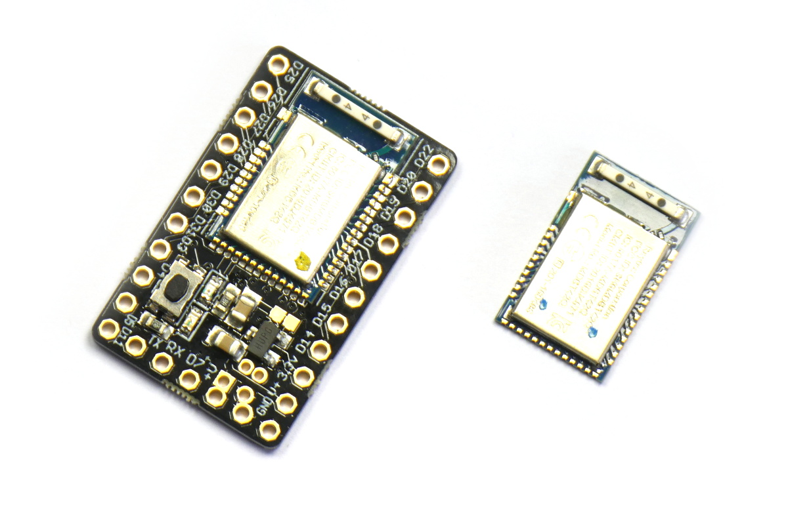
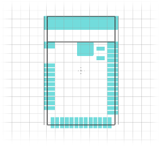

<!--- Copyright (c) 2018 Gordon Williams, Pur3 Ltd. See the file LICENSE for copying permission. -->
Raytac MDBT42Q
==============

:warning: **Please view the correctly rendered version of this page at https://www.espruino.com/MDBT42Q. Links, lists, videos, search, and other features will not work correctly when viewed on GitHub** :warning:

* KEYWORDS: Espruino,MDBT42Q,MDBT42,nRF52832,nRF52,Nordic,Pinout,Bluetooth,BLE,Bluetooth LE

This is the Bluetooth module that we use in [Puck.js](/Puck.js) and [Pixl.js](/Pixl.js)
devices. You can [buy it from us](https://shop.espruino.com/mdbt42q) with the
Espruino firmware pre-installed.

**Note:** We only provide support for MDBT42 modules purchased from us. Other
modules won't have a bootloader installed so need connecting to a programmer
in order to have firmware installed.

Features
--------

* Bluetooth Low Energy
* Espruino JavaScript interpreter pre-installed
* nRF52832 SoC - 64MHz ARM Cortex M4, 64kB RAM, 512kB Flash
* 32 x GPIO (capable of PWM, SPI, I2C, UART) on 0.7mm Pitch, including 8 analog inputs
* 1.7v - 3.6v voltage range
* Built in thermometer
* NFC tag programmable from JavaScript (when an antenna is connected)
* Dimensions: 16mm x 10mm x 2.2mm thick

Buying
------

You can buy pre-programmed MDBT42Q modules [direct from us](https://shop.espruino.com/mdbt42q)

Getting Started
----------------

All you need to get the MDBT42Q working is to apply power between the `VDD` and
`GND` pins. A 3v non-rechargeable lithium cell is ideal for this (LiPo batteries
have a voltage that is too high and will need the voltage dropping with a diode
or voltage regulator). Check [the pinout](#pinout) below for details on where to
 connect power.

It is recommended to connect all the `GND` pins together (especially when
designing a PCB) but it is not absolutely required - you can boot the
MDBT42Q module with just two wires.

Once powered up follow the [Puck.js Getting Started Guide](/Puck.js+Quick+Start) for details
on getting the IDE connected wirelessly. You can also [use a wired connection](#serial-console)
if you prefer.

On-board peripherals
--------------------

While there are no buttons or LEDs on the module, the MDBT42Q build assumes:

* There is a button (`BTN`/`BTN1`) between pin `D0` and 3.3v. Pulling this high on boot
enables the bootloader.
* There is a LED (`LED`/`LED1`) between pin `D1` and GND. This is flashes at
boot and also indicates bootloader mode.

Tutorials
--------

First, it's best to check out the [Puck.js Getting Started Guide](/Puck.js+Quick+Start)

Most tutorials that use Puck.js also apply to the MDBT42Q module:

* APPEND_USES: Puck.js

Tutorials using MDBT42Q:

* APPEND_USES: MDBT42Q

Pinout
---------------------------

* APPEND_PINOUT: MDBT42Q

**Note:** The nRF52 port has one available I2C, SPI and USART (and infinite software SPI and I2C).
Unlike other Espruino boards, these peripherals can be used on *any* pin.

Information
-----------

* [Eagle CAD footprint](https://raw.githubusercontent.com/espruino/EspruinoBoard/master/MDBT42/mdbt42.lbr)
* [nRF52832 Datasheet](/datasheets/nRF52832_PS_v1.0.pdf)
* [MDBT42 Datasheet](/datasheets/MDBT42Q-E.pdf)

Serial Console
---------------

When power is first applied, the MDBT42Q checks if pin `D8` is at 3.3v (which will be the
case if it is connected to a Serial port's transmit line). If it is, it initialises
the on-chip UART on `D8` (MDBT42Q RX) and `D6` (MDBT42Q TX) and puts the Espruino
console (REPL) on it at 9600 baud.

To use it, connect to a 3.3v output USB to TTL converter as follows:

| MDBT42Q  | USB->TTL converter |
|----------|--------------------|
| GND      | GND                |
| D8       | RX ( -> PC )       |
| D6       | TX ( <- PC )       |
| 3V       | 3.3v (Optional - to run without a battery) |

You can now use the normal Espruino Web IDE, or a serial terminal application at 9600 baud.

When you connect via Bluetooth, the console will automatically move over. To
stop this, execute `Serial1.setConsole(true)` to force the console to stay on
`Serial1`.

**Note:** Serial1 is not enabled by default because it requires the high speed
oscillator to stay on, which increases power draw a huge amount. If you connect
the UART but don't power down and power on the MDBT42Q, you won't get a serial port.

Firmware Updates
-----------------

Check out the [Puck.js firmware update instructions](/Puck.js#firmware-updates)
for full details. All you need to do is apply power to your module with
pin `D0` connected to VDD, then release it after a second.

This will enable the bootloader mode, and you can then connect with the
nRF connect app.
