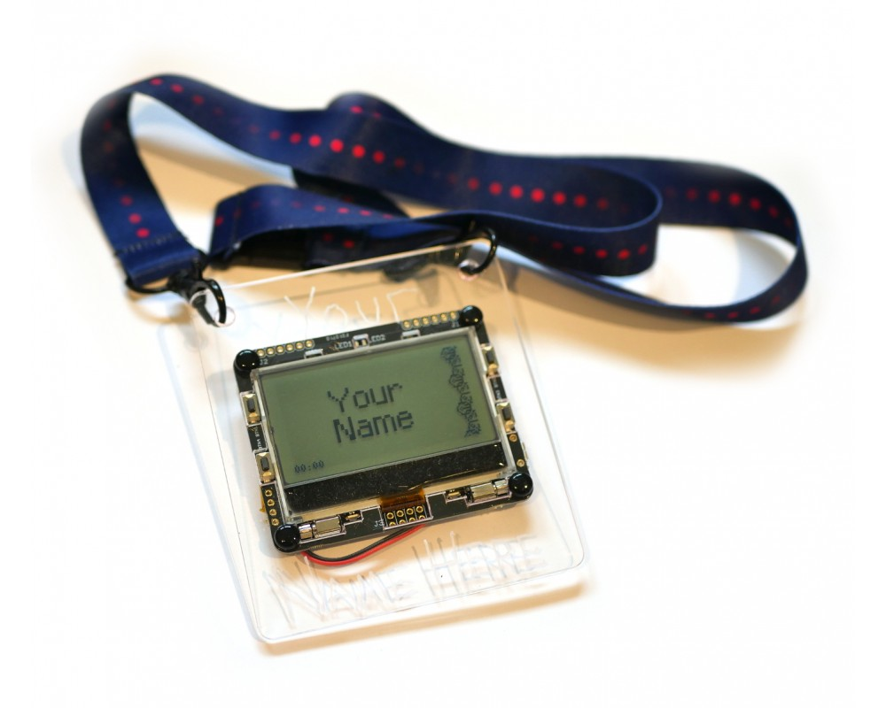

<!--- Copyright (c) 2018 Gordon Williams, Pur3 Ltd. See the file LICENSE for copying permission. -->
Pixl.js Multicolour
===================

<span style="color:red">:warning: **Please view the correctly rendered version of this page at https://www.espruino.com/Pixl.js+Multicolour. Links, lists, videos, search, and other features will not work correctly when viewed on GitHub** :warning:</span>

* KEYWORDS: Espruino,Official Board,Pixl,Pixljs,Pixl.js,nRF52832,nRF52,Nordic,Board,PCB,Pinout,Bluetooth,BLE,Bluetooth LE,Graphics



* BUYFROM: £54,,https://shop.espruino.com/pixljs-multicolour

A special version of the [[Pixl.js]] Smart LCD with multicolour LEDs,
sensors and a rechargeable battery.

Contents
--------

* APPEND_TOC

## Quick Links

- [Original Nodeconf badge pages](https://nodeconfeubadge.org)
- [GitHub Repo](https://github.com/nearform/nceubadge2018)
- [Espruino Bluetooth Getting Started](http://www.espruino.com/Quick+Start+BLE#pixljs)
- [Espruino Pixl.js info](http://www.espruino.com/Pixl.js)
- [Returning your badge to normal](#returning-to-standard)

### Firmwares

- [Simple Badge firmware](https://github.com/Espruino/EspruinoDocs/blob/master/boards/PixljsMulticolour/simple.js)
- [The Nodeconf EU Badge's default firmware](https://github.com/nearform/nceubadge2018/blob/master/js/badge.js)

## Getting Started

The badge is based on a [Pixl.js](http://www.espruino.com/Pixl.js), so a
lot of the tutorials and information there still apply.

The button names can be hard to read because of the badge surround, but they
are as follows:

```
  ......                      ......
      ___________________________
BTN1 |                           | BTN2
     |                           |
     |                           |
     |                           |
BTN4 |___________________________| BTN3
                  ::::
```

There is an on/off slider switch on the rear of the badge just by the USB connector
(which is used for charging only).

## Bugs!

- On some of the badges, the vibration caused by the vibration motors during startup can
  cause the LED controller to stop working. If when you power your badge on it _doesn't_ go
  through all the colours of the rainbow, power it on with your thumbs over the vibration motors
  at the bottom left and right of the screen. **This should be fixed on badges produced after Nodeconf 2018**
- If your badge stops animating while in badge mode, try just pressing a button
  and it should spring back to life (updating the actual Espruino firmware can fix
  this - see [Updating Espruino](#updating-espruino) below).
- When you charge the badge via USB, the on/off switch on the back needs to be
  set to ON (with the sticky-out part nearest the USB connector) or the battery
  won't charge. **This is not required on badges produced after Nodeconf 2018**
- If you're writing bits of code using `require("Storage").write('.boot...')`
  you may eventually get errors about not being able to write (the same can happen
  when trying to change settings). You can solve this by following the
  [Returning your badge to normal](#returning-to-standard) instructions -
  but [Updating Espruino](#updating-espruino) can stop it happening again as well.

## Connecting

To avoid a complete free-for-all when many badges are used, when the badges start up
they disable the ability to connect to them. To connect, you must do one of:

- Go to the `Make Connectable` menu item
- Power the badge off, and power it on with `BTN2` or `BTN3` held down. The badge
  firmware will be loaded, but your badge will be connectable.
- (Not recommended) Power the badge off, and power it on with `BTN1` held down while the bootloader
  percent bar goes to the end, **then release when told. Do not keep holding the button
  down or all saved badge code will be erased.**. This initialises a self
  test, which will fail (because the board isn't quite a standard Pixl.js). This
  will start your badge without loading any of the badge code.

You can then use the Chrome web Browser on any Windows 10 or Mac OS device
and go to [https://www.espruino.com/ide](espruino.com/ide) and you can connect.
You're looking for a device called `Pixl abcd` where `abcd` are the last 4
characters of the MAC address shown on the Badge's screen.

*If you used Espruino before, ensure that the `Save on Send` option in the
`Communications` part of the Web IDE's settings is set to `To RAM` otherwise
you'll overwrite the badge firmware.*

### Using your own Editor

You can use the Espruino CLI:

```
npm install -g espruino

# abcd = last 4 digits displayed on your badge
espruino -d abcd --config RESET_BEFORE_SEND=false -w filename.js
```

The `-w filename,js` option watches that file for changes, so the connection
to the badge (and REPL) will be maintained and every time you save the file
in your editor it'll automatically upload.

In this case the CLI tool will upload to RAM without resetting the device,
so writing an app like this will allow you to quickly test your code:

```
Badge.apps["My App"] = ()=>{
 // Reset everything on the badge to a known state
 Badge.reset();
 // Display a menu
 Pixl.menu({ "": { "title": "-- A Test --" },
   "LED1 on" : ()=>LED1.write(1),
   "LED1 off" : ()=>LED1.write(0),
   "Back to Badge":Badge.badge
  });
};
// automatically run app for testing
Badge.apps["My App"]();
```

## Returning to Standard

- <a href="https://www.espruino.com/ide/?codeurl=https://raw.githubusercontent.com/nearform/nceubadge2018/master/js/badge.js" target="_blank">Click this link</a> in Chrome for the nodeconf firmware
- OR <a href="https://www.espruino.com/ide/?codeurl=https://raw.githubusercontent.com/nearform/nceubadge2018/master/boards/PixljsMulticolour/simple.js" target="_blank">Click this link</a> in Chrome for the simple firmware
- Change `Badge.NAME = ...` to `["Your", "Name"]` - each array element is a new line
- Connect to your badge (see above)
- If you're having trouble connecting, power your badge on with `BTN1` held down for ~10 seconds (until a message about code being erased is shown) - this will remove all code from the badge and make it connectable - ready for you to re-upload the badge code.
- Optional: Type `require("Storage").eraseAll()` in the left hand side of the IDE. This will remove all data from nonvolatile storage.
- Turn the `Save on Send` option in the `Communications` part of the Web IDE's settings to `Direct To Flash`
- Upload the code
- Return the `Save on Send` option in the `Communications` part of the Web IDE's settings to `To RAM` so you don't accidentally overwrite the code in the future.

You're sorted!

## Stuff to do

On the badge, you have a bunch of stuff you can use. Most of it is available via `NC`
in a global variable created by the badge software. If you're trying to
do things on your own without the badge software, use `var NC = require("nodeconfeu2018");`
first.

### Bluetooth

Check out [the Pixl.js page](http://www.espruino.com/Pixl.js) for examples.

### LED1, LED2

You can turn the LEDs on and off with `digitalWrite(LED1,1)` or `LED1.write(1)`. Use `0` to turn them off.

### RGB lighting

The badge has fancy RGB lighting. There's:

- **LEDs facing up** - Change these with `NC.ledTop([R,G,B])` or `NC.ledTop([])` to turn them off
- **LEDs facing down** - Change these with `NC.ledBottom([R,G,B])` or `NC.ledBottom([])` to turn them off
- **LCD backlight with 4 zones** - Change this with `NC.backlight([B,G,R,B,G,R,B,G,R,B,G,R])` or `NC.backlight([])` to turn them off

In the above code, `B/G/R` are numbers between 0 and 255 and represent Blue, Green and Red.

### Light sensor

LED2 can be used as an ambient light sensor - just use `NC.light()` to get
a reading between 0 and 1.

It will _definitely_ be thrown off by any light from any of the other on-badge LEDs.

### Vibration

You can use the vibration motors just like normal pins on Espruino...

```
// Use VIBL/VIBR for left and right motors

// Motor on
digitalWrite(VIBL,1);
// Motor off
digitalWrite(VIBL,0);
// Pulse motor on for 100ms
digitalPulse(VIBL,1,100);
// Pulse motor 3 times, for 100ms, with 150ms between each pulse
digitalPulse(VIBL,1,[100,150,100,150,100]);

// Or slowly ramp the speed of the motor up and down
var n = 0;
setTimeout(function cb() {
  analogWrite(VIBL,Math.sin(n));
  n+=0.01;
  if (n<Math.PI) setTimeout(cb,20);
  else digitalWrite(VIBL,0);
}, 20);
```

### Sound

The vibration motors can also be used to create (reasonably quiet) sounds.

```
analogWrite(VIBL,0.05,{freq:2000});  // Make sound!
```

There are some very simple examples at http://www.espruino.com/Making+Music
that will work on the vibration motor - just make sure that the second argument
of `analogWrite` (the duty cycle) is low enough that the vibration motor isn't
turning!

### Accelerometer

```
console.log(NC.accel());
// {x,y,z}
```

### Magnetometer

```
console.log(NC.mag());
// {x,y,z}
```

### LiPo

```
NC.getBatteryState()
// { charging:bool, standby:bool}
```

## Extending the badge

You can add your own 'Apps' or LED patterns that will display in the Badge's
memory just by adding them to the `Badge.patterns` or `Badge.apps` arrays.

Normally when you upload code from the right-hand side of the IDE it will reset
the badge (this won't remove saved code, but will stop the badge code from running).
To avoid this, either copy/paste your code from the right-hand side of the IDE
to the left, or disable the `Reset before send` option in the `Communications` part
of the Web IDE's settings.

## Patterns

Just do something like:

```
// LED patterns - each is [callback, period_in_ms]
Badge.patterns.blue=()=>{ var n=0;return [()=>{
  var c = [127,0,0];
  NC.ledTop(c);
  NC.ledBottom(c);
  NC.backlight(c.concat(c,c,c));
},0];};
```

And you can test by running `Badge.pattern("mine")`.

The above example will only be called once because it returns `0` for `period_in_ms`,
but you can easily supply a different value to be called more often:

```
Badge.patterns.green=()=>{ var n=0;return [()=>{
  n+=50;
  if (n>1536)n=0;
  NC.ledTop([0,Math.max(255-Math.abs(n-1024),0),0]);
  NC.ledBottom([0,Math.max(255-Math.abs(n-1384),0),0]);
  NC.backlight([0,Math.max(255-Math.abs(n-640),0),0,
                0,Math.max(255-Math.abs(n-512),0),0,
                0,Math.max(255-Math.abs(n-384),0),0,
                0,Math.max(255-Math.abs(n-256),0),0]);
},50];};
```

50ms is usually a good balance of battery life and smoothness.

## Apps

Just write your app to the `Badge.apps` array:

```
Badge.apps["My App"] = ()=>{
 // Reset everything on the badge to a known state
 Badge.reset();
 // Display a menu
 Pixl.menu({ "": { "title": "-- A Test --" },
   "LED1 on" : ()=>LED1.write(1),
   "LED1 off" : ()=>LED1.write(0),
   "Back to Badge":Badge.badge
  });
};
```

And you can test by running `Badge.apps["My App"]()`

To return to normal badge functionality just call `Badge.badge()` or `Badge.menu()`
to return to the menu.

## Saving...

When you upload code as described above, your function will be loaded
into RAM and will be lost when the badge is reset.

To make it persist, you can write it into a file in the badge's storage
called `.boot0`,`.boot1`,`.boot2` or `.boot3` - each one is executed in
turn on boot so you can have more than one extension at once.

```
require("Storage").write(".boot0",`
Badge=global.Badge||{};
Badge.apps=Badge.apps||{};
Badge.apps["My App"] = ()=>{
 // Reset everything on the badge to a known state
 Badge.reset();
 // Display a menu
 Pixl.menu({ "": { "title": "-- A Test --" },
   "LED1 on" : ()=>LED1.write(1),
   "LED1 off" : ()=>LED1.write(0),
   "Back to Badge":Badge.badge
  });
};
`);
```

You can also do things like overwrite the built-in name,
without having to overwrite the basic badge firmware.

```
require("Storage").write(".boot1",`
Badge=global.Badge||{};
Badge.NAME=["Hello","World"];
`);
```

## Common Pitfalls

- If you get `Badge not found` errors while trying to upload an app from the right hand side, it'll be because you're uploading with the `Reset before send` option turned on in the IDE settings (it should be turned off)
- `reset()` (or 'reset before send) removes all JS code from the badge's RAM (including the `Badge` object) - it can be handy if you want to have full control of everything on the badge. To get back, see the next point...
- If you want to get your badge firmware back out of flash memory _without_ power cycling your badge, just type `load()` in the left-hand side of the IDE
- Calling `Badge.menu()` will bring the Badge's menu back up - `Badge.badge()` goes back to displaying the badge. If you want a button in the app to bring you back to the menu, you can just call: `setWatch(Badge.menu, BTN1);`
- `Badge.reset()` attempts to reset the badge's state (removing watches and intervals) - it's an idea to stick this as the first line in your app to make sure you start from a known state each time.

## Soldering Stuff

There are some special GPIO connectors on the badge. These can be accessed with
commands like `digitalWrite(D10,1)` or `analogRead(A0)`.

- `J2` (Top Left) contains (left to right) `GND`,`D10`,`D11`,`D12`,`D13` and `3.3v`
- `J1` (Top Right) contains (left to right) `GND`,`A0`,`A1`,`A2`,`A3` and `3.3v`
- `J3` (Bottom center) contains the pinout for an ESP8266 ESP01 module. This can
  also be used for wired serial comms with the badge:

```
GND            NC    NC        D1(Badge TX)
D0(Badge RX)   D9    NC        3.3v
```

### ESP8266 Wiring

**On Nodeconf.eu badges**, due to a slight mirroring accident, a normal ESP8266
module has to be attached to the FRONT of the badge, slightly covering the display:

However by removing the ESP01's pins and soldering them on the other side of the
module, you can fit the ESP01 to the rear of the badge very tidily.

```
  ......                      ......
      ___________________________
BTN1 |                           | BTN2
     |                           |
     |            ____           |
     |           |    |          |
BTN4 |___________|    |__________| BTN3
                 |::::|
                  ----
```

**This is fixed on badges produced after Nodeconf 2018** and the ESP01 module
goes on the back of the badge without modification:

```
  ......                      ......
      ___________________________
BTN1 |                           | BTN2
     |                           |
     |                           |
     |                           |
BTN4 |___________________________| BTN3
                 |::::|
                  ----
```

Once soldered you can access the internet as follows:

```
var WIFI_NAME = "...";
var WIFI_PASS = "...";
D9.set(); // power on
Serial1.setup(115200,{rx:D0,tx:D1});
var wifi = require("ESP8266WiFi_0v25").connect(Serial1, function(err) {
  if (err) throw err;
  console.log("Connecting to WiFi");
  wifi.connect(WIFI_NAME, WIFI_PASS, function(err) {
    if (err) throw err;
    console.log("Connected");
    // Now you can do something, like an HTTP request
    require("http").get("http://www.pur3.co.uk/hello.txt", function(res) {
      console.log("Response: ",res);
      res.on('data', function(d) {
        console.log("--->"+d);
      });
    });
  });
});
```

Check out [http://www.espruino.com/Internet](Espruino's page on Internet stuff)
for more info.

## Updating Espruino

The badges came with Espruino v2.00, but there have [been a few changes](https://github.com/espruino/Espruino/blob/master/ChangeLog)
to Espruino since then that have fixed:

- The badge pausing issue (caused by high Bluetooth LE traffic when scanning)
- Filesystem issues when repeatedly calling `require("Storage").write`
- Other issues

To update Espruino, just [follow the Pixl.js instructions here](http://www.espruino.com/Pixl.js#firmware-updates)
with the 'Cutting edge' build linked from [the firmware download page](http://www.espruino.com/Download#pixljs).

This'll take a few minutes, and you then need to follow the steps for [Returning your badge to normal](#returning-to-standard) - so if you're fine with everything as it is, we'd recommend that you keep version 2.00 for now.

## Changing your name on the badge in the Web IDE

As an alternative to using the [simple Web Bluetooth page](https://nearform.github.io/nceubadge2018/namechanger.html) to change the name, you can also do the following:

- On the badge, press the top left button, then select "Make Connectable" from the menu and note the last four hex digits of the address of the badge
- <a href="https://www.espruino.com/ide/?codeurl=https://raw.githubusercontent.com/nearform/nceubadge2018/master/js/namechange.js" target="_blank">Click this link</a> in Chrome to open the Online IDE with the correct code
- In that code, edit the two fields "Bob" and "Loblaw" to whatever you need.
- Click the yellow Connect button in the top left corner of the IDE
- Click "Web Bluetooth" in the pop-up
- Click your device name
- Once connected, click the "Send to Espruino" button in the middle of the IDE
- Reboot your badge and you'll see the new name


Other Official Espruino Boards
------------------------------

* APPEND_KEYWORD: Official Board
