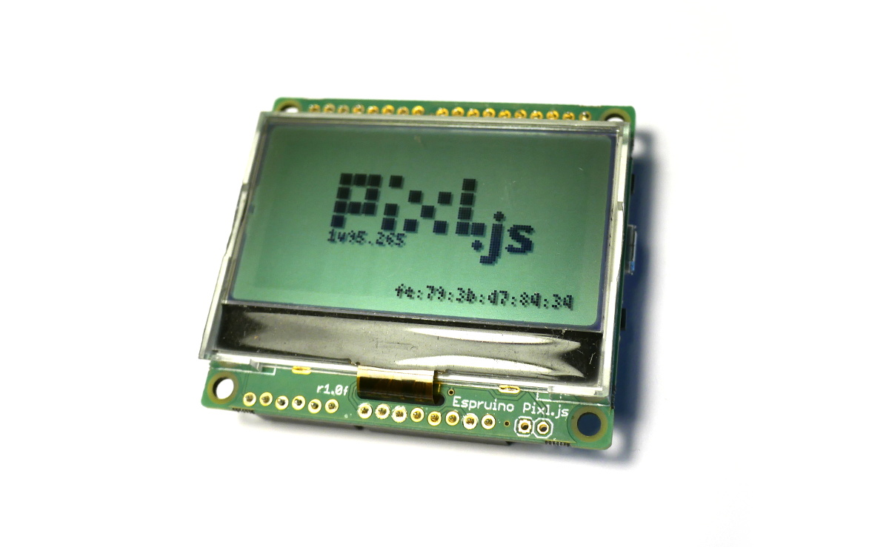
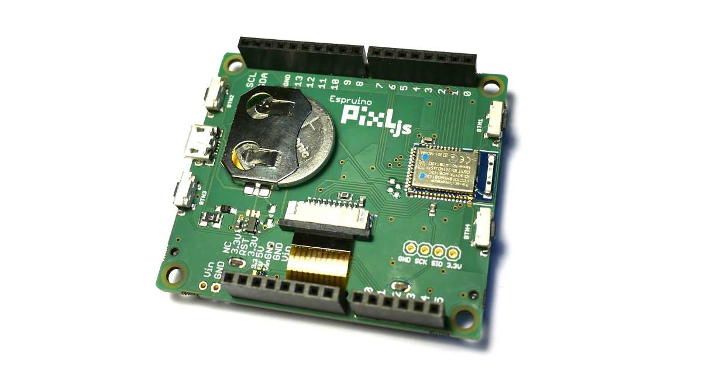

<!--- Copyright (c) 2016 Gordon Williams, Pur3 Ltd. See the file LICENSE for copying permission. -->
Pixl.js
=======

:warning: **Please view the correctly rendered version of this page at https://www.espruino.com/Pixl.js. Links, lists, videos, search, and other features will not work correctly when viewed on GitHub** :warning:

* KEYWORDS: Espruino,Pixl,Pixljs,Pixl.js,nRF52832,nRF52,Nordic,Board,PCB,Pinout,Bluetooth,BLE,Bluetooth LE,Graphics

# COMING SOON

Please enter your email address below and we'll let you know when Pixl.js
is available to buy. This is expected to be at the beginning of April.

<form action="https://docs.google.com/forms/d/e/1FAIpQLSecLWXsbe8Oc9B62V1WkmDfoYxIMvPoXw4fCg33ZdBb_RTcjw/formResponse" target="_blank" method="POST" class="form-inline" role="form">
  

    <label for="exampleInputEmail1">Email:</label>
    <input type="email" name="emailAddress" value="" class="form-control" placeholder="bob@example.com" style="width: 200px;"/>
  

  <button type="submit" class="btn btn-primary">Submit</button>
</form>

Features
--------

* Bluetooth Low Energy
* Espruino JavaScript interpreter pre-installed
* nRF52832 SoC - 64MHz ARM Cortex M4, 64kB RAM, 512kB Flash
* 54mm diagonal, 128 x 64 Sunlight readable monochrome display with white backlight
* 20x GPIO in Arduino footprint (capable of PWM, SPI, I2C, UART, Analog Input)
* Support for GSM, LTE, WiFi and Ethernet Arduino shields
* 3v to 16v input range
* CR2032 battery holder, or Micro USB (power only)
* 4x 3mm mounting holes
* 4x Buttons
* Built in thermometer and battery level sensors
* NFC tag programmable from JavaScript
* Dimensions: 60mm x 53mm x 15mm
