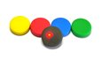
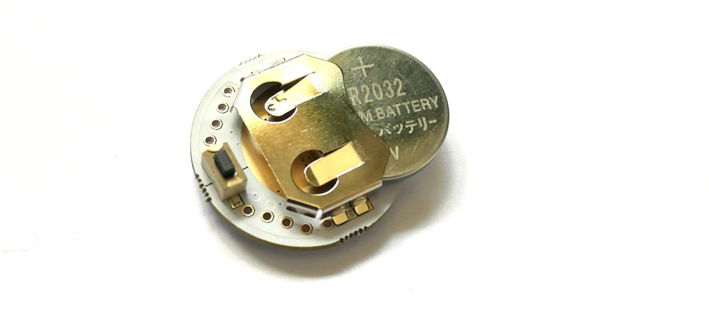
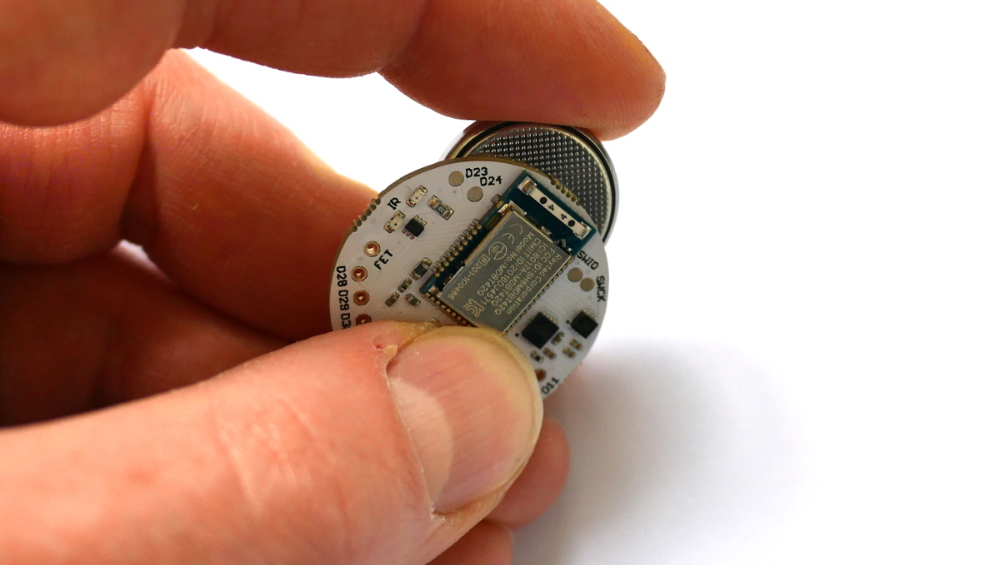
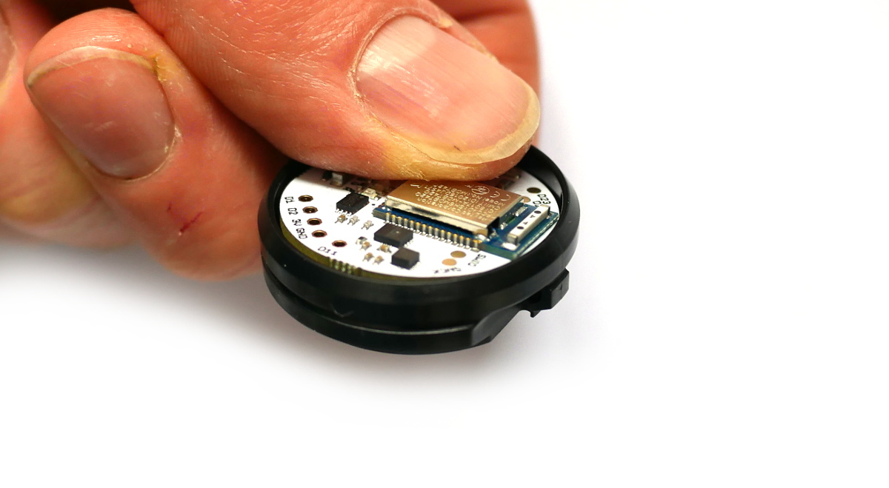

<!--- Copyright (c) 2016 Gordon Williams, Pur3 Ltd. See the file LICENSE for copying permission. -->
Puck.js
=======

<span style="color:red">:warning: **Please view the correctly rendered version of this page at https://www.espruino.com/Puck.js. Links, lists, videos, search, and other features will not work correctly when viewed on GitHub** :warning:</span>

* KEYWORDS: Espruino,Official Board,Puck,Puckjs,Puck.js,nRF52832,nRF52,Nordic,Board,PCB,Pinout,Bluetooth,BLE,Bluetooth LE


* BUYFROM: £30,£21.60,https://shop.espruino.com/puckjs,/Order#puckjs

**Puck.js is an easy to use, programmable Bluetooth sensor and button**

You can customise Puck.js with JavaScript or a graphical programming language (Blockly). All you need is a Web Browser (Chrome, Edge or Opera) and you can upload code wirelessly! Puck.js comes with bluetooth low energy, accelerometer, gyro, 3 axis compass, temperature sensor, IR, NFC and more!

**Just got your Puck.js? [Click here to get started!](https://www.puck-js.com/go)**


Contents
--------

* APPEND_TOC

Features
--------

* Bluetooth Low Energy
* Espruino JavaScript interpreter pre-installed
* nRF52832 SoC - 64MHz ARM Cortex M4, 64kB RAM, 512kB Flash
* ABS plastic rear case with lanyard mount
* Silicone cover with tactile button
* IR Transmitter
* Built in thermometer, light and battery level sensors
* Red, Green and Blue LEDs
* NFC tag programmable from JavaScript
* Pin capable of capacitive sensing
* Weight: 14g in plastic case, 20g in packaging
* Dimensions of cardboard box: 64mm x 62mm x 16mm
* Dimensions of plastic case: 36mm dia, 12.5mm thick
* Dimensions of bare PCB: 29mm dia, 9mm thick

| Features  | Puck.js v1 | Puck.js v2 |
|-----------|------------|------------|
| 0.1" GPIO |  8         | 7          |
| SMD  GPIO |  9         | 2          |
| Magnetometer | MAG3110 | [LIS3MDLTR](/files/LIS3MDL.pdf)  |
| Accelerometer | No     | [LSM6DS3TR-C](/files/LSM6DS3TR-C.pdf) |
| Gyro          | No     | [LSM6DS3TR-C](/files/LSM6DS3TR-C.pdf) |
| Temperature Sensor | nRF52 (uncalibrated) | PCT2075TP (calibrated)  |
| MOSFET Output | No     | 1x         |


Accessories
-----------

You can also buy kits of different color cases for Puck.js from the
[Espruino Shop](https://shop.espruino.com/puckjs-accessories) or [our Tindie store](https://www.tindie.com/stores/gfwilliams/)

[](https://shop.espruino.com/puckjs-cover-black)
[](https://shop.espruino.com/puckjs-cover-selection)


Turning Puck.js on
------------------

Puck.js is either supplied with a separate battery, or assembled with the
battery inside and a **clear plastic tab** between the battery
and PCB to keep it turned off. To turn it on, you need to:

* Pull the silicone case off the top,
* Tip the PCB out
* If a battery is installed, push it out from the back with a blunt object and make sure the clear plastic tab is removed
* Push the battery back in, with the `+` side of the battery (with the writing on)
facing away from the Puck.js PCB:

  
  

* As the battery is inserted the red LED should flash once, very briefly.
* If the green LED lights or red stays lit, it is because you have accidentally
pressed the button down while inserting the battery. Remove the battery and try
again, making sure the button next to the battery connector isn't pressed.
* Reassemble (note that the battery should be facing the black plastic case,
  and the button (next to the battery) should be positioned as far away from
  the 'step' in the case as possible:

  

**Note: Do not re-fit the PCB upside-down or force it into the case.** If
positioned correctly it should slide in. Forcing the PCB or fitting it
upside-down could damage the aerial which will stop Puck.js's Bluetooth
from working correctly.


Resetting Puck.js
-----------------

Occasionally you may want to reset Puck.js. To do this:

* Take the PCB out of the silicone case
* Place your finger nail between the Battery and the PCB, near the `Puck.js 1.x` text
* Gently pull the battery away from the PCB for 1 second and release
* The red LED should then flash, indicating that Puck.js had rebooted.

If you are not able to do that, you can always remove the battery by pushing it
out of the holder from behind with matchstick or biro. When you re-insert it,
Puck.js will have reset.


Hard Reset
----------

Perform the steps for a Reset (see above) but keep the button held for around 10 seconds.

The green LED should light, followed by all 3 LEDs, then the red LED will blink 5 times.

Release the button at least 1 second after the blinking has stopped - this will clear out any previously saved code and bonding data that could have caused you problems.

**Note:** If you release the button when all 3 LEDs are on then a self-test will be performed. The green LED will blink on success, or red on failure.
Saved code will not be loaded from flash, *but will not be erased from flash either* - a subsequent reset will start Espruino up loading the saved code as normal.

**Note:** The initial Puck.js v2 ships with 2v05 firmware, and the self-test may report that IR LEDs are disconnected or the Blue LED voltage is wrong. This is not the case, and later firmwares have updated self test code.


Tutorials
--------

First, it's best to check out the [Getting Started Guide](/Quick+Start+BLE#puckjs)

Tutorials using Puck.js:

* APPEND_USES: Puck.js

Tutorials using Bluetooth LE:

* APPEND_USES: Only BLE,-Puck.js

Tutorials using Bluetooth LE and functionality that may not be part of Puck.js:

* APPEND_USES: BLE,-Only BLE,-Puck.js

Pinout
--------

* APPEND_PINOUT: PUCKJS

**Note:** Puck.js has one available I2C, SPI and USART (and infinite software SPI and I2C).
Unlike other Espruino boards, these peripherals can be used on *any* pin.


Information
-----------

* [Circuit Diagram (v1)](https://github.com/espruino/EspruinoBoard/blob/master/Puck.js/pdf/puckjs_sch.pdf)
* [Circuit Diagram (v2)](https://github.com/espruino/EspruinoBoard/blob/master/Puck.js/pdf/puckjsv2_sch.pdf)
* [Board Layout (v1)](https://github.com/espruino/EspruinoBoard/blob/master/Puck.js/pdf/puckjs_brd.pdf)
* [Eagle CAD files (v1)](https://github.com/espruino/EspruinoBoard/tree/master/Puck.js/eagle)
* [3D Case design files](https://github.com/espruino/EspruinoBoard/tree/master/Puck.js/case)
* [nRF52832 Datasheet](/datasheets/nRF52832_PS_v1.0.pdf)
* [MDBT42 Datasheet](/datasheets/MDBT42Q-E.pdf)


<a name="onboard"></a>On-board LEDs, Button and GPIO
-------------------------------

Puck.js contains LEDs and a button that can be accessed in the same way
as other Espruino devices.

### LEDs

* You can use `digitalWrite(LED1,1)` to turn the first (red) LED on, and
`digitalWrite(LED1,0)` to turn it off. You can also use `LED2` for green
and `LED3` for blue, and for convenience `LED` is defined (which is the same as `LED1`).
* You can also use `LED1.write(1)` and `LED1.write(0)` to get the same effect
* As well as `LED1.set()` and `LED1.reset()` to get the same effect
* Finally, you can control all 3 LEDs at once using a binary number if you want
to with `digitalWrite([LED3,LED2,LED1], 7)`

### Button

* You can access the button's state with `digitalRead(BTN)` or `BTN.read()`
(the two commands are identical). `BTN1` is also defined, and is the same as `BTN`.
* Polling to get the button state wastes power, so it's better to use `setWatch`
to call a function whenever the button changes state:

```JS
setWatch(function() {
  console.log("Pressed");
}, BTN, {edge:"rising", debounce:50, repeat:true});
```

### GPIO pins

GPIO pins are numbered `D0` to `D31`. Their numbers are usually written on the PCB.

You can use the same `digitalWrite`/`digitalRead` commands with these that you
do with the buttons, but you can also use [[PWM]], [[I2C]], [[SPI]] and [[Analog]].


On-board peripherals
--------------------

Puck.js's on-board peripherals are exposed by special-purpose functions

### Magnetometer

You can use [`Puck.mag()`](/Reference#l_Puck_mag) to return one magnetometer
reading (with x, y, and z axes).

However you can also leave the magnetometer on permanently and use it to
wake Puck.js up whenever it gets a reading. See [`Puck.magOn()`](/Reference#l_Puck_magOn)

```JS
Puck.magOn();
Puck.on('mag', function(xyz) {
  console.log(xyz);
});
// Turn events off with Puck.magOff();
```

If you have issues using the magnetometer, please check your battery percentage
with `E.getBattery()` to ensure that it has over 30% charge remaining.
When the battery is almost empty the magnetometer can stop working correctly.

**NOTE:** If you have a Puck.js v2 *with the original firmware* then magnetometer
power usage will be higher than normal (~350uA vs 40uA). To fix this add
`require("puckjsv2-2v05-fix")` to the beginning of your program.

#### Field detection

**Puck.js v2 only** You can use the [[puckjsv2-mag-level.js]] module to configure the Puck.js
magnetometer for ultra low power mode (40uA) while acting like a reed
switch (detecting when field strength is high or low).

```JS
require("puckjsv2-mag-level").on();
Puck.on('mag',function(m) {
  digitalPulse(m.state ? LED1 : LED2, 1, 100);
});
// turn off with require("puckjsv2-mag-level").off();
```

##### puckjsv2-mag-level.js

* APPEND_JSDOC: puckjsv2-mag-level.js


#### Direct configuration

For more advanced usage you can also use [`Puck.magWr(reg,data)`](/Reference#l_Puck_magWr)
and [`Puck.magRd(reg)`](/Reference#l_Puck_magRd) to configure the accelerometer
chip exactly as required (using the [datasheet](/files/LIS3MDL.pdf))..

### Accelerometer/Gyro

**Puck.js v2 only** Puck.js v2 has an accelerometer and Gyro (the [LSM6DS3TR-C](/files/LSM6DS3TR-C.pdf))

You can use [`Puck.accel()`](/Reference#l_Puck_accel) to return one accelerometer/gyro
reading, for example:

```
>Puck.accel()
={
  "acc": { "x": 253, "y": -663, "z": 16249 },
  "gyro": { "x": 551, "y": 2604, "z": 4265 }
 }
```

However you can also leave the accelerometer on permanently and use it to
wake Puck.js up whenever it gets a reading. See [`Puck.accelOn()`](/Reference#l_Puck_accelOn)

```JS
Puck.accelOn(); // default is 12.5Hz, with gyro
// or Puck.accelOn(1.6); for 1.6Hz low power, without gyro
Puck.on('accel', function(a) {
  console.log(a);
});
// Turn events off with Puck.accelOff();
```

**NOTE:** If you have a Puck.js v2 *with the original firmware* then accelerometer
power usage will be higher than normal for low data rates (~800uA vs 40uA). To fix this add
`require("puckjsv2-2v05-fix")` to the beginning of your program.

#### Movement detection

**Puck.js v2 only** You can use the [[puckjsv2-accel-movement.js]] module to configure the Puck.js
accelerometer for ultra low power mode (40uA) while detecting movement:

```JS
require("puckjsv2-accel-movement").on();
var idleTimeout;
Puck.on('accel',function(a) {
  LED.set();
  if (idleTimeout) clearTimeout(idleTimeout);
  else print("Motion", a);
  idleTimeout = setTimeout(function() {
    idleTimeout = undefined;
    LED.reset();
  },500);  
});
// turn off with require("puckjsv2-accel-movement").off();
```

##### puckjsv2-accel-movement.js

* APPEND_JSDOC: puckjsv2-accel-movement.js

#### Significant Movement detection

**Puck.js v2 only** You can use the [[puckjsv2-accel-bigmovement.js]] module to configure the Puck.js
accelerometer for ultra low power mode (40uA) while detecting when the Puck
has been moved significantly for more than a few seconds.

```JS
require("puckjsv2-accel-bigmovement").on();
Puck.on('accel',function(a) {
  digitalPulse(LED1,1,500);
});
// turn off with require("puckjsv2-accel-bigmovement").off();
```

##### puckjsv2-accel-bigmovement.js

* APPEND_JSDOC: puckjsv2-accel-bigmovement.js

#### Step counting

**Puck.js v2 only** You can use the [[puckjsv2-accel-steps.js]] module to configure the Puck.js
accelerometer for ultra low power mode (40uA) while detecting movement:

```JS
require("puckjsv2-accel-steps").on();
var steps = 0;
Puck.on('accel',function(a) {
  digitalPulse(LED1,1,1);
  steps++;
});
// turn off with require("puckjsv2-accel-steps").off();
```

##### puckjsv2-accel-steps.js

* APPEND_JSDOC: puckjsv2-accel-steps.js

#### Tilt detection

**Puck.js v2 only**  You can use the [[puckjsv2-accel-tilt.js]] module to configure the Puck.js
accelerometer for ultra low power mode (40uA) while detecting when it has
been rotated by more than 35 degrees:

```JS
require("puckjsv2-accel-tilt").on();
Puck.on('accel',function(a) {
  digitalPulse(LED1,1,100);
});
// turn off with require("puckjsv2-accel-tilt").off();
```

##### puckjsv2-accel-tilt.js

* APPEND_JSDOC: puckjsv2-accel-tilt.js


#### Direct configuration

**Puck.js v2 only** For more advanced usage you can also use [`Puck.accelWr(reg,data)`](/Reference#l_Puck_accelWr)
and [`Puck.accelRd(reg)`](/Reference#l_Puck_accelRd) to configure the accelerometer
chip exactly as required (using the [datasheet](/files/LSM6DS3TR-C.pdf)). ST has
an [app note](https://www.st.com/resource/en/application_note/dm00472670-lsm6ds3trc-alwayson-3d-accelerometer-and-3d-gyroscope-stmicroelectronics.pdf)
on possible configurations.

### IR / Infrared

To transmit an IR signal, you just need to call [`Puck.IR([...])`](/Reference#l_Puck_IR)
with an array of times in milliseconds. They alternate between the time the signal
should be `on` and `off` - eg. `[on, off, on, off, on, etc]`.

For example the command to turn on a [cheap IR lightbulb](http://www.ebay.com/sch/i.html?_nkw=ir+rgb+light+bulb&_sacat=0) is:

```JS
Puck.IR([9.6,4.9,0.5,0.7,0.5,0.7,0.6,0.7,0.5,0.7,0.5,0.7,0.6,0.7,0.5,0.7,0.5,
  0.7,0.6,1.9,0.5,1.9,0.5,1.9,0.6,1.9,0.5,1.9,0.5,1.9,0.6,1.9,0.5,1.9,0.5,1.9,
  0.6,1.9,0.5,1.9,0.6,0.7,0.5,0.6,0.6,0.7,0.5,0.7,0.5,0.7,0.6,0.6,0.6,0.7,0.5,
  0.7,0.6,1.9,0.5,1.9,0.5,1.9,0.6,1.9,0.5,1.9,0.5,43.1,9.6,2.5,0.5]);
```

You can sometimes work this information out based on details online (for instance [Pronto codes](/pronto)), however
it's often easier to measure it by [attaching an IR receiver to your Puck.js](/Puck.js+Infrared).

Puck.js's IR has a range of around 1.5 meters, so it needs to be relatively close to the device it's controlling - however
range can be increased slightly by removing the silicone cover.

### NFC - Near Field Communications

To set Puck.js up to redirect to a new NFC URL, just use [NRF.nfcURL(...)](/Reference#l_NRF_nfcURL):

```JS
NRF.nfcURL("http://espruino.com");
```

or to turn off, call it with no arguments:

```JS
NRF.nfcURL();
```

### Light sensor

To get a light value you can simply call [`Puck.light()`](/Reference#l_Puck_light).

This returns an (uncalibrated) value between `0` and `1`

### Bluetooth

Bluetooth is provided by the [`NRF object`](/Reference#NRF).

Bluetooth itself is quite complicated, so it's best to refer to the tutorials
above, or check the documentation on [`NRF.requestDevice`](/Reference#l_NRF_requestDevice)
for an example of how to connect to another device.

### Temperature

Temperature can be accessed with `E.getTemperature()`. It returns the temperature in degrees C.

* **Puck.js v2:** this uses a PCT2075TP temperature sensor
* **Puck.js v1:** this uses an on-die temperature sensor. It is accurate to ~1 degree C
for changes in temperature, however the absolute values can be 3-4 degrees C
different. For best accuracy, work out each Puck.js's temperature offset by calling
`E.getTemperature()` when it is at a known temperature.

### Battery level

Battery level (based on a normal CR2032 battery) can be accessed with
[`Puck.getBatteryPercentage()`](/Reference#l_Puck_getBatteryPercentage).
You can also get the battery voltage using [`NRF.getBattery()`](/Reference#l_NRF_getBattery).

### Capacitive sense

Puck.js contains a capacitive sense pin `D11`. To use it, simply add some wire
(preferably attached to something with a large surface area) to the `D11` pin.
Then call [`Puck.capSense()`](/Reference#l_Puck_capSense) - this will
return an integer value that rises as the capacitance attached to `D11` increases.

### FET

**Puck.js v2 only** On Puck.js v2 there's a pin called `FET` (available from JS and
marked on the Puck.js PCB). This is connected to a MOSFET that is
capable of pulling the `FET` down to GND with around 200mA.

* `FET.set()` will turn the FET on (shorting `FET` to GND)
* `FET.reset()` will turn the FET off (leaving `FET` floating)


Serial Console
---------------

When power is first applied, Puck.js checks if pin `D28` is at 3.3v (which will be the
case if it is connected to a Serial port's transmit line). If it is, it initialises
the on-chip UART on `D28` (Puck.js RX) and `D29` (Puck.js TX) and puts the Espruino
console (REPL) on it at 9600 baud.

To use it, connect to a 3.3v output USB to TTL converter as follows:

| Puck.js  | USB->TTL converter |
|----------|--------------------|
| `GND`    | `GND`              |
| `D28`    | `RX` ( -> PC )     |
| `D29`    | `TX` ( <- PC )     |
| `3V`     | `3.3v` (Optional - to run without a battery) |

You can now use the normal Espruino Web IDE, or a serial terminal application at 9600 baud.

When you connect via Bluetooth, the console will automatically move over. To
stop this, execute `Serial1.setConsole(true)` to force the console to stay on
`Serial1`.

**Note:** Serial1 is not enabled by default because it requires the high speed
oscillator to stay on, which increases power draw a huge amount. If you connect
the UART but don't power down and power on Puck.js, you won't get a serial port.


Power Consumption
-----------------

Puck.js's power consumption depends a huge amount on not just how much
JavaScript code you execute, but how much you transmit, how often,
and at what power level.

Nordic provides [a tool to work out power consumption](https://devzone.nordicsemi.com/power/),
for advertising, but values are roughly:

* Not doing anything - 3uA
* Not doing anything, watching the button for presses - 12uA
* Advertising, 375ms 0dBm (default mode) - 20uA
* Advertising, 375ms 0dBm (default mode), watching the button - 25uA
* Advertising, magnetometer reading 0.63 Hz (`Puck.magOn()`) - 50uA
* Advertising, magnetometer reading 10 Hz - 200uA
* Connected via BLE - 200uA
* Connected via BLE, `NRF.setConnectionInterval(200)` - 50uA
* One LED lit - 1000-2000uA
* 100% CPU usage running JavaScript - 4000uA
* All LEDs lit, 100% CPU usage running JavaScript - 10000uA
* No LEDs lit, using `NRF.findDevices` to scan for devices - 12000uA
* Puck.js v2: Accelerometer on `Puck.accelOn()` (12.5Hz) : 350uA
* Puck.js v2: Accelerometer on `Puck.accelOn(1.6)` (1.6Hz, no gyro) : 40uA
* Puck.js v2: Accelerometer on, movement/tilt/step detect : 40uA

**Note:** The first Puck.js v2 units shipped with 2v05 firmware
which wasn't as efficient with the accelerometer/magnetometer. See
the magnetometer/accelerometer notes above for the minor code change required
to fix this.

Puck.js sends advertising data without ever executing JavaScript. To get
the best power consumption, make sure your code executes as rarely as
possible.


Firmware Updates
-----------------

### via nRF Toolbox App (iOS & Android)

* On your Bluetooth LE capable phone, install the `nRF Toolbox` app
* Download the latest `espruino_xxx_puckjs.zip` file from [the Download page](/Download#puckjs)
* [Reset Puck.js](#resetting-puck-js) with the button held down - the Green LED should be lit
* Release the button within 3 seconds of inserting the battery - either the Red LED should light instead or on new Puck.js devices, Green will light more brightly. If it doesn't, you'll need to try again, holding the button down for less time after inserting the battery.
* Open the `nRF Toolbox` app
* Tap the `DFU` icon
* Tap `Select File`, choose `Distribution Packet (ZIP)`, and choose the ZIP file you downloaded
* If choosing the ZIP file opens the ZIP and displays files inside (it can do on some Android 7 devices) then hit back, long-press on the ZIP, and choose `Open` in the top right.
* If a `Select scope` window appears, choose `All`
* Tap `Select Device` and choose the device called `DfuTarg`
* Now tap `Upload` and wait. The LED should turn blue and the DFU process will start - it will take around 90 seconds to complete
* If you have problems after completion, perform a [Hard Reset](#hard-reset)

### via nRF Connect App (Android)

[[http://youtu.be/N3CJbl29vy0]]

* On your Bluetooth LE capable phone, install the `nRF Connect` app
* Download the latest `espruino_xxx_puckjs.zip` file from [the Download page](/Download#puckjs)
* [Reset Puck.js](#resetting-puck-js) with the button held down - the Green LED should be lit
* Release the button within 3 seconds of inserting the battery - either the Red LED should light instead or on new Puck.js devices, Green will light more brightly. If it doesn't, you'll need to try again, holding the button down for less time after inserting the battery.
* Open the `nRF Connect` app
* It should show some Bluetooth devices, including one called `DfuTarg`
* Click `Connect` to the right of `DfuTarg`
* Once connected, a `DFU` symbol in a circle will appear in the top right of the App
* Click it, choose `Distribution Packet (ZIP)`, and your Download. If clicking on the downloaded zip file opens its contents (Android 7 may do this) then long-press on the zip and tap open instead.
* The DFU process will start - it will take around 90 seconds to complete
* If you have problems after completion, perform a [Hard Reset](#hard-reset)


Troubleshooting
---------------

Please check out the [Bluetooth Troubleshooting](Troubleshooting+BLE) or [General Troubleshooting](/Troubleshooting) pages.


Other Official Espruino Boards
------------------------------

* APPEND_KEYWORD: Official Board
