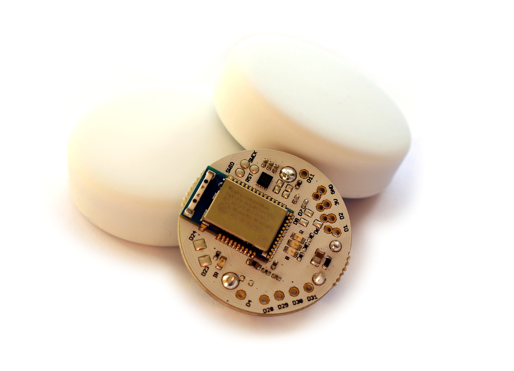
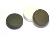

<!--- Copyright (c) 2016 Gordon Williams, Pur3 Ltd. See the file LICENSE for copying permission. -->
Puck.js
=======

<span style="color:red">:warning: **Please view the correctly rendered version of this page at https://www.espruino.com/Puck.js. Links, lists, videos, search, and other features will not work correctly when viewed on GitHub** :warning:</span>

* KEYWORDS: Espruino,Puck,Puckjs,Puck.js,nRF52832,nRF52,Nordic,Board,PCB,Pinout,Bluetooth,BLE,Bluetooth LE




Features
--------

* Bluetooth Low Energy
* Espruino JavaScript interpreter pre-installed
* nRF52832 SoC - 64MHz ARM Cortex M4, 64kB RAM, 512kB Flash
* 8 x 0.1" GPIO (capable of PWM, SPI, I2C, UART, Analog Input)
* 9 x SMD GPIO (capable of PWM, SPI, I2C, UART)
* ABS plastic rear case with lanyard mount
* Silicone cover with tactile button
* MAG3110 Magnetometer
* IR Transmitter
* Built in thermometer, light and battery level sensors
* Red, Green and Blue LEDs
* NFC tag programmable from JavaScript
* Pin capable of capacitive sensing
* Weight: 14g in plastic case, 20g in packaging
* Dimensions of cardboard box: 64mm x 62mm x 16mm
* Dimensions of plastic case: 36mm dia, 12.5mm thick
* Dimensions of bare PCB: 29mm dia, 9mm thick


<a name="buy"></a>Buying
------

You can now get Puck.js from several different distributors. [Click here to see them.](/Order#puckjs)

You can also buy kits of different color cases for Puck.js from [our Tindie store](https://www.tindie.com/stores/gfwilliams/):

[](https://www.tindie.com/products/gfwilliams/puckjs-black-cases/)
[](https://www.tindie.com/products/gfwilliams/puckjs-cases-red-yellow-green-blue/)
[](https://www.tindie.com/products/gfwilliams/puckjs-cases-black-red-yellow-green-blue/)


Turning Puck.js on
------------------

Puck.js is assembled with a **clear plastic tab** between the battery
and PCB to keep it turned off. To turn it on, you need to:

* Pull the silicone case off the top,
* Tip the PCB out
* Push the battery out from the back with a blunt object
* Make sure the clear plastic tab is removed
* Push the battery back in
* Reassemble (note that the battery should be facing the black plastic case,
  and the button (next to the battery) should be positioned as far away from
  the 'step' in the case as possible.

**Note: Do not re-fit the PCB upside-down or force it into the case.** If
positioned correctly it should slide in. Forcing the PCB or fitting it
upside-down could damage the aerial which will stop Puck.js's Bluetooth
from working correctly.


Resetting Puck.js
-----------------

Occasionally you may want to hard-reset Puck.js. To do this:

* Take the PCB out of the silicone case
* Place your finger nail between the Battery and the PCB, near the `Puck.js 1.x` text
* Gently pull the battery away from the PCB for 1 second and release
* The red LED should then flash, indicating that Puck.js had rebooted.

If you are not able to do that, you can always remove the battery by pushing it
out of the holder from behind with matchstick or biro. When you re-insert it,
Puck.js will have reset.


Tutorials
--------

First, it's best to check out the [Getting Started Guide](/Puck.js+Quick+Start)

Other tutorials using Puck.js:

* APPEND_USES: Puck.js

<a name="pinout"></a>Pinout
---------------------------

* APPEND_PINOUT: PUCKJS

**Note:** Puck.js has one available I2C, SPI and USART (and infinite software SPI and I2C).
Unlike other Espruino boards, these peripherals can be used on *any* pin.


Information
-----------

* [Circuit Diagram](https://github.com/espruino/EspruinoBoard/blob/master/Puck.js/pdf/puckjs_sch.pdf)
* [Board Layout](https://github.com/espruino/EspruinoBoard/blob/master/Puck.js/pdf/puckjs_brd.pdf)
* [3D Case design files](https://github.com/espruino/EspruinoBoard/tree/master/Puck.js/case)
* [nRF52832 Datasheet](/datasheets/nRF52832_PS_v1.0.pdf)
* [MDBT42 Datasheet](/datasheets/MDBT42Q-E.pdf)


On-board LEDs, Button and GPIO
-------------------------------

Puck.js contains LEDs and a button that can be accessed in the same way
as othe Espruino devices.

### LEDs

* You can use `digitalWrite(LED1,1)` to turn the first (red) LED on, and
`digitalWrite(LED1,0)` to turn it off. You can also use `LED2` for green
and `LED3` for blue, and for convenience `LED` is defined (which is the same as `LED1`).
* You can also use `LED1.write(1)` and `LED1.write(0)` to get the same effect
* As well as `LED1.set()` and `LED1.reset()` to get the same effect
* Finally, you can control all 3 LEDs at once using a binary number if you want
to with `digitalWrite([LED3,LED2,LED1], 7)`

### Button

* You can access the button's state with `digitalRead(BTN)` or `BTN.read()`
(the two commands are identical). `BTN1` is also defined, and is the same as `BTN`.
* Polling to get the button state wastes power, so it's better to use `setWatch`
to call a function whenever the button changes state:

```
setWatch(function() {
  console.log("Pressed");
}, BTN, {edge:"rising", debounce:50, repeat:true});
```

### GPIO pins

GPIO pins are numbered D0 to D31. Their numbers are usually written on the PCB.

You can use the same `digitalWrite`/`digitalRead` commands with these that you
do with the buttons, but you can also use [[PWM]], [[I2C]], [[SPI]] and [[Analog]].


On-board peripherals
--------------------

Puck.js's on-board peripherals are exposed by special-purpose functions

### Magnetometer

You can use [`Puck.mag()`](/Reference#l_Puck_mag) to return one magnetometer
reading (with x, y, and z axes).

However you can also leave the magnetometer on permanently and use it to
wake Puck.js up whenever it gets a reading. See [`Puck.magOn()`](/Reference#l_Puck_magOn)

```
Puck.magOn();
Puck.on('mag', function(xyz) {
  console.log(xyz);
});
// Turn events off with Puck.magOff();
```

### IR / Infrared

To transmit an IR signal, you just need to call [`Puck.IR([...])`](/Reference#l_Puck_IR)
with an array of times in milliseconds. They alternate between the time the signal
should be `on` and `off` - eg. `[on, off, on, off, on, etc]`.

For example the command to turn on a [cheap IR lightbulb](http://www.ebay.com/sch/i.html?_nkw=ir+rgb+light+bulb&_sacat=0) is:

```
Puck.IR([9.6,4.9,0.5,0.7,0.5,0.7,0.6,0.7,0.5,0.7,0.5,0.7,0.6,0.7,0.5,0.7,0.5,
  0.7,0.6,1.9,0.5,1.9,0.5,1.9,0.6,1.9,0.5,1.9,0.5,1.9,0.6,1.9,0.5,1.9,0.5,1.9,
  0.6,1.9,0.5,1.9,0.6,0.7,0.5,0.6,0.6,0.7,0.5,0.7,0.5,0.7,0.6,0.6,0.6,0.7,0.5,
  0.7,0.6,1.9,0.5,1.9,0.5,1.9,0.6,1.9,0.5,1.9,0.5,43.1,9.6,2.5,0.5]);
```

You can sometimes work this information out based on details online (for instance [Pronto codes](/pronto)), however
it's often easier to measure it by [attaching an IR receiver to your Puck.js](/Puck.js+Infrared).

Puck.js's IR has a range of around 1.5 meters, so it needs to be relatively close to the device it's controlling - however
range can be increased slightly by removing the silicone cover.

### NFC - Near Field Communications

To set Puck.js up to redirect to a new NFC URL, just use [NRF.nfcURL(...)](/Reference#l_NRF_nfcURL):

```
NRF.nfcURL("http://espruino.com");
```

or to turn off, call it with no arguments:

```
NRF.nfcURL();
```

### Light sensor

To get a light value you can simply call [`Puck.light()`](/Reference#l_Puck_light).

This returns an (uncalibrated) value between `0` and `1`

### Bluetooth

Bluetooth is provided by the [`NRF object`](/Reference#NRF).

Bluetooth itself is quite complicated, so it's best to refer to the tutorials
above, or check the documentation on [`NRF.requestDevice`](/Reference#l_NRF_requestDevice)
for an example of how to connect to another device.

### Temperature

Temperature can be accessed with `E.getTemperature()`. It returns the temperature in degrees C.

**Note:** This uses an on-die temperature sensor. It is accurate to ~1 degree C
for changes in temperature, however the absolute values can be 3-4 degrees C
different. For best accuracy, work out each Puck.js's temperature offset by calling
`E.getTemperature()` when it is at a known temperature.

### Battery level

Battery level (based on a normal CR2032 battery) can be accessed with
[`Puck.getBatteryPercentage()`](/Reference#l_Puck_getBatteryPercentage).
You can also get the battery voltage using [`NRF.getBattery()`](/Reference#l_NRF_getBattery).

### Capacitive sense

Puck.js contains a capacitive sense pin `D11`. To use it, simply add some wire
(preferably attached to something with a large surface area) to the `D11` pin.
Then call [`Puck.capSense()`](/Reference#l_Puck_capSense) - this will
return an integer value that rises as the capacitance attached to `D11` increases.


Serial Console
---------------

When power is first applied, Puck.js checks if pin `D28` is at 3.3v (which will be the
case if it is connected to a Serial port's transmit line). If it is, it initialises
the on-chip UART on `D28` (Puck.js RX) and `D29` (Puck.js TX) and puts the Espruino
console (REPL) on it at 9600 baud.

To use it, connect to a 3.3v output USB to TTL converter as follows:

| Puck.js  | USB->TTL converter |
|----------|--------------------|
| GND      | GND                |
| D28      | RX ( -> PC )       |
| D29      | TX ( <- PC )       |
| 3V       | 3.3v (Optional - to run without a battery) |

You can now use the normal Espruino Web IDE, or a serial terminal application at 9600 baud.

When you connect via Bluetooth, the console will automatically move over. To
stop this, execute `Serial1.setConsole(true)` to force the console to stay on
`Serial1`.

**Note:** Serial1 is not enabled by default because it requires the high speed
oscillator to stay on, which increases power draw a huge amount. If you connect
the UART but don't power down and power on Puck.js, you won't get a serial port.


Power Consumption
-----------------

Puck.js's power consumption depends a huge amount on not just how much
JavaScript code you execute, but how much you transmit, how often,
and at what power level.

Nordic provides [a tool to work out power consumption](https://devzone.nordicsemi.com/power/),
for advertising, but values are roughly:

* Not doing anything - 3uA
* Not doing anything, watching the button for presses - 12uA
* Advertising, 375ms 0dBm (default mode) - 20uA
* Advertising, 375ms 0dBm (default mode), watching the button - 25uA
* Advertising, magnetometer reading 0.63 Hz - 50uA
* Advertising, magnetometer reading 10 Hz - 200uA
* Connected via BLE - 200uA
* One LED lit - 1-2mA
* 100% CPU usage running JavaScript - 4mA
* All LEDs lit, 100% CPU usage running JavaScript - 10mA
* No LEDs lit, using `NRF.findDevices` to scan for devices - 12mA

Puck.js sends advertising data without ever executing JavaScript. To get
the best power consumption, make sure your code executes as rarely as
possible.


Firmware Updates
-----------------

**Note:** Firmware 1v95 is known to have problems pairing and connecting to Windows 10 (all other platforms work fine). This is fixed in 1v96 and later, so we'd recommend that you always use the latest firmware.

### via nRF Toolbox App (Android & iOS)

* On your Bluetooth LE capable phone, install the `nRF Toolbox` app
* Download the latest `espruino_xxx_puckjs.zip` file from [the binaries folder](/binaries)
* [Reset Puck.js](#resetting-puck-js) with the button held down - the Green LED should be lit
* Release the button within 3 seconds of inserting the battery - the Red LED should light instead. If it doesn't, you'll need to try again, holding the button down for less time after inserting the battery.
* Open the `nRF Toolbox` app
* Tap the `DFU` icon
* Tap `Select File`, choose `Distribution Packet (ZIP)`, and choose the ZIP file you downloaded
* If choosing the ZIP file opens the ZIP and displays files inside (it can do on some Android 7 devices) then hit back, long-press on the ZIP, and choose `Open` in the top right.
* Tap `Select Device` and choose the device called `DfuTarg`
* Now tap `Upload` and wait. The LED should turn blue and the DFU process will start - it will take around 90 seconds to complete
* After completion, reset Puck.js while keeping the button held for around 10 seconds. The green LED should light, followed by all 3, then the red LED blinking 5 times. Release the button after the blinking has stopped - this will clear out any previously saved code and bonding data that could have caused problems with a new firmware version.

### via nRF Connect App (Android)

[[http://youtu.be/N3CJbl29vy0]]

* On your Bluetooth LE capable phone, install the `nRF Connect` app
* Download the latest `espruino_xxx_puckjs.zip` file from [the binaries folder](/binaries)
* [Reset Puck.js](#resetting-puck-js) with the button held down - the Green LED should be lit
* Release the button within 3 seconds of inserting the battery - the Red LED should light instead. If it doesn't, you'll need to try again, holding the button down for less time after inserting the battery.
* Open the `nRF Connect` app
* It should show some Bluetooth devices, including one called `DfuTarg`
* Click `Connect` to the right of `DfuTarg`
* Once connected, a `DFU` symbol in a circle will appear in the top right of the App
* Click it, choose `Distribution Packet (ZIP)`, and your Download. If clicking on the downloaded zip file opens its contents (Android 7 may do this) then long-press on the zip and tap open instead.
* The DFU process will start - it will take around 90 seconds to complete
* After completion, reset Puck.js while keeping the button held for around 10 seconds. The green LED should light, followed by all 3, then the red LED blinking 5 times. Release the button after the blinking has stopped - this will clear out any previously saved code and bonding data that could have caused problems with a new firmware version.

Troubleshooting
---------------

### My Puck.js is not working when it arrives

Puck.js is assembled with a **clear plastic tab** between the battery
and PCB to keep it turned off.

See [here](#turning-puck-js-on) for instructions on removing it.

### Web Bluetooth doesn't appear in my Web IDE connection options

* Try following [these instructions](Puck.js Quick Start#with_web_bluetooth)
* Do you have an up to date version of Chrome? (`Help` -> `About Google Chrome`) - it should be at least version 51
* Have you enabled Web Bluetooth in `chrome://flags`?
* You need a Bluetooth LE-capable adaptor (at least Bluetooth 4.0). If your PC doesn't have one, you can [buy one for well under $10](http://www.ebay.com/sch/i.html?_nkw=usb+bluetooth+4+dongle&_sacat=0)
* **Android** needs to be at least version 6 (or version 5 with recent builds of Chromium)
* **Windows** isn't currently supported by Chrome. You can use the [Web Bluetooth Polyfill](https://github.com/urish/web-bluetooth-polyfill), or if you just need the IDE you can use the [packaged version of the Web IDE](/Web+IDE#as-a-native-application)
* **Linux** needs Bluez 5.41 or above - [see here for instructions on how to install it](/Web Bluetooth On Linux)
* **MacOS** needs OS X Yosemite or later. Older hardware will need an external USB dongle though - check that `Low Energy` supported in `About this Mac` -> `System Report`/`Bluetooth`  
* **Chrome OS** works fine

### I can't see my Puck.js in the IDE in Windows

* Are you sure some other device isn't connected to it? See the next item.
* Are you **sure** you're using the [native Espruino IDE](http://www.espruino.com/Puck.js+Quick+Start#with-an-application) as opposed to the IDE Website or Chrome App?
* **On Windows 10**, have your paired your Puck using the built-in Windows Bluetooth menu? You need that before the IDE can see it. If you can't pair then your PC may not support Bluetooth LE (even if it supports normal Bluetooth) and you may need an exernal Bluetooth dongle.
* **On Windows 7** you'll need a supported Bluetooth dongle that [may need setting up with Zadig](/Web+IDE#zadig)

### I can't see my Puck.js device any more

Puck.js can only accept one incoming connection at a time. When a device is connected
to it, it stops advertising its name.

As a result, if you can't see Puck.js advertising then it is probably because
some other device that is connected. It may even be *an application on the same device*.

### I can't reconnect to my Puck.js on Mac OS

This often happens if you've turned your Puck into a [HID device](/Puck.js+Keyboard) and paired it with your Mac.

* Close the Web Browser window that had the Web IDE in it
* Hold the `option` key down while clicking on the Bluetooth icon in the top right menu bar.
* You should see something like `Puck.js abcd` in bold on the drop-down list
* Click on it, and you'll see menu options for `Disconnect` and `Remove`
* Click `Remove`
* Open up the [Web IDE](/ide) in Chrome and try connecting again

### Connections to Puck.js sometimes fail

The firmware that the first Puck.js shipped with only advertises every 700ms, which means
that some devices/applications find it difficult to connect to it,

We'd recommend that you [update Puck.js's firmware](/Puck.js#firmware-updates)
to a more recent version which advertises every 350ms and is much more reliable
to connect to.

### I can't get the battery out

Poke it with something nonconductive from behind (where the button is). If you
just want to reset your Puck.js you can also lift the battery away from the PCB
slightly with a fingernail.

### When I insert the battery the green light comes on

This is because you're pressing the button down while putting it in. Try inserting the battery without the button pressed.

### When I insert the battery the red light comes on

You're in bootloader mode. You get to this when you press the button while inserting the battery and then release it.

To get out, just take the battery out and re-insert it without pressing the button.

### I disassembled my Puck.js and now the button won't click

Take it apart again, and place the area on the back with the text `Puck.js`
against the ledge on the plastic case (the dimples in the case should
align with the holes in the PCB).

### I can no longer connect to my Puck.js device from Android

Have you been running one of the `Nordic`/`nRF` applications? If so, make sure
it is closed (Click the square icon to get to the application chooser, and swipe
the application to the left or right)

### When I disconnect the battery, my code is lost. How do I save it?

It's as easy as typing `save()` in the left-hand side of the IDE. When power is re-applied Espruino will resume where it left off, remembering timers, watches, and even pin state. For certain things (like initialising connected hardware like displays) you'll want to run some code when Espruino starts up, in which case you can just add a function called `onInit()` - this will be executed each time Espruino starts.

For more information, see the [page on Saving](/Saving).

### I saved some code and my Puck.js no longer works

* [Reset Puck.js](#resetting-puck-js) with the button held down - the Green LED will light.
* Keep the button pressed for ~3 seconds until all 3 LEDs light
* Release the button
* The Green LED will flash 5 times (this is the self-test)

Puck.js will now have booted without loading the saved code. However it won't
have deleted your saved code. To do that, you'll need to log in and type
`save()`. It's also an idea to type `E.setBootCode("")` as well, as this will
clear any JS code that was saved if `Save on Send` was turned on in the IDE.

### How can I change my Puck's name?

Check out the reference pages for [NRF.setAdvertising](https://www.espruino.com/Reference#l_NRF_setAdvertising)...

You can simply call `NRF.setAdvertising({},{name:"My Name"});` to change your Puck's advertised name!

### It's some other problem!

Check out the [main troubleshooting page](/Troubleshooting) and also the [Espruino Forums](http://forum.espruino.com/)
