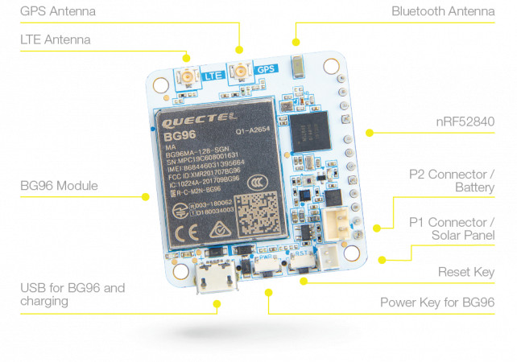
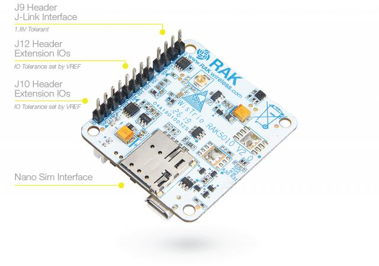

<!--- Copyright (c) 2020 Gordon Williams, Pur3 Ltd. See the file LICENSE for copying permission. -->
iTracker RAK5010
=======================

<span style="color:red">:warning: **Please view the correctly rendered version of this page at https://www.espruino.com/RAK5010. Links, lists, videos, search, and other features will not work correctly when viewed on GitHub** :warning:</span>

* KEYWORDS: Third Party Board,nRF52,nRF52832,RAK,iTracker,RAK5010,GSM,GPRS,GPS
* USES: GPS,ATSMS,QuectelBG96,LIS3DH,OPT3001,LPS22HB,SHT3C




The [RAK5010](https://www.rakwireless.com/en-us/products/nb-iot-boards/rak5010-nb-iot-tracker) is an advanced, highly flexible NB-IoT tracker based on Quectel BG96 LTE Cat M1&NB1, integrated with GPS, BLE and a variety of sensors. The MCU running the board is a Nordic nRF52840 controller.

With the GPS and BLE features, the device can be used in a wide range of applications from outdoor to indoor scenarios where location based service are necessary.

The board is equipped with four sensors on board: humidity and temperature sensor, pressure sensor, 3-axis motion sensor, and ambient light sensor. Additionally, the extension IOs in the module allow expandable sensor application in addition to the on-board ones.

This board is particularly suitable to be used as a quick testing and prototyping tool for applications requiring Nb-IoT connectivity. Application development supports the GCC environment.

Binaries can be found in:

* the [Downloadable zip of firmare](/Download#RAK5010) (current version)
* the [binaries folder](/binaries) (current version)
* the [automatic Travis Builds](https://www.espruino.com/binaries/travis/master/) (cutting edge builds)

Contents
--------

* APPEND_TOC

Using
-----

### Serial connection

When the iTracker powers on or is reset, if it detects a USB connection it will appear
as a USB serial port device (USB CDC). Otherwise it can be programmed via
Bluetooth LE.

*iTracker is not yet able to detect a USB connection that is plugged in
after it has started up*

iTracker does contain two Serial ports, so you can use `Serial2` for
communications while `Serial1` is in use for GPS.


### GPS

There is no separate GPS chip on the RAK5010. Instead, it is built into the
BG96. Use as follows - this also turns the BG96 on if it wasn't already enabled.

```
require("iTracker").setGPSOn(true, function(err, gps) {
  /* gps contains: {
    at : AT command handler
    on : function(callback(err)) // turn GPS on (turned on automatically)
    off : function(callback(err)) // turn GPS off
    get : function(callback(data)) // get GPS data
  } */
  setInterval(function() {
    gps.get(function(data) {
      print("GPS", data);
      /* returns {error:...} on failure. 'ERROR: 516' means 'no fix'
         returns { raw : raw data as <UTC>,<latitude>,<longitude>,<hdop>,<altitude>,<fix>,<cog>,<spkm>,<spkn>,<date>,<nsat>
                   lat :   latitude in degrees,
                   lon :   longitude in degrees,
                   alt : altitude in m  } */
    });
  }, 10000);
});
```

**Note** you'll probably get `GPS {"error": "ERROR: 516"}` initally. This just means 'no fix' and
you just need to wait a few seconds/minutes until the data starts being populated properly.

### Modem testing

The following code will power up the modem and report back the version number.
It's a quick, easy way to test it without needing an active SIM.

```
var at;
console.log("Turning Cell on");
require("iTracker").setCellOn(true, function(usart) {
  console.log("Cell now on");
  at = require("AT").connect(usart);
  // at.debug(); // this enables printing of data received for debug purposes
  at.cmd("AT+GMR\r\n",1000,function cb(d) {
    if (d=="AT+GMR") return cb;
    if (d!="OK") console.log("Version is "+d);
  });
});
```

You can use the [AT Module (click here fore more info)](/AT) in this way to send your own custom commands
as well (it's also available as `sms.at` and `gprs.at` in the examples below.

### SMS

See [the ATSMS module](/ATSMS) for full documentation.

```
var sms;

console.log("Turning Cell on");
require("iTracker").setCellOn(true, function(usart) {
  console.log("Connecting SMS");
  var ATSMS = require("ATSMS");
  sms = new ATSMS(usart);
  //Use sms.at.debug(); here if you want debug messages

  sms.init(function(err) {
    if (err) throw err;
    console.log("Initialised!");

    sms.list("ALL", function(err,list) {
      if (err) throw err;
      if (list.length)
        console.log(list);
      else
        console.log("No Messages");
    });

    // and to send a message:
    //sms.send('+441234567890','Hello world!', callback)
  });

  sms.on('message', function(msgIndex) {
    console.log("Got new message, index ", msgIndex);
  });

  // when done use require("iTracker").setCellOn(false)
});
```

### GSM/GPRS

See [the QuectelBG96 module](/QuectelBG96) for full documentation. This
handles proper internet access.

```
function connectionReady() {
  var http = require("http");
  http.get("http://www.pur3.co.uk/hello.txt", function(res) {
    res.on('data', function(data) {
      console.log(data);
    });
  });
}

var gprs;
console.log("Turning Cell on");
require("iTracker").setCellOn(true, function(usart) {
  console.log("Waiting 30 sec for modem to boot");
  setTimeout(function() {
    console.log("Connecting GPRS");
    gprs = require('QuectelBG96').connect(usart, {
      apn : "",
      username : "",
      password : "",
      // debug : true // to show raw AT command info
    }, function(err) {
      if (err) throw err;
      console.log("Connected!");
      connectionReady();
    });
    // gprs.debug(); // show just debug info from BG96 module
  }, 30000);
});
```

After a while `Hello World!` will be displayed - the contents of `http://www.pur3.co.uk/hello.txt`.

To use [Hologram](https://www.hologram.io/), all you need to do is change `apn : "",` to `apn : "hologram",` and upload the code.


### NB-IoT

[This blog post by Wolfgang Klenk](https://wolfgangklenk.wordpress.com/2018/10/12/espruino-on-rak8212-accessing-the-nb-iot-nb1-modem/) shows how to get connected with Vodafone's NB-IoT in Germany.


### Sensors

```
a = require("iTracker").setAccelOn(true, function() {
  console.log(a.read()); // {x,y,z}
});
// { "x": 0.439453125, "y": -0.14453125, "z": -0.150390625 }

o = require("iTracker").setOptoOn(true, function() {  
  console.log(o.read());
});
// 217.44

p = require("iTracker").setPressureOn(true, function() {  
  console.log(p.get());
});
p.on('data', print);
// { "pressure": 1011.04125976562, "temperature": 25.79, "new": true }

e = require("iTracker").setEnvOn(true, function() {  
  e.read(function(d) {
    print(d);
  });
});
// { "humidity": 42.67883300781, "temp": 24.81201171875 }
```

Reference
----------

`iTracker.setGPSOn = function(isOn, callback)  { ... }`

Return [[GPS]] instance. callback is called whenever data is available!

`iTracker.setEnvOn = function(isOn, callback)  { ... }`

Returns [[SHT3C]] instance. callback when initialised. Then use 'read(callback)' to get data

`iTracker.setAccelOn = function(isOn, callback) { ... }`

Returns a [[LIS3DH]] instance. callback when initialised. Then use `read` to get data

`iTracker.setOptoOn = function(isOn, callback) { ... }`

Returns a [[OPT3001]] instance. callback when initialised. Then use `read` to get data

`iTracker.setPressureOn = function(isOn, callback)  { ... }`

Returns a [[LPS22HB]] instance. callback when initialised. Then use 'get' to get data, or the `on('data'` event

`iTracker.setCellOn = function(isOn, callback) { ... }`

Turn cell connectivity on - will take around 8 seconds. Calls the `callback(usart)` when done. You then need to connect either [[ATSMS]] or [[QuectelBG96]] to the serial device `usart`

`iTracker.setCharging = function(isCharging) { ... }`

Set whether the TP4054 should charge the battery (default is yes)

`iTracker.isCharging = function() { ... }`

Get whether the TP4054 is charging the battery

`NRF_IO1 / NRF_IO2 / NRF_IO3 / NRF_IO4`

IO pins. Note - these need VREF to be connected to 3.3v to function

`AIN`

Analog input pin

`PINS`

List of IO pins

`i2c`

I2C interface used for communicating with on-board peripherals


Tutorials
---------

First, it's best to check out the [Getting Started Guide](/Quick+Start+BLE#RAK5010)

Tutorials using Bluetooth LE:

* APPEND_USES: Only BLE

Tutorials using Bluetooth LE and functionality that may not be part of the iTracker:

* APPEND_USES: BLE,-Only BLE


Pinout
--------

* APPEND_PINOUT: RAK5010


Firmware Updates
-----------------

You need to attach a nRF52DK or other SWD programmer to the `SWDCLK`
and `SWDIO` pins, then upload the hex file by copying it to the `JLINK` drive
or using `nrfjprog`.
