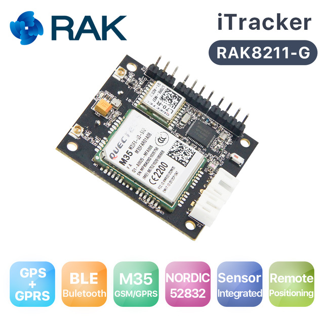

<!--- Copyright (c) 2018 Gordon Williams, Pur3 Ltd. See the file LICENSE for copying permission. -->
iTracker RAK8211 (G/NB)
=======================

<span style="color:red">:warning: **Please view the correctly rendered version of this page at https://www.espruino.com/RAK8211. Links, lists, videos, search, and other features will not work correctly when viewed on GitHub** :warning:</span>

* KEYWORDS: Third Party Board,nRF52,nRF52832,RAK,iTracker,RAK8211,RAK8211-G,RAK8211-NB,GSM,GPRS,GPS
* USES: GPS,ATSMS,QuectelM35,BME280,LIS2MDL,LIS3DH,OPT3001



Binaries can be found in:

* the [Downloadable zip of firmare](/Download#RAK8211) (current version)
* the [binaries folder](/binaries) (current version)
* the [automatic Travis Builds](https://www.espruino.com/binaries/travis/master/) (cutting edge builds)

Contents
--------

* APPEND_TOC

Using
-----

### Serial connection

When the iTracker powers on, if it detects 3.3v on pin `D28` (Serial RX)
then it will enable serial comms at 9600 baud on `D28`(RX) and `D29`(TX).

For instance if the iTracker is connected to the adaptor board
and that board is powered on, you'll be able to use the USB
Serial interface to program your iTracker.

**However** there is just one Serial port on the nRF52. If you then use
GPS or GSM, the connection to `D28/D29` will be moved, removing your
communications. If you need to maintain communications during that time,
please connect via Bluetooth instead.

### GPS

```
require("iTracker").setGPSOn(true,print)
/* { "time": "23:59:43",
  "lat": NaN, "lon": NaN,
  "fix": 0, "satellites": 0, "altitude": NaN } */
```

When a fix is received, the values no longer be `NaN` and `fix` will be 1.

### Modem testing

The following code will power up the modem and report back the version number.
It's a quick, easy way to test it without needing an active SIM.

```
var at;
console.log("Turning Cell on");
require("iTracker").setCellOn(true, function(usart) {
  console.log("Cell now on");
  at = require("AT").connect(usart);
  at.cmd("AT+GMR\r\n",1000,function cb(d) {
    if (d=="AT+GMR") return cb;
    if (d!="OK") console.log("Version is "+d);
  });
});
```

You can use the [AT Module](/AT) in this way to send your own custom commands
as well (it's also available as `sms.at` and `gprs.at` in the examples below.

### SMS

See [the ATSMS module](/ATSMS) for full documentation.

```
var sms;

console.log("Turning Cell on");
require("iTracker").setCellOn(true, function(usart) {
  console.log("Connecting SMS");
  var ATSMS = require("ATSMS");
  sms = new ATSMS(usart);
  //Use sms.at.debug(); here if you want debug messages

  sms.init(function(err) {
    if (err) throw err;
    console.log("Initialised!");

    sms.list("ALL", function(err,list) {
      if (err) throw err;
      if (list.length)
        console.log(list);
      else
        console.log("No Messages");
    });

    // and to send a message:
    //sms.send('+441234567890','Hello world!', callback)
  });

  sms.on('message', function(msgIndex) {
    console.log("Got new message, index ", msgIndex);
  });

  // when done use require("iTracker").setCellOn(false)
});
```

### GSM/GPRS

See [the QuectelM35 module](/QuectelM35) for full documentation.

```
function connectionReady() {
  var http = require("http");
  http.get("http://www.pur3.co.uk/hello.txt", function(res) {
    res.on('data', function(data) {
      console.log(data);
    });
  });
}

var gprs;
console.log("Turning Cell on");
require("iTracker").setCellOn(true, function(usart) {
  console.log("Waiting 30 sec for GPRS connection");
  setTimeout(function() {
    console.log("Connecting GPRS");
    gprs = require('QuectelM35').connect(usart, {}, function(err) {
      console.log("Connected!");
      if (err) throw err;
      connectionReady();
    });
  }, 30000);
});
```

### Sensors

```
e=require("iTracker").setEnvOn(true, function() {
  console.log(e.getData());
});
// { "temp": 27.05661935425, "pressure": 1007.23205361758, "humidity": 40.728515625 }

m=require("iTracker").setMagOn(true, function() {
  console.log(m.read());
});
// { "x": -92, "y": -17, "z": 424 }

a=require("iTracker").setAccelOn(true, function() {
  console.log(a.read());
});
// { "x": 0.0263671875, "y": 0.3505859375, "z": -0.3291015625 }

o=require("iTracker").setOptoOn(true, function() {
  console.log(o.read());
});
// 2709.76
```

Reference
----------

`iTracker.setGPSOn = function(isOn, callback)  { ... }`

Return [[GPS]] instance. callback is called whenever data is available!

`iTracker.setEnvOn = function(isOn, callback)  { ... }`

Returns [[BME280]] instance. callback when initialised. Call `getData` to get the information

`iTracker.setMagOn = function(isOn, callback)  { ... }`

Returns a [[LIS2MDL]] instance. callback when initialised. Then use `read` to get data

`iTracker.setAccelOn = function(isOn, callback) { ... }`

Returns a [[LIS3DH]] instance. callback when initialised. Then use `read` to get data

`iTracker.setOptoOn = function(isOn, callback) { ... }`

Returns a [[OPT3001]] instance. callback when initialised. Then use `read` to get data

`iTracker.setCellOn = function(isOn, callback) { ... }`

Turn cell connectivity on - will take around 8 seconds. Calls the `callback(usart)` when done. You then need to connect either [[ATSMS]] or [[QuectelM35]] to the serial device `usart`

`iTracker.setCharging = function(isCharging) { ... }`

Set whether the BQ24210 should charge the battery (default is yes)

Tutorials
---------

First, it's best to check out the [Getting Started Guide](/Quick+Start+BLE#RAK8211)

Tutorials using Bluetooth LE:

* APPEND_USES: Only BLE

Tutorials using Bluetooth LE and functionality that may not be part of the iTracker:

* APPEND_USES: BLE,-Only BLE


Pinout
--------

* APPEND_PINOUT: RAK8211


Firmware Updates
-----------------

You need to attach a nRF52DK or other SWD programmer to the `SWDCLK`
and `SWDIO` pins.
