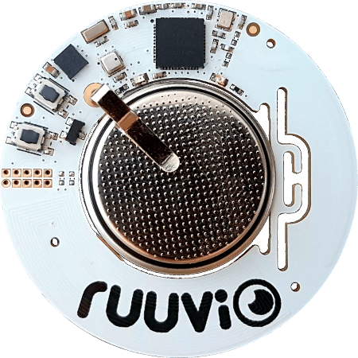

<!--- Copyright (c) 2017 Gordon Williams, Pur3 Ltd. See the file LICENSE for copying permission. -->
Ruuvitag
========

<span style="color:red">:warning: **Please view the correctly rendered version of this page at https://www.espruino.com/Ruuvitag. Links, lists, videos, search, and other features will not work correctly when viewed on GitHub** :warning:</span>

* KEYWORDS: Third Party Board,nRF52,nRF52832,Ruuvi,Ruuvitag,Board,Module



The Ruuvitag is a Bluetooth LE beacon with an environment sensor and accelerometer built in.

<a name="firmware-updates"></a>Full details on flashing Ruuvitag can be found at [https://ruu.vi/setup](https://ruu.vi/setup/)

Binaries can be found in:

* the [Downloadable zip of firmare](/Download#ruuvitag) (current version)
* the [binaries folder](/binaries) (current version)
* the [automatic Travis Builds](https://www.espruino.com/binaries/travis/master/) (cutting edge builds)

Contents
--------

* APPEND_TOC

Using
-----

Ruuvitag can be used like any other Espruino Bluetooth LE device, with full access to the [NRF](http://www.espruino.com/Reference#NRF) class for BLE Functionality.

Check out the [Getting Started Guide](/Quick+Start+BLE#ruuvitag)

However to use the built-in sensors you will need to use the Ruuvitag library. For instance to get data, use:

```
var Ruuvitag = require("Ruuvitag");
Ruuvitag.setEnvOn(true);
Ruuvitag.setAccelOn(true);
console.log(Ruuvitag.getEnvData());
// prints { "temp": 23.70573815741, "pressure": 1017.27733597036, "humidity": 42.0771484375 }
console.log(Ruuvitag.getAccelData());
// prints { "x": 3.90625, "y": -7.8125, "z": 984.375 }
```

You can also call a function whenever acceleration data is received:

```
var Ruuvitag = require("Ruuvitag");
Ruuvitag.setAccelOn(true, function(xyz) {
  console.log(xyz);
});
```

By default Espruino uses the low power accelerometer mode, however the peripherals can be accessed directly:

* `Ruuvitag.env` is an instance of the [BME280](/BME280) environment sensor library
* `Ruuvitag.accel` is an instance of the [LIS2DH12](/LIS2DH12) accelerometer library

Saving Code
-----------

Normally, uploading code to Espruino will put everything in RAM and it will be
lost when power is removed. You can type `save()` on the left-hand side of the IDE
to save to Flash memory though ([more information](/Saving)).

When you do that, the sensors will require initialising at power on (so may
  not work if you 'just' save your code). You'll need to create an `onInit`
  function like this, where you turn the sensors' power on at boot time:

```
var Ruuvitag = require("Ruuvitag");

function onInit() {
  Ruuvitag.setAccelOn(true, function(xyz) {
    console.log(xyz);
  });
}
```

Tutorials
---------

First, it's best to check out the [Getting Started Guide](/Quick+Start+BLE#ruuvitag)

Tutorials using Bluetooth LE:

* APPEND_USES: Only BLE

Tutorials using Bluetooth LE and functionality that may not be part of Ruuvitag:

* APPEND_USES: BLE,-Only BLE


Reference
---------

* APPEND_JSDOC: Ruuvitag.js


Firmware Updates
-----------------

Check out [Ruuvi's DFU instructions](https://lab.ruuvi.com/dfu/)
