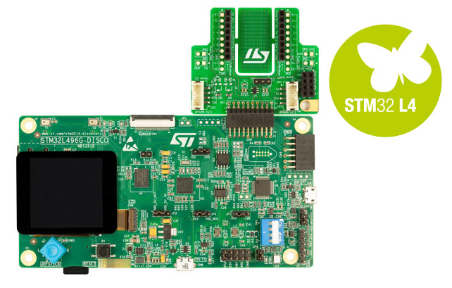

<!--- Copyright (c) 2018 Gordon Williams, Pur3 Ltd. See the file LICENSE for copying permission. -->
STM32L496G Discovery Board
==========================

:warning: **Please view the correctly rendered version of this page at https://www.espruino.com/STM32L496GDISCOVERY. Links, lists, videos, search, and other features will not work correctly when viewed on GitHub** :warning:

* KEYWORDS: Espruino,STM32L496GDISCOVERY,STM32,STM32L4,STM32L496,STM32L496G,STM32L496AG,32L496GDISCOVERY,Discovery,Pinout

The 32L496GDISCOVERY Discovery board is a complete demonstration and development platform for STMicroelectronics ARM® Cortex®-M4 core-based STM32L496AG microcontroller.

Features
--------

* STM32L496AGI6 microcontroller featuring 1 Mbyte of Flash memory and 320 Kbytes of RAM in an UFBGA169 package
* microSD™ card connector
* STMod+ and PMOD connectors
* 8 Mbit-PSRAM
* 64 Mbit-Quad-SPI Flash
* 8 LEDs
* Reset push button
* 4 direction-joystick with selection
* USB OTG FS with Micro-AB connector
* Compatible Arduino™ Uno V3 connectors
* On-board ST-LINK/V2-1 debugger

Buying
-------------------------

This board can be [purchsed direct from ST or from distributors](http://www.st.com/en/evaluation-tools/32l496gdiscovery.html#samplebuy-scroll).

Getting Started
----------------

* Plug the Discovery board in via the `USB STLINK` USB connector.
* Go to http://www.espruino.com/binaries (or http://www.espruino.com/binaries/travis/master/
  for the absolute latest builds) and download the latest file named `espruino_*_stm32l496gdiscovery.bin`
* Save it to the `DIS_L496ZG` drive that should have appeared on your computer and wait for the LEDs on the board to stop flashing

And you're ready to go! Follow the [Getting Started Guide](/Quick+Start) for details
on getting the IDE connected via USB. You can communicate with the board via the
`USB STLINK` USB connector or the `OTG FS` USB connector (`OTG FS` takes priority if connected).

Information
-----------

* [STM32L496AG information](http://www.st.com/en/microcontrollers/stm32l496ag.html)
* [Dicovery board information](http://www.st.com/en/evaluation-tools/32l496gdiscovery.html)

Pinout
---------------------------

**Note:** All pins on Arduino headers are available via [the `Nucleo` object](http://www.espruino.com/Reference#Nucleo),
eg. `Nucleo.A1`.

* APPEND_PINOUT: STM32L496GDISCOVERY
