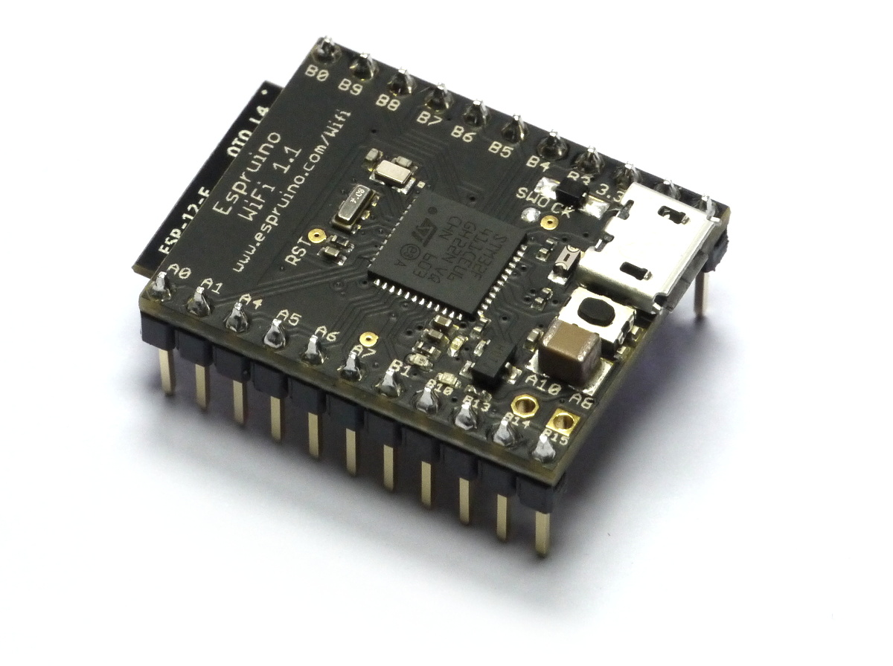

<!--- Copyright (c) 2013 Gordon Williams, Pur3 Ltd. See the file LICENSE for copying permission. -->
Espruino WiFi
=============

* KEYWORDS: Espruino WiFi,WiFi,Wireless,Internet,Radio,ESP8266,Board,PCB,Pinout



**Note:** Espruino WiFi provides an easy, well-supported way to get on the Internet, however it's not the only way to access a WiFi network from an Espruino board. [See here](/Internet#related-pages) for more information.

Features
-------

* 30mm x 23mm (1.2 x 0.9 inch)
* On-board Micro USB connector
* 2 rows of 11 0.1" pins, with 2 extra 0.1" holes
* 21 GPIO pins : 8 Analog inputs, 20 PWM, 1 Serial, 3 SPI, 3 I2C
* Three on-board LEDs (2x user programmable, 1x WiFi activity) and one button.
* [STM32F411CEU6](/datasheets/STM32F411xE.pdf) 32-bit 100MHz ARM Cortex M4 CPU
* 512kb flash, 128kb RAM
* ESP8266 WiFi (802.11 b/g/n)
* All GPIO is 5 volt tolerant (Arduino compatible)
* RTC with external oscillator
* On-board 3.3v 250mA voltage regulator, accepts voltages from 3.5v to 16v (**Note:** with WiFi on, it's recommended that you power the board with 5v or less to minimise the voltage regulator's temperature)
* Current draw in sleep: &lt; 0.05mA - over 2.5 years on a 2500mAh battery
* 500mA polyfuse on board

<a name="buy"></a>Buying
------

<!-- You can now get an Espruino WiFi from several different distributors. [Click here to see them.](/Order) -->
Espruino WiFi is currently only available from [our Tindie store](https://www.tindie.com/products/gfwilliams/espruino-wifi).


Pinout
------

* APPEND_PINOUT: ESPRUINOWIFI


Information
-----------

* [Circuit Diagram](https://github.com/espruino/EspruinoBoard/blob/master/WiFi/pdf/espruino_wifi_sch.pdf)
* [Board Layout](https://github.com/espruino/EspruinoBoard/blob/master/WiFi/pdf/espruino_wifi_brd.pdf)
* [STM32F411CE Datasheet](/datasheets/STM32F411xE.pdf)
* [STM32F411CE Reference Manual](/datasheets/STM32F411xE_ref.pdf)


Using WiFi
----------

To use wifi, simply require the EspruinoWiFi module and call `connect`:

```
var WIFI_NAME = "";
var WIFI_OPTIONS = { password : "" };

var wifi = require("EspruinoWiFi");
wifi.connect(WIFI_NAME, WIFI_OPTIONS, function(err) {
  if (err) {
    console.log("Connection error: "+err);
    return;
  }
  console.log("Connected!");
  getPage();
});

function getPage() {
  require("http").get("http://www.pur3.co.uk/hello.txt", function(res) {
    console.log("Response: ",res);
    res.on('data', function(d) {
      console.log("--->"+d);
    });
  });
}
```

**Note:** If you want Espruino to connect at power on, make sure that you
call the WiFi initialisation code inside an `onInit` function - eg:

```
var WIFI_NAME = "";
var WIFI_OPTIONS = { password : "" };

var wifi;

function onInit() {
  wifi = require("EspruinoWiFi");
  wifi.connect(WIFI_NAME, WIFI_OPTIONS, function(err) {
    if (err) {
      console.log("Connection error: "+err);
      return;
    }
    console.log("Connected!");
    getPage();
  });
}
```

Espruino WiFi's module is designed to work similarly to the [ESP8266 native WiFi module](http://www.espruino.com/Reference#Wifi),
however *you can't use the `WiFi` module directly*. Eventually you will, however this is still in development.

* APPEND_JSDOC: ../devices/EspruinoWiFi.js


Tutorials
---------

Tutorials using the Espruino WiFi Board:

* APPEND_USES: EspruinoWiFi

There aren't currently many tutorials using this board, however it can be used just like the [Espruino Pico](/Pico), which has a lot of tutorials available.


Hardware Limitations
------------------

* You can only have one watched pin of each number (Watching A0 and A1 is fine, but watching A1 and B1 isn't)
* When in Deep sleep, pin B9 cannot be used as a watch (as A9 is used to wake up on USB)


Troubleshooting
-------------

Please see the [[Troubleshooting]] section.


Advanced Reflashing
-----------------

In very rare cases (if you are experimenting with writing to Flash Memory), you may be able to damage the bootloader, which will effecitively 'brick' the Espruino WiFi.

To fix this, you'll have to use the hard-wired USB DFU (Device Firmware Upgrade) bootloader. You can also use this method for flashing non-Espruino firmwares to Espruino.

Just:

* Short out the `BOOT0/BTN` solder jumper on the back of the board - you can do this by drawing over it with a pencil.
* Install [ST's DFU utility](http://www.st.com/web/en/catalog/tools/FM147/CL1794/SC961/SS1533/PF257916) on Windows, or [dfu-util](http://dfu-util.sourceforge.net/) for Mac or Linux
* Download the latest Espruino WiFi binary from [espruino.com/binaries](http://www.espruino.com/binaries/)
* Hold down the Espruino WiFi's button while plugging it into USB
* Use the DFU tool to flash the firmware. Using the GUI on windows, or with the command `sudo dfu-util -a 0 -s 0x08000000 -D espruino_binary_file.bin` for `dfu-util` on Mac/Linux.
* Un-short the `BOOT0/BTN` jumper to re-use the original Espruino Bootloader. If you used a Pencil mark then you may need to use cleaning fluid and a small brush to totally clear out the graphite.
