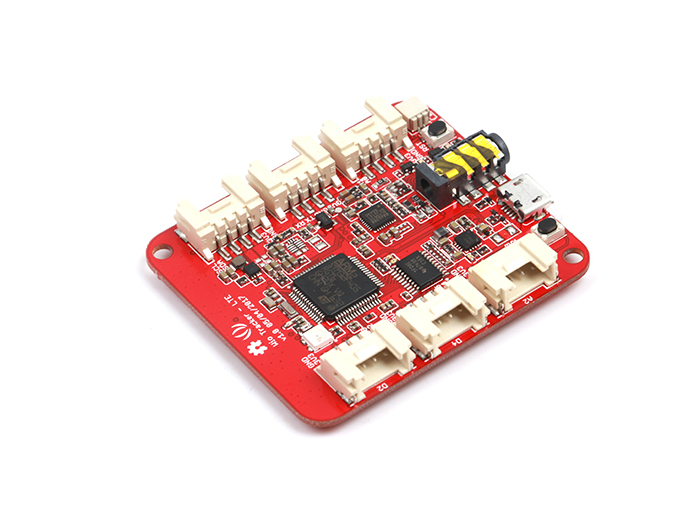

<!--- Copyright (c) 2017 Gordon Williams, Pur3 Ltd. See the file LICENSE for copying permission. -->
Seeed Wio LTE
=============

<span style="color:red">:warning: **Please view the correctly rendered version of this page at https://www.espruino.com/WioLTE. Links, lists, videos, search, and other features will not work correctly when viewed on GitHub** :warning:</span>

* KEYWORDS: Third Party Board,Seeed,Wio,LTE,UMTS,Board,Module,GPS



The [Seeed Wio LTE](http://wiki.seeed.cc/Wio_Tracker_LTE_CAT1/) board is an open source gateway which enable faster IoT GPS solutions.

It contains:

* Worldwide LTE and UMTS/HSPA+
* GPS/BeiDou/GLONASS/Galileo and QZSS
* 6 [Grove](/Grove) Connectors
* Nano SIM and TF card 2 in 1 socket

Full details on flashing can be found on <a name="firmware-updates"></a>[Seeed's website](https://github.com/SeeedDocument/Wio_LTE#software-updates)

Binaries can be found in:

* the [Downloadable zip of firmare](/Download#Wio_LTE) (current version)
* the [binaries folder](/binaries) (current version)
* the [automatic Travis Builds](https://www.espruino.com/binaries/travis/master/) (cutting edge builds)

Contents
--------

* APPEND_TOC

Pinout
------

* APPEND_PINOUT: WIO_LTE

Using
-----

**Seeed has a [complete Getting Started Guide here](https://github.com/SeeedDocument/Wio_LTE)
which is the best source of information**

Seeed Wio LTE can be used much like any other Espruino USB device, with
the exception of the on-board LED which needs to be accessed with the
`WioLTE.LED(r,g,b)` function.

The built-in object `WioLTE` provides useful functionality:

```
WioLTE.setLEDPower(true);
WioLTE.LED(r,g,b); // Output a color on the LED (values range 0..255)
```

There are also built-in variables for each of the [Grove](/Grove)
connectors marked on the board. These are two-element arrays of Pins:

```
WioLTE.D38
WioLTE.D20
WioLTE.A6
WioLTE.A4
WioLTE.I2C
WioLTE.UART
```

They can be used with Espruino's [Grove modules](/Grove),
however remember to turn power on with `WioLTE.setGrovePower(true);`
first!

You can also access them directly:

```
WioLTE.D38[0].write(1);
digitalWrite(WioLTE.D38[0]);

var pin = WioLTE.D38[0];
digitalWrite(pin, 0);
```


Using SD Card
-------------

The SD card can be accessed with [Espruino's normal File IO](/File+IO).

However you must be careful not to use it less than 4 seconds before
power-on, as the SD card will not have initialised by that point.

```
var fs = require('fs');

// Init SDCard
WioLTE.init;

var test = function() {
  // List files
  console.log('List files on root path:\r\n', fs.readdirSync());
  // Write file  
  fs.writeFileSync("hello.txt", "Hello World");
  // read file
  console.log(fs.readFileSync("hello.txt"));
  // append file
  fs.appendFileSync("hello.txt", "!!!");
  // read again
  console.log(fs.readFileSync("hello.txt"));
};

setTimeout(test, 4000);
```

Using LTE and GPS
-----------------

To use this functionality, you need to `require` the `wiolte` module
with `require('wiolte')`.

An example showing how to connect, use the [[Internet]] connection,
GPS, and SMS is below:

```
var board;
var APN = "UNINET";
var USERNAME = "";
var PASSWORD = "";

function wiolteStart(debug_quectel, debug_at) {
  debug_quectel = debug_quectel || false;
  debug_at = debug_at || false;

  board = require('wiolte').connect(function(err) {
    console.log("connectCB entered...");
    if (err) throw err;
    setTimeout(doConnect,3000);
  });

  board.debug(debug_quectel, debug_at);

}

function doConnect() {
  board.connect(APN, USERNAME, PASSWORD, function(err) {
    console.log("connectCB entered...");
    if (err) throw err;
    board.getIP(print);

    // work after connected
    setTimeout(onConnected, 5000);

  });
}

function onConnected(){
  // Handle call coming
  board.on('RING', function(){
  });

  // Handle SMS coming
  board.on('message', function(id){
    board.SMS.read(id, function(d, sms){
      if(d !== "OK") throw new Error(d);
      console.log('SMS from:', sms.oaddr);
      console.log(':', sms.text);
    });
  });

  // fetch longitude, latitude every 10 s
  board.geoLocStart(10000);

  GetHtmlPage("http://www.pur3.co.uk/hello.txt");
}

function GetHtmlPage(html_page){
  require("http").get(html_page, function(res) {
    var contents = "";

    console.log("Response: ",res);

    res.on('data', function(d) {
      contents += d;
    });

    res.on('close', function(d) {
		console.log("Connection closed");
		console.log("full page content ---> \r\n"+contents);
    });
  });
}

function GeoLoc() {
  var coord="";
  board.geoLocGet(function(err, coord) {
    if(err) throw err;
    console.log("longitude latitude = " + coord.lat,coord.lng);
  });
}

wiolteStart();
```

Once initialised with:

```
board = require('wiolte').connect(function(err) {
  if (err) throw err;
  console.log("Successfully connected!);
});
```

Functionality provided is:
* `debug(boolean, boolean)` - choose debug level
* `reset(callback)` - Reset LTE
* `init(callback)` - Initialise LTE
* `getVersion(callback)` - returns LTE firmware version
* `connect(apn, username, password, callback)` - Connect to mobile network
* `getVersion(callback)` - returns current version
* `getIP(callback)` - Get current IP address
* `geoLocStart(period_in_milliseconds)` - Start getting geolocation data
* `geoLocStop()` - Stop getting geolocation data
* `geoLocGet(callback)` - Get last location
* `geoLocConvert(callback(err,latlong))` - Get last location as latitude/longitude
* `board.SMS` - SMS functionality with `init/read/send/list/delete` functions based on the [[ATSMS]] module
* `board.Call`, with:
  * `call(number, callback)`  
  * `answer(callback)`  
  * `hangup(callback)`  
  * `handleRing(boolean)` - if trie, will call any function added with `board.on('RING', ...)`
* `sleep(callback)` -  LTE modem get into sleep mode, it can save about 100mA
* `wake(callback)` -  LTE modem wake up from sleep mode


Buying
-------

You can buy the Wio LTE Tracker [direct from Seeed](https://www.seeedstudio.com/Wio-LTE-US-Version-4G%2C-Cat.1%2C-GNSS%2C-Espruino-Compatible-p-2957.html)
