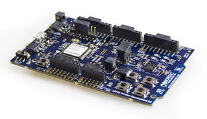

<!--- Copyright (c) 2018 Gordon Williams, Pur3 Ltd. See the file LICENSE for copying permission. -->
Nordic nRF52832 DK
===================

:warning: **Please view the correctly rendered version of this page at https://www.espruino.com/nRF52832DK. Links, lists, videos, search, and other features will not work correctly when viewed on GitHub** :warning:

* KEYWORDS: Espruino,nRF52DK,nRF52-DK,nRF52 DK,nRF52832,nRF52,Nordic,Pinout,Bluetooth,BLE,Bluetooth LE

The nRF52 DK is a versatile single board development kit for Bluetooth® low energy, using the nRF52832 SoC.

Features
--------

* Low cost single board development kit supporting Bluetooth low energy, ANT and 2.4GHz
* Arduino Uno shield compatible
* All GPIO and interfaces available at edge connectors
* Segger J-Link OB Program/Debug supported

Buying
-----------------------

Nordic has [a list of distributors](http://www.nordicsemi.com/eng/Buy-Online?search_token=nRF52-DK)
on their website.

Getting Started
----------------

* Plug the nRF52 DK in
* Go to http://www.espruino.com/binaries (or http://www.espruino.com/binaries/travis/master/
  for the absolute latest builds) and download the latest file named `espruino_*_nrf52832dk.hex`
* Save it to the `JLINK` drive that should have appeared on your computer and wait for the LEDs on the nRF52 DK to stop flashing
* The LED1 on the DK should flash to show Espruino has started. If it doesn't press the `RESET` button.

And you're ready to go! Follow the [Puck.js Getting Started Guide](/Puck.js+Quick+Start) for details
on getting the IDE connected wirelessly, or connect direct to the DK's communications port.

Tutorials
--------

First, it's best to check out the [Puck.js Getting Started Guide](/Puck.js+Quick+Start)

Most tutorials that use Puck.js also apply to the nRF52832DK:

* APPEND_USES: Puck.js

Information
-----------

* [nRF52832 Datasheet](/datasheets/nRF52832_PS_v1.0.pdf)
* [Nordic nRF52 DK information](https://www.nordicsemi.com/eng/Products/Bluetooth-low-energy/nRF52-DK)

Pinout
---------------------------

* APPEND_PINOUT: NRF52832DK

**Note:** The nRF52 port has one available I2C, SPI and USART (and infinite software SPI and I2C).
Unlike other Espruino boards, these peripherals can be used on *any* pin.

Serial Console
---------------

The nRF52 DK firmware exposes a serial console on `D6` (RX) and `D8` (TX) at
9600 baud. You can connect to this with the Espruino Web IDE, or a serial
terminal application at 9600 baud.

**Note:** to be listening for bytes on the serial port, the MCU has to keep
the high speed oscillator running. This means increased power usage over other
nRF52 based devices that only turn the Serial connection on when it is required.

When you connect via Bluetooth, the console will automatically move over to Bluetooth. To
stop this, execute `Serial1.setConsole(true)` to force the console to stay on
`Serial1`.
