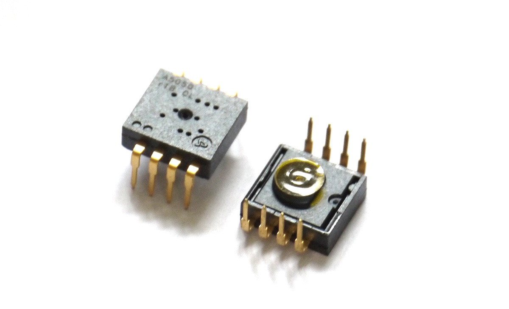

<!--- Copyright (c) 2015 Gordon Williams, Pur3 Ltd. See the file LICENSE for copying permission. -->
ADNS5050 Optical Mouse Sensor
=========================

<span style="color:red">:warning: **Please view the correctly rendered version of this page at https://www.espruino.com/ADNS5050. Links, lists, videos, search, and other features will not work correctly when viewed on GitHub** :warning:</span>

* KEYWORDS: Module,SPI,ADNS5050,ADNS,Avago,Pixart,Graphics,Camera,Mouse,Optical



The ADNS5050 ([datasheet](/datasheets/ADNS5050.pdf)) is a cheap Optical Mouse sensor in an 8 pin pack from Avago ([PixArt Imaging](http://pixart.com.tw)). It detects movement via a monochrome 19x19 pixel image sensor and some fancy image processing. Crucially, this sensor allows you to read the pixels out of the image sensor, turning it into a very cheap 19x19 pixel camera.

Support is included in the [[ADNS5050.js]] module.

**Note:** Pixel readout only allows one pixel to be read per frame. The sensor is read at 3000fps, so realistically Espruino can only read frames at around 6fps. While great for robotics this does limit the sensor's usefulness for other things!

Wiring
------

The sensor itself uses a 2 wire protocol for communication, with clock and data pins. After the first byte is sent, the ADNS5050 takes over the data pin and transmits the result.

For simplicity and speed, this driver requires you to connect the MOSI pin of Espruino to MISO/SDIO via a resistor, allowing the bidirectional communications to work properly.

```
         _______
VCC  5 --|      @|-- 4 NCS
GND  6 --|   .   |-- 3 NRST
REGO 7 --|      :|-- 2 LED
SCLK 8 --|_______|-- 1 SDIO

(Top View)

```

| Pin Number | Type  | Connection                    |
|---------|----------|-------------------------------|
| 1 | SDIO | Connect to B4 (MISO), and via a 3.3k resistor to B5 (MOSI) |
| 2 | LED  | left disconnected      |
| 3 | NRST | Can be connected to VCC pin |
| 4 | NCS  | B6                     |
| 5 | VCC  | 5v                     |
| 6 | GND  | GND                    |
| 7 | REGO | 3.3uF capacitor to GND |
| 8 | SCK  | B3 on Espruino         |


Physical Setup
------------

The sensor itself doesn't have a lens, and instead relies on the lens that is usually built into the bottom of the mouse. Without anything attached, the small hole in it acts like a pinhole camera, however as the hole is roughly the same size as the image sensor itself you get an almost completely blurred image.

You can solve this in a few ways:

* Attach the lens from an old optical mouse
* Use the lens assembly from a small CCD camera
* Create a smaller pinhole. Simply get some black tape and put it over the camera, then make a very small hole with a pin. Note that electrical tape won't be suitable as its stretchiness causes the hole you made to close up. You can however use Magic Tape that has been blackened with a marker pen.
* Use a hemispherical clear stick-on foot as a lens. It is by no means perfect, but is significantly better than nothing:

![Small rubber foot][ADNS5050/optical_lens.jpg]

**Note:** The sensor comes with a small piece of Kapton Tape over the front of it, which is meant to be removed during production. Without this tape, the silicon of the sensor inside the module appears to be completly unprotected.

Software
-------

To get an image from a sensor connected as above, just do the following

```
SPI3.setup({mosi:B5,miso:B4,sck:B3,mode:3}); // NOTE: 'mode:3' is required
var sensor = require("ADNS5050").connect(SPI3, B6);
sensor.drawImage(sensor.getImage());
```

You'll get an ASCII art representation of the sensor's view, a bit like this:

```
 
               ....
           ........
          .........
        ...........
       ........,...
       .....,,,,,,,
      ...,,,,,,,,,,
      .,,,,,,,::,,,
      .,,,:::::::::
     .,,:::::::::::
     .,::::::---:::
    ..,:-----------
    .,:------------
   ..,:---++++++++-
  ...,:-+++++++++++
  ...,-+++++xx+++++
 ....:-+++xxxxxx+x+
....,:+xxxxxxxxxxxx
```

API reference
------------

There are also more functions to get movement, or values from just the first line of the sensor (which is faster).

* APPEND_JSDOC: ADNS5050.js

Using 
-----

* APPEND_USES: ADNS5050

Buying
-----

* [AliExpress](http://www.aliexpress.com/wholesale?SearchText=adns5050)
