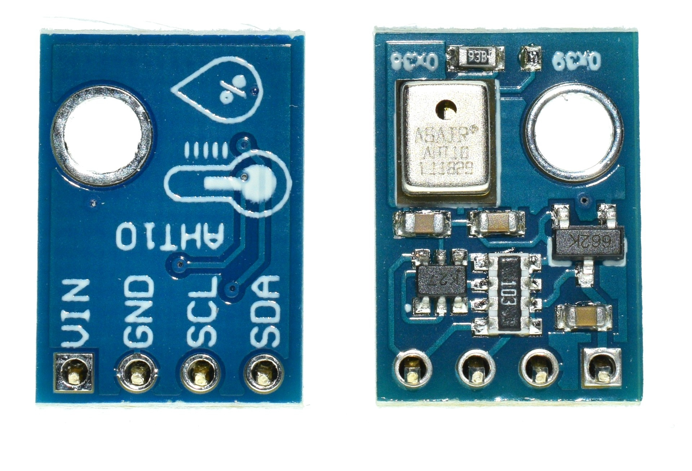

<!--- Copyright (c) 2014 Gustav Karlström. See the file LICENSE for copying permission. -->
AHT10 RH/TEMP Sensor
=====================

<span style="color:red">:warning: **Please view the correctly rendered version of this page at https://www.espruino.com/AHT10. Links, lists, videos, search, and other features will not work correctly when viewed on GitHub** :warning:</span>

* KEYWORDS: Module,I2C,Sensor,rh,aht10,aht,temperature,humidity



The [AHT10](http://www.aosong.com/en/products-40.html) is a high precision, fully calibrated, temperature and humidity sensor chip package.

Use the [AHT10](/modules/AHT10.js) module ([About Modules](/Modules)) for it.

You can wire this up as follows:

| Device Pin | Espruino                         |
| ---------- | -------------------------------- |
| 1 (GND)    | GND                              |
| 2 (VCC)    | 3.3                              |
| 3 (SCL)    | Any I2C software compatible pin  |
| 4 (SDA)    | Any I2C software compatible pin  |

How to use the module:

```
const sensor = require("AHT10").connect(SCL,SDA, bitrate); // Bitrate is optional, defaults to 300000
sensor.getTemperature();
sensor.getHumidity();
sensor.getDewPoint();
```
