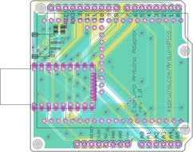

<!--- Copyright (c) 2018 Gordon Williams, Pur3 Ltd. See the file LICENSE for copying permission. -->
Arduino Pico adaptor board
==========================

<span style="color:red">:warning: **Please view the correctly rendered version of this page at https://www.espruino.com/ArduinoPico. Links, lists, videos, search, and other features will not work correctly when viewed on GitHub** :warning:</span>

* KEYWORDS: Module,Arduino,Pico,Adaptor
* USES: Arduino,Pico

There is now an Arduino adaptor shield that converts the Espruino Pico into an [Arduino](/Arduino) form factor. It is available as part of the [Shim Collection](/Shims) available from [Tindie](https://www.tindie.com/products/gfwilliams/espruino-pico-adaptor-pack/)

[](https://www.tindie.com/products/gfwilliams/espruino-pico-adaptor-pack/)

Eagle CAD [board](https://raw.githubusercontent.com/espruino/EspruinoBoard/master/Pico/Adaptors/eagle/arduino.brd)
 and [schematic](https://raw.githubusercontent.com/espruino/EspruinoBoard/master/Pico/Adaptors/eagle/arduino.sch)

Check out some of the  [Arduino Shields](/Arduino) you can use with this adaptor.

Wiring
------

Simply solder an unpinned Espruino Pico flat onto the board (it should be soldered onto the side that contains the silkscreen).

You can solder a Pinned Pico flat by carefully removing the black plastic on the pins first, or you can solder just the 0.1" pins (however you will miss out on some connections - see below).

There is also room for a JST surface mount battery connector, just to the side of the Pico.

The two sets of surface mount pads by the JST connector are for 0805-size 4.7k resistors, which act as pullups for the [I2C](/I2C) pins.


Software
-------

The Pin mapping is as follows:

| Arduino | Pico |
|-----|------|
| A0  | A0 (on 0.05" pins)  |
| A1  | A1 (on 0.05" pins)   |
| A2  | A2 (on 0.05" pins)   |
| A3  | A3 (on 0.05" pins)   |
| A4  | A4 (on 0.05" pins)   |
| A5  | A5   |
| D0  | B7   |
| D1  | B6   |
| D2  | B1   |
| D3  | B3   |
| D4  | B4   |
| D5  | B5   |
| D6  | A6   |
| D7  | A7   |
| D8  | A8   |
| D9  | B10  |
| D10 |  A10 (on 0.05" pins) |
| D11 |  B15 |
| D12 |  B14 |
| D13 |  B13 |
| SCL |  B8 (on 0.05" pins)  |
| SDA |  B9 (on 0.05" pins)  |

However to make this easier we've made a module that contains the pin mapping. You can do:

```
var ard = require("ArduinoPico");
// use normal arduino-style functions
digitalWrite(ard.D9, 1);
console.log(analogRead(ard.A0));
// or access pins directly
ard.D10.set();
```

If you're plugging this board into a [Seeed Grove](/Grove) kit, you can also use the `GroveArduinoPico` module to get the correct pins.

Buying
------

You can:

* Buy the [Shim Pack](/Shims) that contains the Arduino adaptor amongst many other things.
* Download the Eagle CAD board design (linked above) and upload it to be manufactured by a company such as [OSHPark](https://www.oshpark.com/).
