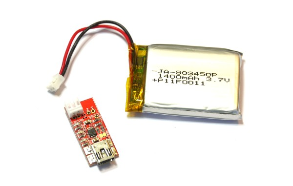

<!--- Copyright (c) 2013 Gordon Williams, Pur3 Ltd. See the file LICENSE for copying permission. -->
Battery
=========

:warning: **Please view the correctly rendered version of this page at https://www.espruino.com/Battery. Links, lists, videos, search, and other features will not work correctly when viewed on GitHub** :warning:

* KEYWORDS: Battery,Charger,LiPo,Li-ion,Power

If you plan to use Espruino with a battery, a small LiPo cell and charger like those above are probably the best things to use - see [below](#buying) for where to find them.

* [Original Espruino boards](/Original) come with a JST PHR-2 2 Pin connector for batteries
* Espruino [[Pico]] comes with a [place to solder](/Pico#battery) a JST connector (or normal 0.1" pins can be used instead)
* [Pixl.js](/Pixl.js) comes with a place to solder a JST connector (or normal 0.1" pins can be used instead)

The JST connector wiring is as follows:

Espruino itself will run from a wide range of batteries and voltages (3.6v to 15v). Some types of small batteries that can be used are:

* Replacement phone batteries (~3.7v)
* Model car/aircraft batteries (4.8v)
* 4xAA or 4xAAA batteries

Adafruit [has a good tutorial on different kinds of Lithium Battery](https://learn.adafruit.com/li-ion-and-lipoly-batteries?view=all)

Charging
-------

Espruino Boards do not contain a battery charger circuit (although the [original Espruino revision 1v4](/Original) has a place where a MAX1551 charger IC can be soldered).

While NiCd and NiMh batteries can be safely trickle charged with a resistor, Lithium Ion batteries need to be charged properly or there may be a risk of fire. If using Lithium Ion batteries we'd suggest that you use a dedicated charger board (links [below](#buying).

USB Power Packs
-------------

While USB Power packs are a cheap and convenient way to power Espruino, there are some things to be aware of:

* Some USB Power Packs (especially the bigger ones) expect a certain amount of power to be drawn from them before they turn on properly. Espruino may draw too little power for them to notice it, and you may have to put a resistor across the supply voltage to increase the power draw enough.
* USB power packs usually contain a Lithium Ion battery and a power supply that will convert the voltage to 5 volts. This supply may not be very efficient at supplying small amounts of power, so you may find you don't get the run-time that you'd expect given the rating of the battery.

If you're willing to open up your USB power pack, you may be able to add wires to power Espruino directly from the Lithium Ion cell. This can be especially useful when connecting Espruino to solar powered USB power packs.

Buying
------

### Batteries

* [Adafruit batteries and chargers](http://www.adafruit.com/categories/138)
* Olimex [battery](https://www.olimex.com/Products/Power/BATTERY-LIPO1400mAh/) and [charger](https://www.olimex.com/Products/Power/USB-uLiPo/), or [selection of batteries](https://www.olimex.com/Products/Power/)
* Buy general purpose charger on [eBay](http://www.ebay.com/sch/i.html?_nkw=genuine+b6+imax)
* See [this page](/Original#connecting_batteries) for details on where to buy the connectors

### Female Connectors (for batteries)

* Farnell ([pins](http://uk.farnell.com/jst-japan-solderless-terminals/sph-002t-p0-5s/contact-loose-piece-0-05-0-22mm/dp/3617210) and [shroud](http://uk.farnell.com/jst-japan-solderless-terminals/phr-2/housing-2way-2mm/dp/3616186))
* Adafruit (US) ([prewired connector](http://www.adafruit.com/products/261))
* Digitalmeans (UK) ([prewired connector](https://digitalmeans.co.uk/shop/jst_2pin_power_connector-2mm_pitch-20))
* Makersify (UK) ([prewired connector](http://makersify.com/products/adafruit-jst-2-pin-cable))

### Male Connectors (for the Espruino [[Pico]])

* Octopart [list of distributors](https://octopart.com/s2b-ph-sm4-tb%28lf%29%28sn%29-jst-248913)
* [Farnell](http://uk.farnell.com/jst-japan-solderless-terminals/s2b-ph-sm4-tb-lf-sn/connector-header-smt-r-a-2mm-2way/dp/9492615)
* [RS](http://uk.rs-online.com/web/p/products/6881353/)
* [Adafruit (US)](http://www.adafruit.com/products/1769)
* [Makersify (UK)](http://makersify.com/products/adafruit-jst-ph-2-pin-smt-right-angle-connector)
* [Seeed OPL Kit](http://www.seeedstudio.com/depot/Open-Parts-LibraryBasic-V2-p-1560.html)
