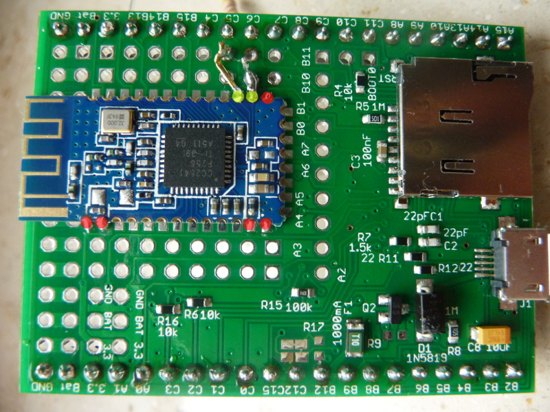

<!--- Copyright (c) 2014 Christian-W. Budde. See the file LICENSE for copying permission. -->
Bluetooth BLE 4.0 (HM-10)
=========================

<span style="color:red">:warning: **Please view the correctly rendered version of this page at https://www.espruino.com/Bluetooth+BLE. Links, lists, videos, search, and other features will not work correctly when viewed on GitHub** :warning:</span>

* KEYWORDS: Bluetooth,BLE,HM-10,HM10,iBeacon,Wireless,Radio,Transceiver
* USES: Espruino,HM-10,Bluetooth

**Note:** This page covers adding Bluetooth LE on the [Original Espruino Board](/Original).
We now [sell Espruino devices](https://shop.espruino.com/ble) with Bluetooth LE capability pre-installed.

Introduction
-------------

Along with (some of) the Kickstarter wireless kits the [HC-05 bluetooth module](/Bluetooth) was included to handle wireless connections. However, as some might have already noted, it does not support Bluetooth 4.0 (BLE), which makes it inaccessible from the majority of Apple devices. Also this bluetooth standard consumes more energy than necessary, so it would be nice to have a module at hand, that offers Bluetooth 4.0 (BLE) support.
The HM-10 module is among the choices. It's cheap and compatible with the Espruino board. However, keep in mind that this board is by far more complex, so you might not get the results you want to see instantly without further configuration. By default the modules are configured to connect to each other, but you have to manually specify one module as master.


Wiring Up
--------

To use it, just solder the same pins as you used to do for the HC-05.



However, there's one exception: This board doesn't use pin 34 as key pin, but pin 23. In addition pin 24 gives information whether it is working/connected. For the beginning you might want to connect these as well as the configuration is more complicated than for the HC-05.

In order to use pin 23, connect this pin via a switch to ground (defaul position of the switch is open). Also connect this pin via a resistor of 1k to 3.3V.

Pin 24, can be connected to an LED and a 470R resistor in series to ground. It is powered by the module.

If everything is wired correctly the LED should blink ina slow interval. If connected it should stay always on.


Software
--------

Once wired up, you can test whether the module is working. It uses basically the same settings as HC-05, but the default baud rate for communication will be 9600. However, you can change this to higher baud rates if you like.

To test if the module works fine just call

```
Serial1.on('data', function (data) {console.log(data);});
Serial1.print("AT")
```

**Note:** it is important that you use print() and not println(). Also don't add anything like \n or \r as it will not work then.

With the slave behaviour it should be able to connect to Bluetooth 4.0 devices. However, despite the fact that the bluetooth specification is basically downward compatible, the module does not support the bluetooth 2.1 (or lower) specification. So for example build-in bluetooth devices or older dongles (without dedicated drivers) might not work on operating systems like Windows 7, since Microsoft didn't backported the Bluetooth 4.0 stack. Also note that it is supported from iPhone 4s, so later modules won't work either.

In case you want to use the latest commands from your HM-10 module, make sure you are using the latest version. To query the version number, just call:

```
Serial1.print("AT+VERS?")
```

and it should read 'HMSoft V522' (eventually scrambled by line breaks) or higher. If not you may want to flash your firmware with the latest version. On the [vendor's website](http://www.jnhuamao.cn/download_rom_en.asp?id=66) further information about this can be found.
