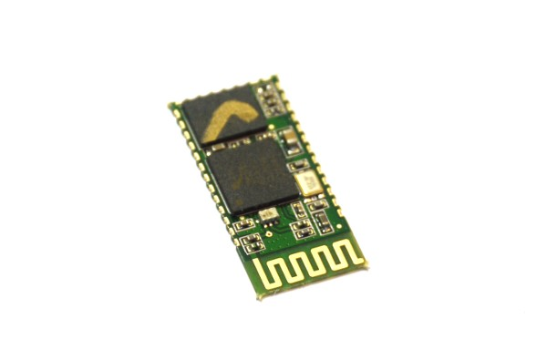
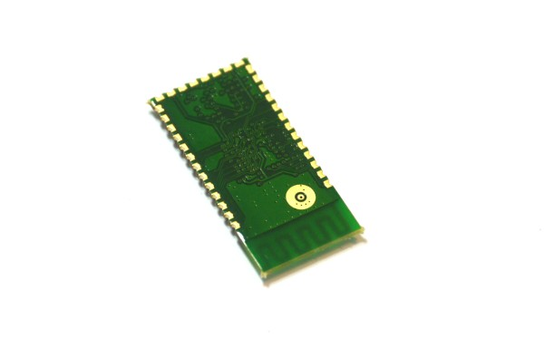
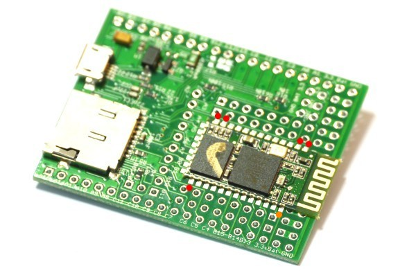

<!--- Copyright (c) 2013 Gordon Williams, Pur3 Ltd. See the file LICENSE for copying permission. -->
Bluetooth
=========

<span style="color:red">:warning: **Please view the correctly rendered version of this page at https://www.espruino.com/Bluetooth. Links, lists, videos, search, and other features will not work correctly when viewed on GitHub** :warning:</span>

* KEYWORDS: Bluetooth,Wireless,BT,HC-05,HC05,Built-In,Radio,Transceiver

**Note:** This page covers adding Bluetooth on the [Original Espruino Board](/Original).
We now [sell Espruino devices](https://shop.espruino.com/ble) with Bluetooth LE capability pre-installed.




The most common Serial Bluetooth module is the HC-05 (above) or HC-06. These are very similar modules and both will work with Espruino. The main difference is that the HC-05 can be configured as a Bluetooth Master, and the HC-06 can't.

Connecting
--------



[[http://youtu.be/J0HJVTDNSUQ]]

The [Espruino Board](/Original) has pads on it already for the placement of an HC-05 Bluetooth module, so it's very easy to connect. Note that while there are many connections on the HC-05 module, only 4 of them are needed.

For the Espruino [[Pico]], there is [an adaptor shim available](/Shims#bluetooth-0-1-adaptor) that makes connecting Bluetooth a lot easier!

See the [[Wiring Up]] page if you want to connect Bluetooth to something other than the Espruino Board.

To solder the HC-05 module, do the following:

* Add a small piece of Magic Tape to the back of the module, over the circular aerial connection.
* Place the module as pictured above, so it overlaps the pads on the Espruino board
* Solder the pins. **Note:** not all the pins need soldering. Only the pins in the picture above with the red dots by them absolutely need soldering, however we'd suggest at a minimum soldering the pin with the orange dot by it as well.

Pairing
------

The Bluetooth module will appear by name as either ```HC-05``` or ```linvor```. Simply pair with this module and enter the pairing code ```1234```. Espruino should then appear as a new Serial port, and you will be able to connect to it with the Web IDE.

Mac OS
-----

At the time of writing, on Mac, the Web IDE won't list Bluetooth serial ports due to a limitation in Google Chrome. Instead, you have to fool Chrome into thinking it's looking at a USB serial port by creating a symbolic link.

To do so, pair the device, start Terminal.app, and do something like:

```
cd /dev
ls tty*
```

Find the desired tty (eg. `tty.HC-05-DevB`) and:

```
sudo ln -s tty.HC-05-DevB tty.usbmodem1701
```

Refresh the Web IDE's connection list. It should show the device under the name `tty.usbmodem1701`.  You'll need to replace the `tty.HC-05-DevB` in the command above with whatever your device's name was.

Software
-------

If there is no USB connection, the Espruino board defaults to using the first Serial Port (USART1) for the Console at 9600 - which is what the Bluetooth module is connected to. This means that just powering Espruino from a USB wall supply, the battery connector, or the GND and VBAT pins will make it work. **Note:** If you power the board from your PC's USB port, it will move the console to USB and you will get no response from the Bluetooth connection.

Changing Bluetooth Module's Name and Passkey
---------------------------------------

_This information is from [this forum post](http://forum.espruino.com/conversations/454/)_

If you have more than one Espruino with the standard HC-05 Bluetooth attached, it can be a little confusing as they may all have the same name, HC-05, appearing on the PC. Also, by default they'll have the same default passkey, 1234, which you'll probably want to change.

You can reconfigure the name and passkey by connecting to the HC-05 Bluetooth module from the Espruino itself, but to do so you'll need to put it into Command Mode.  NOTE: This change is persistent, in that if you change it to something weird or you forget the new passkey, you'll need to repeat all this to change it back.

1. Wire Pin 34 on the HC-05 to 3.3V.  You can do this by temporarily soldering on a wire and clipping it to the 3.3V pin on the Espruino.  The pin is the one at the top right corner when viewing the HC-05 with the squiggly antenna trace at the top.  In other words, it's the pin marked with the orange dot in the diagram above.

2. Connect the Espruino via USB to your PC.  As the HC-05's Pin 34 is high on reset, it should put the HC-05 into Command Mode.

3. Connect to the Espruino via the Web IDE as normal.

4. As you've connected via USB rather than Bluetooth, the HC-05 itself is now on Serial1, in Command Mode and configured at 38400 baud.

5. Run:

```
Serial1.setup(38400);
Serial1.on('data', function (data) {console.log(data);});
Serial1.println('AT+PSWD:1701');
Serial1.println('AT+NAME:Espruino1');
```

Then:

6. Power down, disconnect, unsolder the pin.

7. Power up the Espruino via a power supply (rather than via PC's USB port)

8. It should now be available to pair under the new name `Espruino1` and passkey `1701`!

Using
-----

* APPEND_USES: Bluetooth

Buying
-----

HC05 Bluetooth modules can be purchased from many places. If you wish to buy from eBay, make sure you get one **without** the 0.1" adaptor PCB included if you want to connect it to the [Espruino Board](/Original) ([eBay search](http://www.ebay.com/sch/i.html?_nkw=HC05+bluetooth) - around $6)
