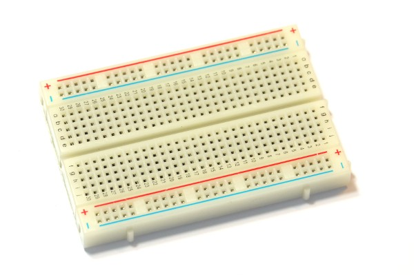
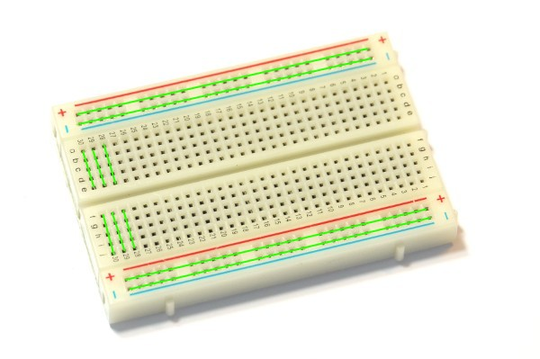

<!--- Copyright (c) 2013 Gordon Williams, Pur3 Ltd. See the file LICENSE for copying permission. -->
Breadboard
=========

:warning: **Please view the correctly rendered version of this page at https://www.espruino.com/Breadboard. Links, lists, videos, search, and other features will not work correctly when viewed on GitHub** :warning:

* KEYWORDS: Breadboard,prototype

Breadboard is an easy way to prototype, as you can plug in through-hole components, patch wires, pin strip, or just solid core wire.

Each socket is connected to its neighbors in a specific way. The pattern is shown (partially) in green in the picture below:

The four long power rails are shorted horizontally, and each shorter block of pins is shorted vertically.

Buying
-----

* [eBay](http://www.ebay.com/sch/i.html?_nkw=solderless+breadboard)
