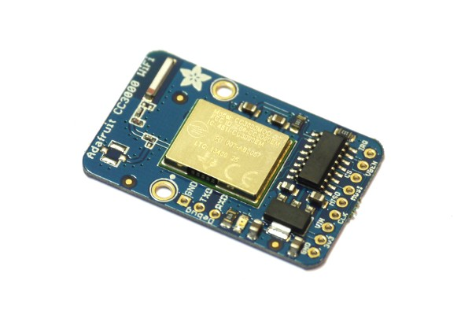

<!--- Copyright (c) 2013 Gordon Williams, Pur3 Ltd. See the file LICENSE for copying permission. -->
CC3000 WiFi Module
================

<span style="color:red">:warning: **Please view the correctly rendered version of this page at https://www.espruino.com/CC3000. Links, lists, videos, search, and other features will not work correctly when viewed on GitHub** :warning:</span>

* KEYWORDS: Wireless,Module,CC3000,CC 3000,WiFi,Internet,WLAN,Web Server,HTTP,Built-In



**The TI CC3000 has now been discontinued.** We'd recommend that you use the [ESP8266](/ESP8266) module
instead - it's significantly cheaper, lower power, and easier to wire up.

The Espruino Board supports the Texas Instruments CC3000 WiFi module. This allows you to connect to Wireless networks (and hence the internet).

First off, you need to connect the module. Currently it **must** be on the following pins:

|  CC3000  |  Espruino |
|----------|-----------|
| GND      | GND       |
| 3v3      | Do not use |
| VIN      | VBAT      |
| CLK/SCK  | B3        |
| DOUT/MISO| B4        |
| DIN/MOSI | B5        |
| CS       | B6        |
| EN/VBEN  | B7        |
| IRQ      | B8        |


**Note:**  The voltage regulator on the Adafruit CC3000 module will work with voltages as high as 18V on VIN. If using a *different* breakout board, you must be sure that the voltage applied to the CC3000 (Vcc) is between 2.7 and 4.8v. On the Espruino Board, VBAT is 4.3v when running from USB and is the same as the battery voltage when plugged into a battery.

Using the CC3000 is as follows:

* Connect it as above CC3000
* Load the CC3000 module with ```require("CC3000").connect()```. This returns a ```WLAN``` object.
* Call ```connect``` on that object (see the example below), with a callback function
* In the callback function, respond to the ```dhcp``` message and use the ```http``` module to access the internet

**Note:** Some calls to the CC3000 module will take a second or more to return, due to TI's driver. ```connect``` especially takes several seconds. In order to make sure your code uploads properly (and that you can save your code to flash), the code to initialise the CC3000 should be put inside a function called `onInit`. Execute `onInit()` manually on the left-hand side after uploading, or type `save()` to save your code to Flash and run it.

This example loads a webpage and prints the result:

```
var wlan = require("CC3000").connect();
wlan.connect( "AccessPointName", "WPA2key", function (s) {
  if (s=="dhcp") {
    require("http").get("http://www.pur3.co.uk/hello.txt", function(res) {
      res.on('data', function(data) {
        console.log(">" + data);
      });
    });
  }
});
```

**Note:** that we're putting all the network initialisation in the callback. The CC3000 will occasionally disconnect (or will sometimes crash and have to be automatically rebooted) and any active HTTP servers or clients will get removed. When it reconnects the callback will be called with `s=='dhcp'` and you can re-add them. Your code needs to be able to cope with the fact that it may be called more than once (eg. if you use `setInterval` make sure you use `clearInterval` to clear the old interval first).

Custom Pins
-----------

Calling `require("CC3000").connect()` without arguments will use the default pins shown above, but you can use a custom SPI device and pins by specifying them as follows:

```
SPI1.setup({ sck:B3, miso:B4, mosi:B5, baud:1000000, mode:1});
var wlan = require("CC3000").connect(SPI1, B6 */ CS */, B7 /* EN */, B8 /* IRQ */);
```

**Note:** It's very important that SPI mode is set to 1, or the CC3000 will not be able to initialise.

Disconnecting
------------

You can also call ```wlan.disconnect()``` which will turn the CC3000 off completely. This is very useful if you're running off a battery and want to connect to the internet, send data, and then disconnect.

You could use it like this:

```
var wlan = require("CC3000").connect();

function getTime() {
  // if we don't get DHCP or a complete request in 30 seconds,
  // disconnect
  var failTimeout = setTimeout(function() {
    console.log("Timed out, disconnecting...");
    wlan.disconnect();
  }, 30000);
  wlan.connect( "AccessPointName", "WPA2key", function (s) {
    if (s=="dhcp") {
      require("http").get("http://www.pur3.co.uk/time.php",
                          function(res) {
        // store the result
        var result = "";
        res.on('data', function(data) {
          result += data;
          console.log(data);
        });
        /* When the connection closes, print what we
        got, and then disconnect from WiFi */
        res.on('close', function() {
          console.log("Got: "+result);
          // finished, disconnect anyway
          setTimeout(function() {
            clearTimeout(failTimeout);
            console.log("Complete!, disconnecting...");
            wlan.disconnect();
          },1000);
        });
      });
    }
  });
}

// Every 24 hours, get the time again
setInterval(getTime, 24*60*60*1000);
```

Web Server
---------

Creating a Web Server is easy too:

```
var wlan = require("CC3000").connect();
wlan.connect( "AccessPointName", "WPA2key", function (s) {
  if (s=="dhcp") {
    console.log("My IP is "+wlan.getIP().ip);
    require("http").createServer(function (req, res) {
      res.writeHead(200, {'Content-Type': 'text/plain'});
      res.write('Hello World');
      res.end();
    }).listen(80);
  }
});
```

When the CC3000 connects to your network, it'll output `My IP is 1.2.3.4`. If you then go to http://1.2.3.4 with your web browser, you'll see a webpage saying `Hello World`.

If you want to do something a bit more interesting, you can turn lights on and off and view the status of inputs:

```
function onPageRequest(req, res) {
  var a = url.parse(req.url, true);
  res.writeHead(200, {'Content-Type': 'text/html'});
  res.write('<html><body>');
  res.write('<p>Pin is '+(BTN.read()?'on':'off')+'</p>');
  res.write('<a href="?led=1">on</a><br/><a href="?led=0">off</a>');
  res.end('</body></html>');
  if (a.query && "led" in a.query) digitalWrite(LED1, a.query["led"]);
}

var wlan = require("CC3000").connect();
wlan.connect( "AccessPointName", "WPA2key", function (s) {
  if (s=="dhcp") {
    console.log("My IP is "+wlan.getIP().ip);
    require("http").createServer(onPageRequest).listen(80);
  }
});
```

Note that to read the state of the button with this example, you'll have to press the button down and then press refresh in your web browser. Turning the LED on and off is done by loading a webpage with a certain name.


For more examples, please see the [[Internet]] page.

Using
-----

* APPEND_USES: CC3000

Buying
-----

At the moment the only CC3000 module that we know works for sure is the [AdaFruit CC3000](http://www.adafruit.com/products/1469) module, so we'd recommend that you get this from [AdaFruit](http://www.adafruit.com) or one of their distributors.

The [Embedded Adventures](http://www.embeddedadventures.com/cc3000_wifi_module_wrl-3000.html) module has been tested and **does not currently work with Espruino**. If you have success with it, please let us know!
