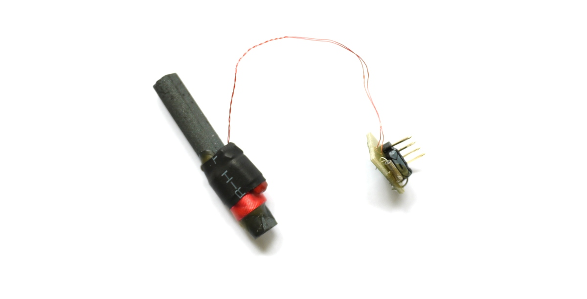

<!--- Copyright (c) 2015 Gordon Williams, Pur3 Ltd. See the file LICENSE for copying permission. -->
DCF77 
======================

<span style="color:red">:warning: **Please view the correctly rendered version of this page at https://www.espruino.com/DCF77. Links, lists, videos, search, and other features will not work correctly when viewed on GitHub** :warning:</span>

* KEYWORDS: Module,Radio,DCF,DCF77,NPL,Rugby Clock,CLoc,Time,wireless,receiver



[DCF77](https://en.wikipedia.org/wiki/DCF77) is a time signal broadcast on 77.5kHz by a radio transmitter located att Mainflingen near Frankfurt. The range is such that it should cover nearly all of Europe.

It works in a very similar way to [Time from NPL](https://en.wikipedia.org/wiki/Time_from_NPL) (which broadcasts from the United Kingdom at 60 kHz).

The DCF77 modules that you can buy are generally simple radios. Give them power, and they return a single digital signal. This signal contains one pulse a second (with a double-length pulse every minute), and the length of the gap between pulses signifies a 1 or a 0. This allows for 60 bits of data per minute ([details on Wikipedia]([DCF77](https://en.wikipedia.org/wiki/DCF77)).

Functionality is provided by the [[DCF77.js]] module.

Wiring Up
--------

There are several different types of module, so please check with the seller of your board for the exact connections and power requirements. In the board pictured above, the connections are:

| No |  Pin | Connection |
|----|------|------------|
| 1  | Vdd  | DC Supply (1.2v - 5.5v) |
| 2  | GND  | Ground |
| 3  | Data | Data output (connect to any GPIO pin on Espruino) |
| 4  | PON  | Power on - must be connected to ground to enable the receiver. Leave open circuit to disable |

Pin numbers are not marked on the board (and similar looking boards have pins in different locations), so you'll need to use a multimeter to check which pin is GND (by checking against the negative side of the board's capacitor).


Software
-------

Just use as follows (assuming you've connected the `Data` pin of the DCF77 receiver to `B3`):

```
require("DCF77").connect(B3, function(err, date, info) {
  if (err)
    console.log("Invalid time received: " + err);
  else
    console.log(date.toString(), info);
});
```

The callback will be called every minute (assuming a good signal has been received). If there has been a decoding error (for instance parity doesn't match) then the error will be returned. Otherwise `err` will be null and `date` will be a `Date` object.

When `Date` is valid, `info` will be an object of the form:

```
{ 
  CEST : boolean,  // Central European Summer Time
  CET : boolean   // Central European Time
}
```

As this is radio, things can get corrupted. If two bits of the signal are wrong then the parity can still be correct and your callback will be called with the wrong `Date` object and no error - to ensure an accurate time signal we'd suggest storing the previous two minutes' `Date` values, and *only* updating the time if all 3 dates are consecutive: eg `13:35`, `13:36`, `13:37`.

Using 
-----

* APPEND_USES: DCF77

Buying
-----

You can buy DCF77 modules separately, but they tend to cost around £10 each.

* [eBay](http://www.ebay.com/sch/i.html?_nkw=dcf77+module)
* [Conrad](http://www.conrad.com/ce/en/product/641138/DCF-receiver-board)
* [pollin](http://www.pollin.de/shop/dt/NTQ5OTgxOTk-/Bausaetze_Module/Module/DCF_Empfangsmodul_DCF1.html)

You may find that it is in fact cheaper to just buy a DCF77 clock, dismantle it and remove the radio (which is usually a separate module).
