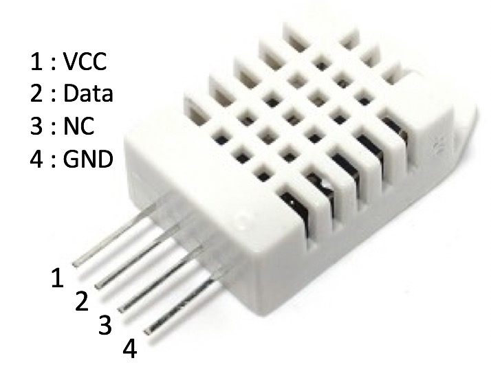

<!--- Copyright (c) 2014 Spence Konde. See the file LICENSE for copying permission. -->
DHT22/AM230x/RHT0x Temperature and RH Sensor
=============================================

<span style="color:red">:warning: **Please view the correctly rendered version of this page at https://www.espruino.com/DHT22. Links, lists, videos, search, and other features will not work correctly when viewed on GitHub** :warning:</span>

* KEYWORDS: Module,DHT21,DHT22,DHT33,DHT44,RHT01,RHT02,RHT03,RHT04,RHT05,AM2301,AM2302,AM2303,HM2301,temperature,humidity



Check the [datasheet](/datasheets/DHT22.pdf) for further details.

Overview
-----------------

This module interfaces with the DHT22 (also DHT21, DHT22, DHT33, DHT44, RHT01, RHT02, RHT03, RHT04, RHT05, AM2301, AM2302, AM2303 and HM2301), an inexpensive temperature and relative humidity sensor similar to the [[DHT11]], but with higher accuracy and wider range. 

Key Specifications:

  |                   |          |
  |-------------------|----------|
  | Temperature Range | -40~80 C |
  | Temp. Accuracy    | +/- 0.5C |
  | Humidity Range    | 0 ~ 100% |
  | Humidity Accuracy | +/- 2%   |

The module will retry if it doesn't get any response, or if other sanity checks fail. If it fails 10 times in a row, the callback will be called with an error (see below), indicating a likely problem with the sensor or wiring. The DHT22 is much more reliable than the [[DHT11]], and it rarely fails to provide data, however, it is still important to perform your own sanity checks on the data returned. 


Wiring
-----------------

From left to right when part is viewed from the front (the side with the ventilation holes) with pins pointing down. (The DHT22 has no pin markings). 

**IMPORTANT:** Be sure to get the polarity right! If connected backwards, it will ruin the DHT22. 

  | Device Pin | Espruino |
  |------------|----------|
  | 1 (Vcc)    | 3.3      |
  | 2 (S)      | Any GPIO |
  | 3 (NC)     | N/C*     |
  | 4 (GND)    | GND      |

**Note:** There are reports of DHT22s on the market where pins 3 and 4 are reversed. Meanwhile, app notes sometimes depict pins 2 and 3 tied together. 


Usage
------------

Call `require("DHT22").connect(pin)` to get a DHT22 object. To read the sensor, the `read` method is called with a single argument, the function that is called when the read is complete. This function is called with an object containing two properties, `temp` and `rh`. Temperature is in °C, RH is in %. 

For example:

```JavaScript
var dht = require("DHT22").connect(C11);
dht.read(function (a) {console.log("Temp is "+a.temp.toString()+" and RH is "+a.rh.toString());});
```

Returns `-1` for the temperature and humidity (and `err:true`) if no data is received. An extra `checksumError` field contains extra information about the type of the failure:

* If no data received at all: `{"temp": -1, "rh": -1, err : true, "checksumError": false}`.

* If some data received, but the checksum is invalid, or timed out: `{"temp": -1, "rh": -1, err : true, "checksumError": true}`

In all cases, a field called `raw` is present which contains the raw data received, as a string of `1` and `0` characters.

**Note:** 
You can also supply a second argument which is the number of retries if there is an error. The default is 10. Collecting period should be : >2 seconds.


Buying
-----

DHT22 parts and modules can be purchased from many places:
* [eBay](http://www.ebay.com/sch/i.html?_nkw=DHT22&_sacat=92074)
* [digitalmeans.co.uk](https://digitalmeans.co.uk/shop/index.php?route=product/search&tag=dht22)
