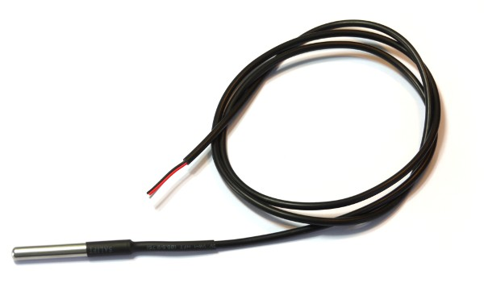
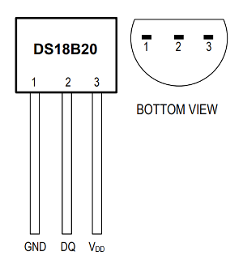

<!--- Copyright (c) 2013 Gordon Williams, Pur3 Ltd. See the file LICENSE for copying permission. -->
DS18B20 Temperature Sensor
=======================

<span style="color:red">:warning: **Please view the correctly rendered version of this page at https://www.espruino.com/DS18B20. Links, lists, videos, search, and other features will not work correctly when viewed on GitHub** :warning:</span>

* KEYWORDS: Module,OneWire,DS18B20,DS18S20,Temperature,Sensor



One of the most common 1-Wire devices is the DS18B20/DS18S20 thermometer, which can be read with the [[DS18B20.js]] module.

**Note:** The DS18B20 comes in a cable, SMD, and transistor-style package. We're only covering the cable and transistot package here, but for the SMD one see the [Datasheet](/datasheets/DS18B20.pdf).

Wiring
------

Connect as below, with a 4.7k resistor between data and the 3.3v line.

Newer Espruino firmwares use the microcontroller's internal pullup resistor
so can function without the external resistor - however for any wire length
over a few centimeters you'll still need an external resistor to get reliable
communications.


### Cabled

There seem to be three types of cabled sensor (listed below - please tell us if you find more!). **Note:** there are *two types of Green/Red/Yellow sensor* so please check with the seller which one you have (type 2 is the most common).

| Sensor type 1 | Sensor type 2 | Sensor type 3 | Espruino   | 4.7k Resistor |
| --------- | --------- | --------- | ---------- | ------------- |
| Black     | Green     | Yellow | GND        |               |
| Red       | Red       | Red | 3.3v       | 1st wire      |
| White/Blue/Yellow     | Yellow    | Green | Data - any GPIO | 2nd wire      |

### TO-92



Just connect the TO-92 as in the pin diagram above (with the resistor mentioned
  above).


Software
--------

To use it (assuming you connected to pin A1), simply write the following on the [right-hand side](/Modules#repl):

```JavaScript
var ow = new OneWire(A1);
var sensor = require("DS18B20").connect(ow);
setInterval(function() {
  sensor.getTemp(function (temp) {
    console.log("Temp is "+temp+"°C");
  });
}, 1000);
```

And the current temperature will be displayed every second.

```JavaScript
27.625
```

You can also call the `getTemp` function directly (for instance `console.log(sensor.getTemp())`) however in this case it will immediately return with the *last temperature reading* and will start another. This means the first time `getTemp` is called, an incorrect temperature will be returned.


Multiple sensors
---------------

The DS18B20 communicates over a 1-Wire bus, which allows connecting multiple thermometers on the same data line.

To create an array containing three sensors, simply use:

```JavaScript
var ow = new OneWire(A1);
var sensor1 = require("DS18B20").connect(ow, 0);
var sensor2 = require("DS18B20").connect(ow, 1);
var sensor3 = require("DS18B20").connect(ow, 2);
var sensors = [sensor1, sensor2, sensor3];
```

Alternatively, you can create the same array with a little help of the Array.map() function:

```JavaScript
var sensors = ow.search().map(function (device) {
  return require("DS18B20").connect(ow, device);
});
```

Now make a function that will be called repeatedly by Espruino:

```JavaScript
setInterval(function() {
  sensors.forEach(function (sensor, index) {
    sensor.getTemp(function (temp) {
      console.log(index + ": " + temp + "°C");
    });
  });
}, 1000);
```

And the current temperature of each sensor will be displayed every second:

```JavaScript
0: 25.3125
1: 21.0625
2: 24.1875
```

Module reference
---------------

* APPEND_JSDOC: DS18B20.js

Using
-----

* APPEND_USES: DS18B20

Buying
-----

DS18B20 modules can be purchased from many places:

* [Sparkfun](https://www.sparkfun.com/products/11050)
* [eBay](http://www.ebay.com/sch/i.html?_nkw=DS18B20)
* [digitalmeans.co.uk](https://digitalmeans.co.uk/shop/index.php?route=product/search&tag=18b20)
