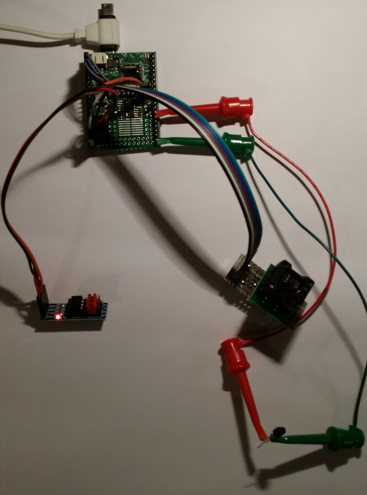

<!--- Copyright (c) 2013 Spence Konde. See the file LICENSE for copying permission. -->
EEPROMs (and related technologies)
==============================

<span style="color:red">:warning: **Please view the correctly rendered version of this page at https://www.espruino.com/EEPROMs. Links, lists, videos, search, and other features will not work correctly when viewed on GitHub** :warning:</span>

* KEYWORDS: EEPROM, eeprom, fram, FRAM, memory, rom, storage

An EEPROM is a form of byte-addressable non-volatile storage, allowing a project based on Espruino to save small amounts of persistant data. 

"EEPROM" stands for "Electrically Erasable Programmable Read-Only Memory" - it is a form of non-volatile memory that is available using several interfaces, in many packages and capacities. This document describes how to use EEPROMs and similar non-volatile memory with Espruino, and explains some of the considerations involved in selecting a memory technology for your project. 

The operating principle of EEPROM is much like that of modern flash memory.  It is non-volatile memory, meaning that data is retained while the power is off. Those who have used AVR devices (like Arduino) will already be familiar with EEPROMs, as almost all AVR processors have built in EEPROMs. Unfortunately, the ARM processors used in the Espruino do not - however external EEPROM chips are widely available. Each page of an EEPROM can only be erased and rewritten a limited number of times before it stops working - this is typically in the range of 100,000 to 1,000,000 rewrite cycles, and is specified in the datasheet.


An Espruino board with multiple EEPROMs connected to it:
* I2C EEPROM DIP-8 package on breakout board (these typically sell for $2-5 on ebay)
* I2C EEPROM SOIC-8 package soldered onto Espruino's prototyping area
* SPI EEPROM SOIC-8 package in an SOIC socket
* OneWire EEPROM TO-92 package connected with the two clipleads. The pullup resistor has been connected between 3.3v and C4 on the underside of the board. 


Using EEPROMs
-------
The EEPROM modules contain two main functions, read and write. To use this in your project, after wiring up the EEPROM (see the appropriate module documentation for details), simply setup the interface (I2C, SPI, or OneWire), and call 'connect()' (again, see module doc, as the arguments vary by interface).

`write(address,data)` writes the supplied data to the specified address. Data can be an array of bytes or string. This handles page boundaries and waiting out the write cycle for long writes, and returns the length of the data written. 

`read(address,length)` reads data from the EEPROM starting from the supplied address, as a Uint8Array.

####Example

```javascript

//pick one:
I2C2.setup({scl:B10,sda:B11}); //I2C
SPI1.setup({sck:B3,miso:B4,mosi:B5}); //SPI
var OW=new OneWire(C4);//OneWire

//Pick one:
var eeprom=require("AT24").connect(I2C2,64,128,2); //I2C2, 64 byte pages, 128 (16 kbyte) kbit capacity, with the A1 pin high, and A0 and A2 low. 

var eeprom=require("AT25").connect(SPI1,0,64,B2); //SPI, 64 kbit FRAM (no pages).

var eeprom=require("DS2xxx").connect(OW,32,20); //OneWire, 32 byte pages, 20kbit - DS28EC20. 

console.log(E.toString(eeprom.read(0,25)); //Read the beginning of the EEPROM. 
eeprom.write(10,[12,23,240,192,245]) //write some numbers;
console.log(eeprom.read(0,16); //this will show the 5 bytes we wrote above, surrounded on both sides by whatever we wrote ontop of. 
var a;
var l=eeprom.write(0x64,"digitalWrite(LED1,!a);a=!a;digitalWrite(LED3,!a);)"); //write a bit of JS to the EEPROM at position 100

eval(E.toString(eeprom.read(0x64,l)); //read it back and run the code;

var interval=setInterval("eval(E.toString(eeprom.read(0x64,l));",333); //Oh noes! It's the police!

```

Applications
------
* Saving user settings, presets, defaults
* Remembering WiFi access point SSID and password for use with CC3000 or ESP8266. 
* Recording recent history of sensor data
* Storing snippets of code that are used infrequently (in order to reduce usage of memory). 

Converting values
------

When working with EEPROMs it is often necessary to convert strings, 16 or 32 bit integers, or floating point numbers, into an array of bytes. Conversions to strings can be done with the E.toString() function. Conversion of other types can be done with array buffers (these can easily be extended to handle arrays as input):

```javascript

function F32ToA(a) {
	a=new Float32Array([a]);
	return new Uint8Array(a.buffer,0,4);
}

function F64ToA(a) {
	a=new Float64Array([a]);
	return new Uint8Array(a.buffer,0,8);
}

function int32ToA(a) {
	a=new Int32Array([a]);
	return new Uint8Array(a.buffer,0,4);
}

function uint32ToA(a) {
	a=new Uint32Array([a]);
	return new Uint8Array(a.buffer,0,4);
}

function int16ToA(a) {
	a=new Int16Array([a]);
	return new Uint8Array(a.buffer,0,2);
}

function uint16ToA(a) {
	a=new Uint16Array([a]);
	return new Uint8Array(a.buffer,0,2);
}

function int8ToU(a) {
	a=new Int8Array([a]);
	a= new Uint8Array(a.buffer,0,1);}
	return a[0];
}

function Uint8ToI(a) {
	a=new Uint8Array([a]);
	a= new Int8Array(a.buffer,0,1);}
	return a[0];
}

```

Similarly, to go the other direction:

```javascript


function aToFloat32(a) {
	a=E.toUint8Array([a]);
	a=new Float32Array(a.buffer,0,1);
	return a[0];
}

function aToFloat64(a) {
	a=E.toUint8Array([a]);
	a=new Float64Array(a.buffer,0,1);
	return a[0];
}


function aToInt32(a) {
	a=E.toUint8Array([a]);
	a=new Int32Array(a.buffer,0,1);
	return a[0];
}

function aToUint32(a) {
	a=E.toUint8Array([a]);
	a=new Uint32Array(a.buffer,0,1);
	return a[0];
}

function aToInt16(a) {
	a=E.toUint8Array([a]);
	a=new Int16Array(a.buffer,0,1);
	return a[0];
}

function aToUint16(a) {
	a=E.toUint8Array([a]);
	a=new Uint16Array(a.buffer,0,1);
	return a[0];
}

```

Alternately, without arrayBuffers, types can be converted like this - this may be more reasonable for integers (particularly unsigned ones):

```javascript
function uint16ToA(a) { //another way of doing it
	return new Uint8Array([a>>8,a&255])
}

function aToUint16(a) {
	return a[0]+(a[1]<<8)//watch out for order of operations
}
```

Interfaces and Capacities
------
EEPROMs are available with almost every interface imaginable. Module support ([About Modules](/Modules)) is available for three of the most common interfaces: I2C, SPI, and OneWire. These interfaces all have their own considerations. 

####I2C
I2C is the most common interface for EEPROMs, and the least expensive. Support is provided by the [AT24](/modules/AT24.js) module, which supports devices with a capacity up to 4mbit. The speed of these EEPROMs is limited by the speed of the I2C bus, which is 100kbit by default, though the Espruino supports 400mbit mode as of v72. Most (but not all) I2C EEPROMs are rated for 1mhz use, and almost all are rated for 400mhz. For some parts, the maximum speed may depend on the supply voltage. 

I2C EEPROMs are available in 8-pin DIP, SOIC, and TSSOP packages. Breakout boards with a DIP socket and jumpers for address/wp pins are readily available from ebay, or ones in the SOIC package can be soldered onto the prototyping area on the Espruino Board (in this case, be sure to include the 10k pullup resistors on SDA and SCL). Connection requires 4 wires (Vcc, Ground, SDA, and SCL); the other 4 pins are used to set the address (A0-2) and write protect the chip (WP). WP should be tied to Vcc unless you want to prevent writes. The A0-A2 pins set the 3 low bits in the I2C address, allowing up to 8 EEPROMs on one I2C bus. Note that I2C EEPROMs of certain sizes use the low bits of the I2C address to expand the address space; these are listed in the [AT24 module documentation](AT24.md). 

I2C EEPROMs are manufactured by almost every major semiconductor manufacturer, each of which use their own part numbering scheme. The parts from different manufacturers are fully interchangible.  Some examples are below - there are many more:

*Atmel: AT24Cxxx (where xxx is the capacity in KB)
*Microchip: 24LCxxx, 24AAxxx (low voltage)
*ON Semiconductor: CAT24Cxxx
*Fremont Microdevices: 24FTxxx
*Rohm: BR24Gxxx

####SPI
SPI is the second most common interface for EEPROMs, and the chips are only modestly more expensive than comparable I2C ones, and available in many of the same capacities as I2C EEPROMs. Support is provided by the [AT25](/modules/AT25.js) module, which supports devices with a capacity of 32 kbit up to 4 mbit. Smaller sizes exist, but the module does not support them.  

SPI EEPROMs are available in 8-pin DIP, SOIC, and TSSOP packages, as well as larger packages with several not-connected pins. While breakout boards/modules are not available on ebay as is the case for I2C EEPROMs. SPI EEPROMs in SOIC package can be soldered onto the prototyping area on the Espruino Board. Connection requires 6 wires (Vcc, Ground, SCK, MISO, MOSI, and CS); The other two pins should be tied to Vcc, unless you want to write protect the chip. Many SPI EEPROMs can be connected to the same SPI bus, as long as a separate CS line is run for each chip. SPI EEPROMs can be used with software SPI.

Like I2C EEPROMs, compatible SPI EEPROMs are available from many manufacturers:

*Atmel: AT25xxx (where xxx is the capacity in KB)
*Microchip: 25LCxxx, 25AAxxx (low voltage)
*ON Semiconductor: CAT25xxx
*Rohm: BR25Sxxx 

####OneWire
OneWire EEPROMs are manufactured only by Dallas Semiconductor, and are available in a limited range of capacities, at higher prices than comparable I2C or SPI EEPROMs. As the name implies, a OneWire EEPROM requires only a single wire (plus ground); it draws the power it needs to operate from the signal line, simplifying layout dramatically. These are typically available in TO-92 packages, though SMT packages are also available. Pin 1 is connected to ground, while pin 2 is connected to any IO pin on the Espruino. A 1k (approx) pullup resistor must be placed between pin 2 and 3.3v (it is easiest to do where the signal line reaches the Espruino). Support is provided by the [DS2xxx](/modules/DS2xxx.js) module.


####Summary

|          |I2C        |    SPI    |   OneWire   |
|----------|-----------|-----------|-------------|
| Capacity | 1kbit-4mbit| 32kbit-4mbit | 1 kbit - 20 kbit |
| Max # per bus| 1-8 | Many w/CS wires | Many |
| Speed    | up to 400khz | 1mhz+ | 15.6kbit/s |
| IO pins needed | 2 | 3+1 per eeprom| 1 |


EEPROMs vs SD Cards
------
The Espruino Board has a built-in micro-SD card, and (micro-) SD card readers are readily available and can be connected to other boards running Espruino, communicating over SPI. 

Compared to EEPROM, an SD card:
* Has much higher capacity - the smallest SD cards are larger than the largest EEPROMs.
* Is meant to use a socket, and be easily removable. (EEPROMs in DIP packages can be used in sockets, but care is required to avoid damage to the pins, while the (micro-) SD card is meant to be inserted and removed frequently). 
* Is readily available from retail stores.
* Can be read directly by a computer.
* Supports a file system, allowing data to be organized as files and directories.
* Does not support byte-level access, only files.
* Is physically larger than an EEPROM chip, requiring more board real-estate
* Only operates over SPI (within the context of microcontrollers)
* Is less reliable - SD cards seem to have a remarkably high failure rate. 
* Has lower write endurance

For purposes involving storing large amounts of data - such as logging - or where reading or writing of the non-volatile storage by a computer is desired, an SD card is probably a better choice. However, when the data to be saved is small, 

EEPROMs vs FRAM and MRAM
-----

FRAM (ferroelectric RAM) and MRAM (magnetoresisive RAM) are two other types of non-volatile memory, based on magnetic effects. These can be used in similar ways to EEPROMs, however, there are several important differences. They are produced in pin compatible form, and use the same instruction set as EEPROMs.

* FRAM/MRAM has no concept of pages, and writes are instantaneous; there is no internally timed write cycle. 
* The write endurance is effectively unlimited (1 trillion for Fugitsu FRAM, Everspin claims unlimited writes for MRAM). 
* FRAM and MRAM for SPI can be extremely fast, and is often spec'ed at speeds to 20mhz or more (I2C FRAM is limited by the speed of the I2C bus). 
* FRAM and MRAM is exorbitantly expensive, with a cost per byte several times higher than EEPROMs. 
* FRAM selection in DIP packages is very limited, while MRAM is only available in DFN package. 

CBRAM
-----

CBRAM (conductive bridge RAM) is a new type of non-volatile memory, based on forming or breaking metalic bridges. It is available in 8-pin SPI and I2C packages which are intended as a low cost replacement for EEPROM for use cases that involve little write activity. The parts are currently available in sizes up to 128 kbit (16 kbyte), at around half the cost of EEPROMs. In some cases, these parts are fully compatible with EEPROMs, and offer thousands of write cycles - these are fully supported by the AT24 and AT25 modules. In other cases they are only spec'ed for 100 write cycles, and require a separate command for erasing; this erase command is not included in the AT24/AT25 modules.

Related Documents
------
* APPEND_KEYWORD: EEPROM
