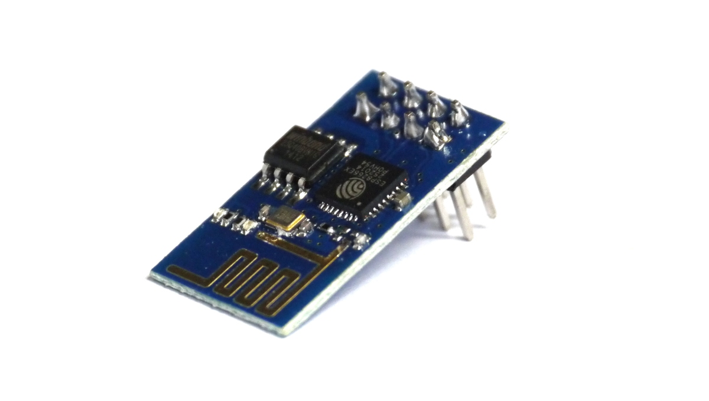
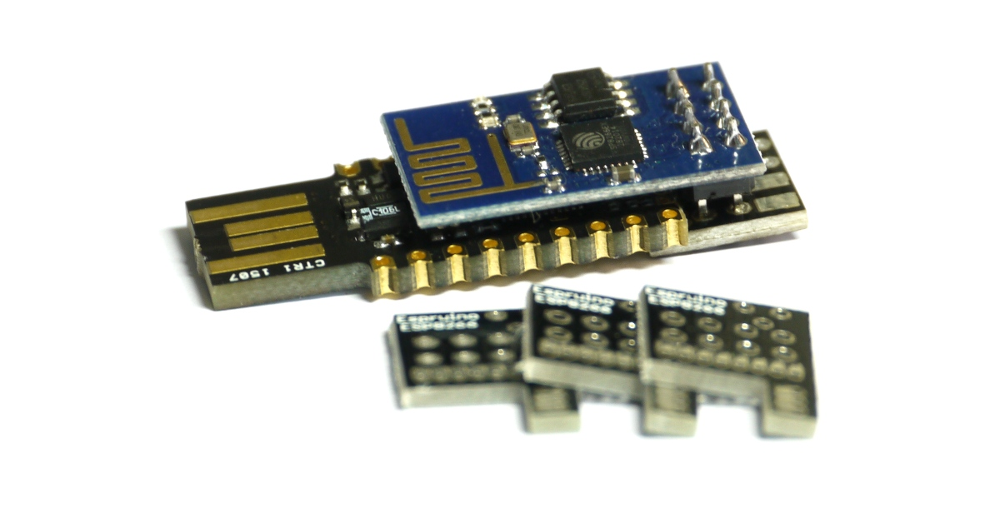
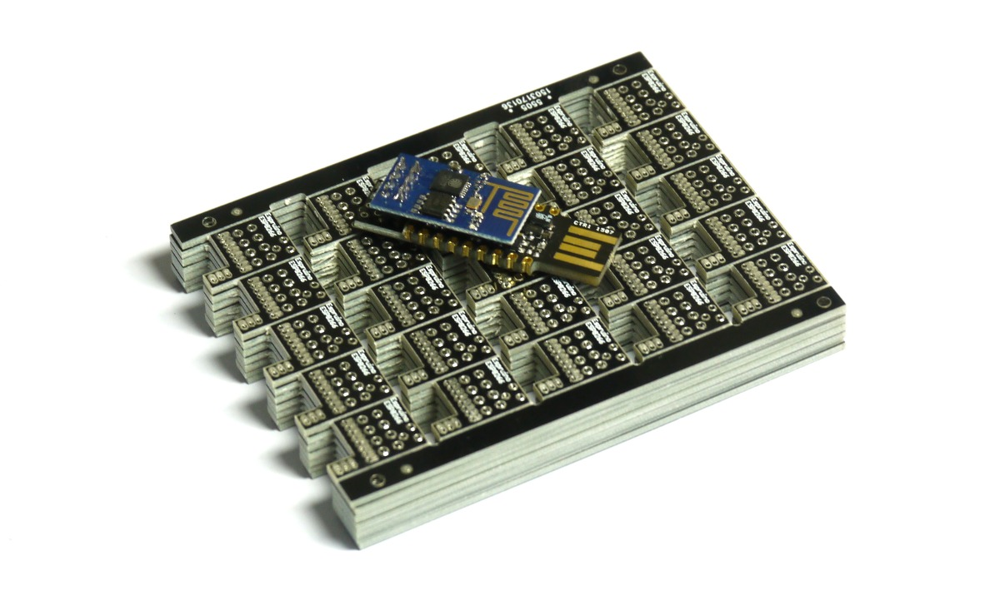
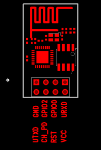
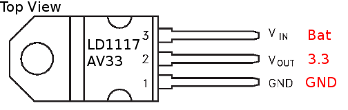

<!--- Copyright (c) 2014 Gordon Williams, Pur3 Ltd. See the file LICENSE for copying permission. -->
ESP8266 WiFi Module
=================

* KEYWORDS: Wireless,Module,WiFi,WLAN,Ethernet,Internet,LAN,Web Server,HTTP,Built-In,Wi07c,ESP8266,ESP8266WiFi,ESP01,ESP12,ESP-01,ESP-12
* USES: AT

**Note:** *This page contains information on using an ESP8266 module with an Espruino board. If you want to run the
Espruino Firmware directly on an ESP8266 board, see [this page instead](/EspruinoESP8266)*



Support is provided in Espruino by the [[ESP8266WiFi.js]] and [[ESP8266WiFi_0v25.js]] modules.

Different versions of the ESP8266 firmware communicate at different baud rates and have subtly different commands - make sure you use the ESP8266 module that corresponds to the ESP8266 firmware version that you have.

Espruino Pico Shim
----------------





The [Shim](/Shims) available for the Espruino Pico helps to adapt the ESP8266 to fit onto the Pico, while still keeping all of the IOs intact.

There are pads for an optional 3.3v regulator (not needed) and a 1206 or 1210-style capacitor. It's often a good idea to fit the capacitor if you're planning on powering anything else from the Pico's 3.3v rail. A 47uF, 6.3v 1210 MLCC capacitor [like this one](http://uk.farnell.com/murata/grm31cr60j476ke19l/cap-mlcc-x5r-47uf-6-3v-1206/dp/1828809) is perfect.

Please see the videos below for more information on wiring the shims up:

### Shim Version 1

[[http://youtu.be/zqI_g-T0HP0]]

If you have the v1 shim and your Pico has pins pre-installed, you will need to cut the black plastic away from the last 3 pins in order to fit the [shim](/Shims).

### Shim Version 2

[[http://youtu.be/BGaCPDWYOOY]]

Shim wiring:

| Pin   | Pico Shim 1 | Pico Shim 2 | Notes |
|-------|------|-------|
| URXD  | A2  | A2  | (Serial2) |
| VCC   | 3.3 | 3.3 |       |
| GPIO0 | N/C | A1  |       | 
| RST   | N/C | A10 |       |
| GPIO2 | N/C | A0  |       |
| CH_PD | 3.3 | B9  | Boot mode - must be 3.3v to enable WiFi |
| GND   | GND | GND |      |
| UTXD  | A3  | A3  | (Serial2)  |


Wiring Up
--------



(viewed from component side)

| Pin   | Espruino | Pico | Notes |
|-------|----------|------|-------|
| URXD  | C10  (Serial3 / Serial4) | A2 (Serial2) | |
| VCC   | 3.3      | 3.3 | You'll need an extra 3.3v regulator when using this on an original [Espruino board](/EspruinoBoard) as it can't supply enough power. The [[Pico]] is fine without though. |
| GPIO0 | Not Connected | |      |
| RST   | Not Connected | |      |
| GPIO2 | Not Connected | |      |
| CH_PD | 3.3      | 3.3  | Boot mode - must be 1 to enable WiFi      |
| GND   | GND      | GND |      |
| UTXD  | C11 (Serial3 / Serial4) | A3 (Serial2)  |  |

**Note:** 

* If you're not using the ESP8266 shim, you will almost certainly need to add at least a 10uF capacitor between `GND` and the ESP8266's `3.3v` line to get it to work reliably.

* If you're using the [Adafruit HUZZAH board](https://www.adafruit.com/product/2471), you'll only need power, GND, and RX/TX for it to work. As the board has its own voltage regulator, you'll need to run it off of 5V, not 3.3V.


The board communicates at 9600 8 baud, 1 stop bit, no parity. *However some versions use 115200 baud - see below*.

To add a voltage regulator (needed on the original [Espruino board](/EspruinoBoard)), we'd suggest you wire up an LD1117AV33 as follows:



If you're using the [Shim](/Shims) for the Espruino Pico you needn't worry about this - just solder the [Shim](/Shims) to the Espruino and the ESP8266.


Firmware Versions
---------------

To quickly test which firmware you have and that you have a connection, paste the following code into the left hand side of the Web IDE (making sure you use the pins and Serial port from the table above):

```
var serial = Serial2;
var pins = { rx: A3, tx : A2 };
function test(baud) {
  serial.removeAllListeners();
  var l="";
  serial.on('data', function(d) {l+=d;});
  serial.setup(baud, pins);
  serial.write("AT+GMR\r\n");
  setTimeout(function(){console.log(JSON.stringify(l));},800);
}
digitalWrite(B9,1); // enable on Pico Shim V2
setTimeout(function() { test(9600); }, 2000);
setTimeout(function() { test(115200); }, 3000);
setTimeout(function() { test(57600); }, 4000);
setTimeout(function() { console.log("Done!"); }, 5000);
```

After 6 seconds it should write `Done!`, but before that on one of the three quoted lines you should see something like `"AT+GMR\r\r\n0018000902-AI03\r\n\r\nOK\r\n"`, showing that `0018000902-AI03` is the version number.

If you don't get any response, check that the red power LED on the ESP8266 is lit, and that you have TX and RX wires the correct way around.

| Tested Version    | Baud Rate  | Module Name | Notes |
|-------------------|------------|-------------|-------|
| `0018000902-AI03` | 9600       |`ESP8266WiFi` | This was the version sent on boards that came with the Espruino Pico KickStarter. It's quite old now, and is known have quite a few bugs. ([download firmware](/files/ESP8266_AT_V00180902_04.bin))  |
| `0.25.0.0`        | 115200 |`ESP8266WiFi_0v25` | This is a newer, more reliable version ([download firmware](/files/ESP8266_AT25-SDK112-512k.bin)) |
| `0.40.0.0`        | 115200 |`ESP8266WiFi_0v25` | This comes pre-installed on most AI-thinker modules at the moment, and works well with Espruino  |
| `0.50.0.0`        | 115200 |`ESP8266WiFi_0v25` | This appears to be the newest firmware ([download firmware](http://bbs.espressif.com/viewtopic.php?f=46&t=1123)), however at the moment we'd recommend 0.25 over this, as it has been tested more thoroughly. |

If you don't have the `0018000902-AI03` firmware version, make sure you change the baud rate and Module Name in the code examples below.

Updating ESP8266 Firmware
----------------------

While ESP8266 has the ability to automatically update its firmware over the air, the functionality in most early ESP8266 boards is broken - making updates a lot more difficult.

There are 2 main options:

### Use a separate USB-TTL adaptor

This is the easiest *if your ESP8266 isn't soldered to your Espruino*. If it is, you might want to try the second option.

* Get a USB-TTL converter
* Connect it to the ESP8266's RX and TX pins, and short GPIO2 to 3.3v when you first apply power to your ESP8266 (see the diagram under 'Wiring Up' to find which pins are which).
* Then, either use the [esptool.py command-line tool](https://github.com/themadinventor/esptool) like this: `./esptool.py write_flash 0 binary_file.bin`
* Or [there is a tutorial using a Windows-based GUI on Instructables](http://www.instructables.com/id/Intro-Esp-8266-firmware-update/)

### Use Espruino

With newer Espruino firmwares (1v80) and later, you can flash the ESP8266 by using Espruino as a makeshift USB-TTL adaptor (this is easier on Linux/MacOS):

* Download [esptool.py](https://github.com/themadinventor/esptool) and get the correct firmware from the links in the table above.
* Change the following lines in `esptool.py`:

```Python
# Maximum block size for RAM and Flash writes, respectively.
ESP_RAM_BLOCK   = 0x80
ESP_FLASH_BLOCK = 0x80
```

* Make sure you have an up to date Espruino firmware
* Connect to Espruino, copy and paste this code into the left-hand side, and click the disconnect button in the Web IDE (don't physically disconnect the board):

```
// On the Pico's new ESP8266 shim the following 4 lines automatically reboot into bootloader mode
digitalWrite(B9,1);
digitalWrite(A1,0);
digitalWrite(A10,0); // pulse reset
digitalWrite(A10,1);
// -------------------------
Serial2.setup(115200, { rx: A3, tx : A2 });
Serial2.on('data', function(d) { USB.write(d); });
USB.on('data', function(d) { Serial2.write(d); });
Serial1.setConsole();
```

* If you don't have the Pico's new ESP8266 shim, you'll need to boot the ESP8266 into bootloader mode manually. Take 2 wires and connect one side of each to GND. Connect the first to GPIO0, while connecting and releasing the second to RST (see the diagram under 'Wiring Up' to find which pins are which). See the video below:

[[http://youtu.be/X12YdIhaauI]]

* Finally run this command:

```Bash
./esptool.py -p /dev/ttyACM0 -b 115200 write_flash 0 your_firmware.bin
```

The command above assumes you're running Linux. If you're using Windows or MacOS you'll have to change `/dev/ttyACM0` to the name of the Serial port that Espruino is on. If everything works, it'll take a few minutes to update the ESP8266.

If not,

* If you're on Mac, you may need to install the `PySerial` library in order for `esptool.py` to work correctly.
* Check that the code under `Firmware Versions` works - this'll make sure your power and serial lines are connected properly
* When resetting into bootloader mode, the blue LED on the ESP8266 should flash briefly *once*. If it flashes twice then most likely GPIO0 wasn't shorted to GND when RST was released.

Software
-------

Just use something like the following for the Espruino Pico:

```
digitalWrite(B9,1); // enable on Pico Shim V2
Serial2.setup(115200, { rx: A3, tx : A2 });
var wifi = require("ESP8266WiFi_0v25").connect(Serial2, function(err) {
  //                ^^^^^^^^^^^^^^^^
  //                Use ESP8266WiFi here (and 9600 baud) if you have an ESP8266 with firmware older than 0.25
  if (err) throw err;
  wifi.reset(function(err) {
    if (err) throw err;
    console.log("Connecting to WiFi");
    wifi.connect("WiFi_Name","WPA2_Key", function(err) {
      if (err) throw err;
      console.log("Connected");
      // Now you can do something, like an HTTP request
      require("http").get("http://www.pur3.co.uk/hello.txt", function(res) {
        console.log("Response: ",res);
        res.on('data', function(d) {
          console.log("--->"+d);
        });
      });
    });
  });
});
```

or the following for the original Espruino board:

```
Serial4.setup(115200, { rx: C11, tx : C10 });
var wifi = require("ESP8266WiFi_0v25").connect(Serial4, function() {
  //                ^^^^^^^^^^^^^^^^
  //                Use ESP8266WiFi here (and 9600 baud) if you have an ESP8266 with firmware older than 0.25
 ...
}
```

**Note:** You don't absolutely have to call `reset()`, but in order to get a reliable connection we'd recommend it.


Apart from the initialisation (`require("ESP8266WiFi").connect(...)`) the networking code should be identical to that described on the [[Internet]] page.

Gotchas
------

* `Uncaught No 'ready' after AT+RST`? Check you've got the correct firmware and baud rate, and that your wiring is correct.
* `WARNING: Module "NetworkJS" not found` is because you either need to update the firmware on your Espruino board, or you're using a third-party board that doesn't have network support.
* You can only have a maximum of 5 concurrent TCP/IP clients
* You can only have one TCP/IP server, and while it is active you *can not have any clients*
* You'll need to have the correct firmware on the ESP8266 (see above). See some of the links below for details on how to modify your firmware.

Reference
--------

`wifi.at`

The AT command handler - use this to send your own AT commands to the ESP8266. 
You can also call `wifi.at.debug()` to return debugging information and to turn
on debug messages.

`wifi.debug()`

Return information on open sockets and received data.

`wifi.init(function(err) { ... })`

Initialise WiFi settings - you shouldn't ever need to call this. The callback is called with `err==null` on success.

`wifi.reset(function(err) { ... });`

Reset the ESP8266 with `AT+RST`, also call `wifi.init`. The callback is called with `err==null` on success.

`wifi.getVersion(function(err, version) { ... });`

Call the callback with the version number reported back from the `AT+GMR` command. The callback is called with `err==null` on success.

`wifi.connect(ssid, key, function(err) { ... });`

Connect to the given access point. The callback is called with `err==null` on success.

`wifi.getAPs(function(err, aps) { ... });`

Call the callback with a list of access points, of the form `aps = [ { ssid, enc, signal_strength, mac_address } ]`.  The callback is called with `err==null` on success.

`wifi.getConnectedAP(function(err, ap) { ... });`

Call the callback with the name of the currently connected access point.  The callback is called with `err==null` on success.

`wifi.createAP(ssid, key, channel, enc, function(err) { ... })`

Create an access point with the given ssid, key, channel, and encoding. Encoding can be `0`, `undefined`, `"open"`, `"wep"`, `"wpa_psk"`, `"wpa2_psk"` or `"wpa_wpa2_psk"`.

See [the table on Wikipedia](http://en.wikipedia.org/wiki/List_of_WLAN_channels#Interference_concerns) for available channels. Channels 5 to 11 seem safe to use in virtually all countries. The function may fail if the supplied key is too short.

*Example:* `wifi.createAP("ESP123","HelloWorld",5,"wpa2_psk",print)`

`wifi.getConnectedDevices(function(err, devices) { ... });` (0v25 firmware only)

If if AP mode (with `wifi.createAP`), call the callback with the second argument as an array of `{ ip, mac }` objects - one for each connected device.

`wifi.getIP(function(err, ip) { ... });`

Call the callback with the current IP address, as a String.  The callback is called with `err==null` on success.

Other Resources
-------------

* [EspressIF ESP8266 Wifi](https://github.com/espressif/esp8266_at/wiki)
* http://wiki.iteadstudio.com/ESP8266_Serial_WIFI_Module
* http://www.electrodragon.com/w/Wi07c
* https://nurdspace.nl/ESP8266
* http://www.esp8266.com
* http://hackaday.com/2014/09/06/the-current-state-of-esp8266-development
* http://hackaday.io/project/2879-ESP8266-WiFi-Module-Library

Using 
-----

* APPEND_USES: ESP8266

Buying
-----

* http://www.electrodragon.com/product/esp8266-wi07c-wifi-module
* [digitalmeans.co.uk](https://digitalmeans.co.uk/shop/index.php?route=product/search&tag=esp8266)
* [ESP8266 Shim on Tindie](https://www.tindie.com/products/gfwilliams/espruino-pico-esp8266-wifi-shim/)
* [Adafruit HUZZAH ESP12 breakout](https://www.adafruit.com/product/2471)
