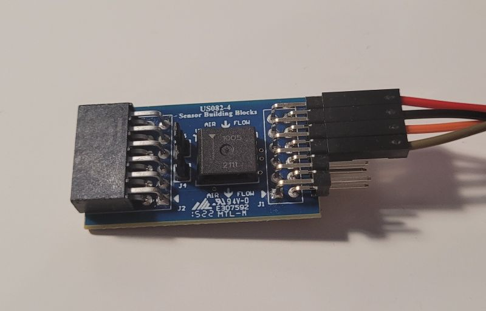

<!--- Copyright (c) 2018 Gordon Williams. See the file LICENSE for copying permission. -->
Renesas FS3000 Air velocity sensor module
==================================

<span style="color:red">:warning: **Please view the correctly rendered version of this page at https://www.espruino.com/FS3000. Links, lists, videos, search, and other features will not work correctly when viewed on GitHub** :warning:</span>

* KEYWORDS: Module,I2C,FS3000,air-velocity,environmental-sensor,sensor

[FS3000](https://www.renesas.com/us/en/products/sensor-products/flow-sensors/fs3000-air-velocity-sensor-module) is an [[I2C]] digital air velocity sensor by Renesas, which is handled with the [FS3000](/modules/FS3000.js) module.
This sensor comes in two variants: FS3000-1005 (measuring up to 7.23 m/s) and FS3000-1015 (measuring up to 15 m/s).
This is a unidirectional sensor: you can only measure air velocity in one direction. Air flowing backwards results in 0 reading.


How to use
-----------
For ease of use, there is a reasonably priced [Pmod(tm) compatible board from Renesas](https://www.renesas.com/us/en/products/sensor-products/flow-sensors/us082-fs3000evz-air-velocity-sensor-pmod-board-renesas-quickconnect-iot), other breakouts are available too.

It's a simple I2C sensor, you only have to connect GND, 3.3v, SDA and SCL.
The sensor is continuously measuring air velocity, there is no initialization, configuration or sleep mode. Current consumption is ~10mA by the datasheet.


By default, this module assumes the FS3000-1005 variant. If you have the FS3000-1015 variant, pass in true as the second parameter to the `connect` function.
The return value of the `read` function is the air velocity in meter/second, if the checksum is correct. If the checksum calculation fails, the function returns -1.

Wiring up
---------
This sensor can use only one I2C address: 0x28. This means if you want to use multiple sensors, you would have to connect it to different pins, or use an I2C multiplexer. You can use I2C speed up to 400kHz.

| PMOD Pin | Espruino Wifi |
| -------- | ------------- |
| 3 (SCL)  | B8            |
| 4 (SDA)  | B9            |
| 5 (GND)  | GND           |
| 6 (3.3)  | 3.3           |




```
I2C1.setup({scl: B8, sda: B9, bitrate: 400000});

// using the FS3000-1005
var fs1005 = require("FS3000").connect(I2C1);

// using the FS3000-1015
var fs1015 = require("FS3000").connect(I2C1, true);


setInterval(function() {
  print(fs1005.read());
  // outputs air velocity in m/s 
}, 200);
```


Reference
---------

* APPEND_JSDOC: FS3000.js


Using
-----

* APPEND_USES: FS3000