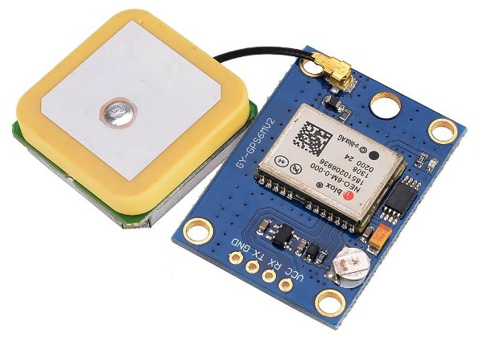

<!--- Copyright (c) 2013 Gordon Williams, Pur3 Ltd. See the file LICENSE for copying permission. -->
GPS Module
=========

* KEYWORDS: GPS,Module,Global Positioning System,Location,NEO6MV2,Ublox,NMEA,UART



GPS devices are getting very small and very cheap, and they pretty much all use the [NMEA standard](http://www.gpsinformation.org/dale/nmea.htm). This transfers simple human-readable serial data at 9600 baud.

To use a GPS module, just wire it up as follows. I'm using the Ublox NEO6MV2 module:

| GPS | Espruino |
|-----|----------|
| VCC | Bat      |
| RX  | C10      |
| TX  | C11      |
| GND | GND      |

**Note:** The Ublox NEO6MV2 has a voltage regulator on board - however if you have a different module then it might need a 3.3v supply.

For software, just do something like the following:

```
Serial4.setup(9600,{tx:C10,rx:C11});
var gps = require("GPS").connect(Serial4, function(data) {
  console.log(data);
});
```

This will return data every second that looks a lot like:

```
...
{ "time":"16:35:29", "lat":53.068403,"lon":-4.076282,"fix":1,"satellites":7,"altitude":1085.0 }
...
```

The latitude and longitude are in degrees North and East respectively, and altitude is in meters.


There's a [lot more](http://www.gpsinformation.org/dale/nmea.htm) data available from the GPS (such as velocity), and hopefully the amount of data returned to the callback will increase as the library gets more full-featured.


Using
-----

* APPEND_USES: GPS


Buying
-----

* [eBay](http://www.ebay.com/sch/i.html?_nkw=Ublox+NEO6MV2)
