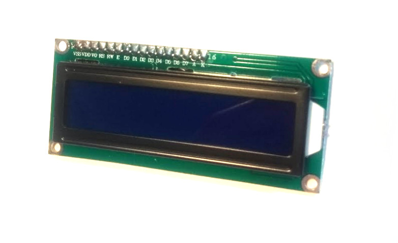

<!--- Copyright (c) 2013 Gordon Williams, Pur3 Ltd. See the file LICENSE for copying permission. -->
HD44780 Character LCD
===================

<span style="color:red">:warning: **Please view the correctly rendered version of this page at https://www.espruino.com/HD44780. Links, lists, videos, search, and other features will not work correctly when viewed on GitHub** :warning:</span>

* KEYWORDS: Module,HD44780,I2C,PCF8574,LCD,Display,Text,Character,20x4,16x2,1602,2004,big number module

Almost all character LCDs currently available are compatible with the HD44780 driver IC. It can work in either 8 or 4 bit modes, however most microcontrollers choose to save IO by using the 4 bit mode.

Support for this display is included in the [[HD44780.js]] module.

Simple Example
--------------

### I2C

If you have one of the LCDs with an [[I2C]] backpack (containing a PCF8574 8 bit IO expander), just use connect it to I2C with 2 pullup resistors, and use the following example:

```JavaScript
I2C1.setup({scl:B6, sda:B7});
var lcd = require("HD44780").connectI2C(I2C1);
lcd.print("Hello World!");
```

The default I2C device address is 0x27. To customize it specify it as second parameter to `connectI2C`:

```
require("HD44780").connectI2C(I2C1, 0x3F);
```

### Parallel



Otherwise if you're using the normal parallel interface try the following connections:

| LCD | Function | Espruino |
|-----|----------|----------|
| 1  VSS | GND      | GND      |
| 2  VDD | VCC      | Bat (5V) |
| 3  VO  | Contrast | GND or variable resistor |
| 4  RS  | RS       | A0       |
| 5  RW  | RW       | GND      |
| 6  E   | EN       | A1       |
| 7  D0  | D0       | -        |
| 8  D1  | D1       | -        |
| 9  D2  | D2       | -        |
| 10 D3  | D3       | -        |
| 11 D4  | D4       | C0       |
| 12 D5  | D5       | C1       |
| 13 D6  | D6       | C2       |
| 14 D7  | D7       | C3       |
| 15 A   | LED +    | Bat      |
| 16 K   | LED -    | GND (5V) |

**Note:** Pin 1 is usually the pin nearest the corner. If in doubt and
your LCD has no markings it's usually pretty easy to see the big PCB 
trace for GND on one side, and the two wires going to the LED backlight
on the other.

And code:

```JavaScript
//                                   rs,en,d4,d5,d6,d7
var lcd = require("HD44780").connect(A0,A1,C0,C1,C2,C3);
lcd.print("Hello World!");
``` 

However, none of the pins used need special functions, so you should be able to use any of Espruino's pins.

### Other

If your display is connected in some other way, you can specify your own `write` function:

```
function writeFn(data, cmd) {
  // data is a number from 0..255
  // cmd is 1 for a command, 0 or undefined for data
}
var lcd = new require("HD44780").HD44780(writeFn);
```


Printing an Analog value every second
-------------------------------------

```JavaScript
// var lcd = ... from simple example above ...
function showData() {
 lcd.clear();
 lcd.setCursor(0,0);
 lcd.print("Current data:");
 lcd.setCursor(4,1);
 lcd.print("D1 = "+analogRead(D1));
}
setInterval(showData, 1000);
```


With a Bar Chart
--------------

You can easily create custom characters too. The example below creates custom characters for a bar chart, reads an analog value every 5 seconds, and keeps a 20 sample history!

```JavaScript
// var lcd = ... from simple example above ...
lcd.createChar(0,[0,0,0,0,0,0,0,31]);
lcd.createChar(1,[0,0,0,0,0,0,31,31]);
lcd.createChar(2,[0,0,0,0,0,31,31,31]);
lcd.createChar(3,[0,0,0,0,31,31,31,31]);
lcd.createChar(4,[0,0,0,31,31,31,31,31]);
lcd.createChar(5,[0,0,31,31,31,31,31,31]);
lcd.createChar(6,[0,31,31,31,31,31,31,31]);
lcd.createChar(7,[31,31,31,31,31,31,31,31]);
var history = new Array(20);


function showData() {
 for (var i=1;i<history.length;i++) history[i-1]=history[i];
 history[history.length-1] = Math.round(analogRead(D1)*16);

 lcd.clear();
 lcd.setCursor(0,0);
 lcd.print("Current data:");
 lcd.setCursor(4,1);
 lcd.print("D1 = "+analogRead(D1));
 lcd.setCursor(0,2);
 for (var i=0;i<history.length;i++) {
  var n=history[i];
  if (n>16) n=16;
  lcd.write((n>8)?(n-9):32);
 }
 lcd.setCursor(0,3);
 for (var i=0;i<history.length;i++) {
  var n=history[i];
  if (n>8) n=8;
  lcd.write((n>0)?(n-1):32);
 }
}
setInterval(showData, 5000);
```


Big Number Module
----------------

You might want super big numbers on your 20x4 display - in which case you can use the [[big_number.js]] module... The code below sets up the LCD with a few custom characters, and then uses them to display full-height characters.

Each big number is 4 characters deep, and 3 characters wide.

```showDigit``` draws a number: and the first parameter is the X position, the second is the number itself. 

```showNumber``` draws a a 5 digit number over the whole LCD. Use it like this:

Use it as follows:

```JavaScript
// var lcd = ... from simple example above ...
var disp = require("big_number").use(lcd);
// fill the screen with '12345'
disp.showNumber(12345);
// or draw just the digits you want, where you want
lcd.clear();
disp.showDigit(0,1);
disp.showDigit(3,2);
disp.showDigit(6,3);
disp.showDigit(9,4);
```


Using 
-----

* APPEND_USES: HD44780


Buying
-----
* [eBay](http://www.ebay.com/sch/i.html?_nkw=HD44780&_sacat=92074)
* [digitalmeans.co.uk](https://digitalmeans.co.uk/shop/index.php?route=product/search&tag=hd44780)
