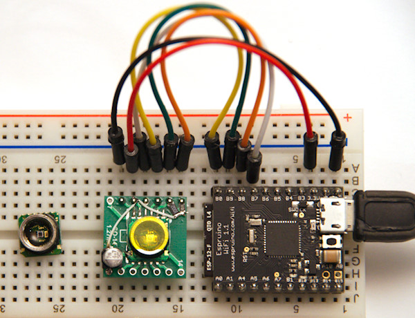

<!--- Copyright (c) 2016 Luwar. See the file LICENSE for copying permission. -->
HP03S pressure sensor module
============================

* KEYWORDS: Module,I2C,HP03S,pressure,temperature,altitude,sensor



The HP03S is a pressure and temperature module with:

* standard I2C interface plus two additional output pins required
* 300-1100hpa absolute pressure range
* -20..+60°C temperature range
* Supply voltage 2.2v-3.6v with automatic power down switching
* Low power consumption: 1µA standby supply current; 500µA supply current during conversion

Use the [HP03S](/modules/HP03S.js) module for it.


Wiring
------

You need an SO-xx adapter if you want to use it with a breadboard.

You can use any I2C port, e.g. I2C1. Additionally a simple output pin and one pwm pin are required.

| Device Pin | Espruino e.g. Wifi | Description
| ---------- | ------------------ | --------------------------------------------- |
| 1 SCL      | B8 I2C1 SCL        |                                               |
| 2 SDA      | B9 I2C1 SDA        | Don\'t forget I²C pullup                      |
| 3 XCLR     | B0                 | Any Espruino output pin                       |
| 4 MCLK     | B7 PWM             | pwm pin - internal clock for the AD-converter |
| 5 VDD      | 3.3                |                                               |
| 6 VSS      | GND                |                                               |

Important Notices from the datasheet: *Never unplug the module when power is on.*


### Initialisiation

```JavaScript
I2C1.setup( { scl: B6, sda: B7 } );
var hp03s = require('HP03S').connect( { i2c: I2C1, mclk: B4, xclr: B5 } );
```


### Reading pressure in Pa and temperature in °C

```JavaScript
I2C1.setup( { scl: B6, sda: B7 } );
var hp03s = require('HP03S').connect( { i2c: I2C1, mclk: B4, xclr: B5 } );

hp03s.getPressure( function( pressure, temperature ) {
    console.log( "Pressure    = " + pressure + " Pa" ); 
    console.log( "Temperature = " + temperature + " °C" ); 
} );
```

You can only start a new measurement when a previous measurement is completed.


Links
-----
* Manufacturer [http://www.hoperf.com/pressure_sensor/digital/HP03S.html](http://www.hoperf.com/pressure_sensor/digital/HP03S.html)
* Datasheet [http://www.hoperf.com/upload/sensor/HP03S.pdf](http://www.hoperf.com/upload/sensor/HP03S.pdf)


Buying
------
* AliExpress [http://www.aliexpress.com/wholesale?SearchText=hp03s](http://www.aliexpress.com/wholesale?SearchText=hp03s)
* EBay [http://www.ebay.co.uk/sch/i.html?_nkw="hp03s"](http://www.ebay.co.uk/sch/i.html?_nkw="hp03s")
* Pollin [https://www.pollin.de/shop/dt/MDg4OTgxOTk-](https://www.pollin.de/shop/dt/MDg4OTgxOTk-)


References
----------

* APPEND_JSDOC: HP03S.js
