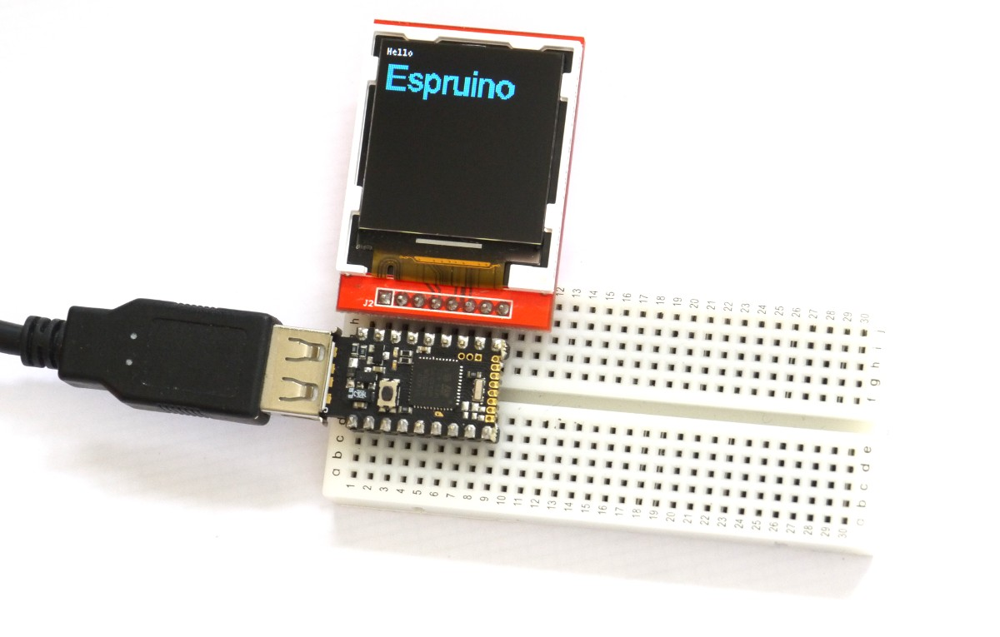

<!--- Copyright (c) 2015 Gordon Williams, Pur3 Ltd. See the file LICENSE for copying permission. -->
ILI9163 LCD controller
===================

<span style="color:red">:warning: **Please view the correctly rendered version of this page at https://www.espruino.com/ILI9163. Links, lists, videos, search, and other features will not work correctly when viewed on GitHub** :warning:</span>

* KEYWORDS: Module,SPI,ILI9163,Graphics,Graphics Driver,LCD,Color,Colour,128x128,ST7735



This is a common LCD controller for 128x128 LCDs. These are available cheaply from via various suppliers online, often marketed as 'Nokia 5110 LCD Replacements' - While the modules are pin compatible, they're not software compatible and require this driver instead of the [[PCD8544]] one.

Support is included in the [[ILI9163.js]] module, using the [[Graphics]] library.

Just wire up as follows:

| LCD pin | Pin type | Example pin on Espruino Board |
|---------|----------|-------------------------------|
| VCC | Power | B15 or 3.3v |
| GND | Power | B14 or GND |
| CS/CE  | GPIO | B13 |
| RST | GPIO | B10 or 3.3v | 
| A0/DC  | GPIO | B1  |
| SDA | SPI MOSI | A7  |
| SCL | SPI SCK | A6  |
| LED | GPIO/Power | A5 or 3.3v  |

**Note:** The display takes around 200ms to initialise after calling 'connect'. There's an optional callback that is called after this time (shown in the examples). Sending data to it before initialisation may cause it not to initialise correctly.


Normal mode
-----------

```
B15.set();// VCC
B14.reset(); // GND
A5.set(); // Backlight On

var spi = new SPI();
spi.setup({mosi:A7 /* sda */, sck:A6 /* scl */});
var g = require("ILI9163").connect(spi, B1 /* DC */, B13 /* CE */, B10 /* RST */, function() {
  g.clear();
  g.setRotation(2);
  g.drawString("Hello",0,0);
  g.setFontVector(20);
  g.setColor(0,0.5,1);
  g.drawString("Espruino",0,10);
});
```

This module doesn't use a double-buffer as it would use up almost all the RAM - `128 * 128 * 16bpp = 32768 bytes`. Pixels are written to the display as they are drawn, so you will get some flicker and relatively slow updates. See the next heading for another option

Paletted Mode
-------------

```
B15.set();// VCC
B14.reset(); // GND
A5.set(); // Backlight On

var colorPalette = new Uint16Array([0, 0xF80F, 0x001F, 0xFFFF]);
var spi = new SPI();
spi.setup({mosi:A7 /* sda */, sck:A6 /* scl */});
var g = require("ILI9163").connectPaletted(colorPalette, spi, B1 /* DC */, B13 /* CE */, B10 /* RST */, function() {
  g.clear();
  g.setRotation(2);
  g.setColor(3);
  g.drawString("Hello",0,0);
  g.setColor(1);
  g.setFontVector(20);
  g.drawString("Espruino",0,10);
  g.flip();
});
```

As there isn't enough RAM to store full 16 bit pixels of the LCD display in Espruino's RAM, this stores a paletted version of the data. For instance if you only need 4 colours, these can be stored as 2 bits per pixel rather than 16. The buffer then takes `128 * 128 / 4 = 4096 bytes` which will fit into the available RAM.

This means that all drawing functions can be done much more quickly offscreen, and then the LCD can be updated in one go (removing flicker).

To use this module, simply use the `connectPaletted` function and supply a palette array as the first argument. The palette can be either 1, 2, 4 or 8 bits - so the array should be either 2, 4, 16 or 256 elements. Then, when you use `setColor`, the number you supply corresponds to that array element in the palette array,

Using 
-----

* APPEND_USES: ILI9163

Buying
-----

* [eBay](http://www.ebay.com/sch/i.html?_nkw=1.44+128x128)

