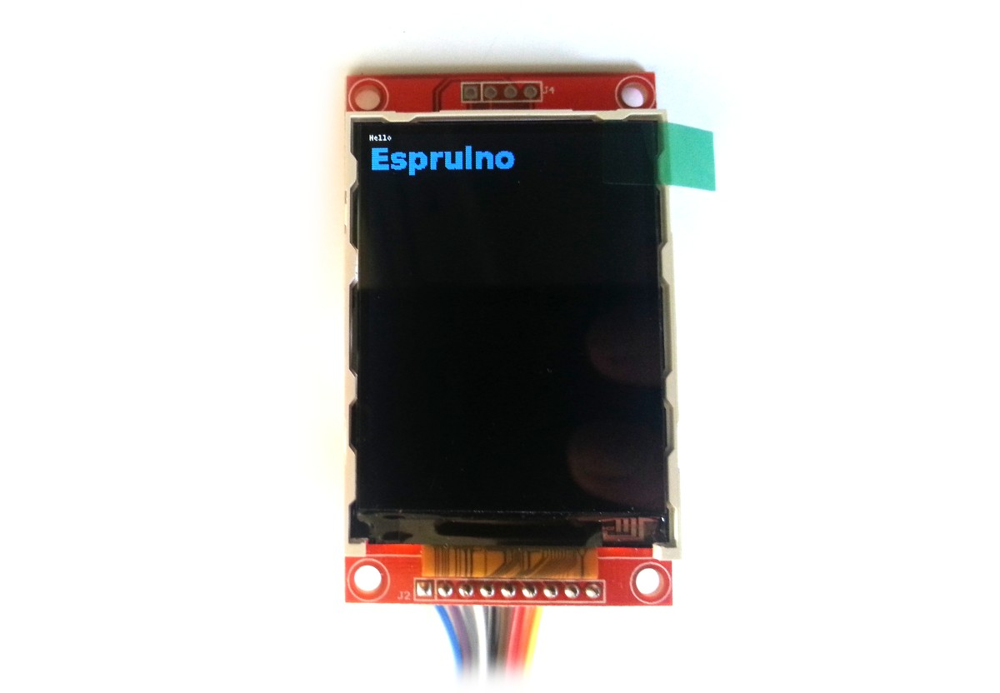

<!--- Copyright (c) 2013 Gordon Williams, Pur3 Ltd. See the file LICENSE for copying permission. -->
ILI9341 LCD controller
===================

<span style="color:red">:warning: **Please view the correctly rendered version of this page at https://www.espruino.com/ILI9341. Links, lists, videos, search, and other features will not work correctly when viewed on GitHub** :warning:</span>

* KEYWORDS: Module,SPI,ILI9341,Graphics,Graphics Driver,LCD,Color,Colour,320x240



This is an extremely common LCD controller for 320x240 LCDs. These are available cheaply from via various suppliers online.

Support is included in the [[ILI9341.js]] and [[ILI9341pal.js]] modules, using the [[Graphics]] library.

Just wire up as follows:

| LCD pin | Pin type | Example pin on Espruino Board |
|---------|----------|-------------------------------|
|  VCC       | 5V       | Bat                        |
|  GND       | GND      | GND                        |
|  CS        | Any      | B8                         |
|  RESET     | Any      | B7                         |
|  D/C       | Any      | B6                         |
|  SDI(MOSI) | SPI MOSI | B5                         |
|  SCK       | SPI SCK  | B3                         |
|  LED       | Any      | B2                         |
|  SDO(MISO) | SPI MISO | B4 (Unused)                |

**Note:** The display takes around 200ms to initialise after calling 'connect'. There's an optional callback that is called after this time (shown in the examples). Sending data to it before initialisation may cause it not to initialise correctly.


Normal mode
-----------

```
B2.set(); // light on
SPI1.setup({sck:B3, miso:B4, mosi:B5, baud: 1000000});
var g = require("ILI9341").connect(SPI1, B6, B8, B7, function() {
  g.clear();
  g.drawString("Hello",0,0);
  g.setFontVector(20);
  g.setColor(0,0.5,1);
  g.drawString("Espruino",0,10);
});
```

This module doesn't use a double-buffer as there isn't enough RAM - `320 * 240 * 16bpp = 153600 bytes`. Pixels are written to the display as they are drawn, so you will get some flicker and relatively slow updates. See the next heading for another option

Paletted Mode
-------------

```
SPI1.setup({sck:B3, miso:B4, mosi:B5, baud: 1000000});
var colorPalette = new Uint16Array([0, 0xF800, 0x001F, 0xFFFF]);
var g = require("ILI9341pal").connect(colorPalette, SPI1, B6, B8, B7, function() {
  g.clear();
  g.setColor(3);
  g.drawString("Hello",0,0);
  g.setFontVector(20);
  g.setColor(1);
  g.drawString("Espruino",0,10);
  g.setColor(2);
  g.drawString("Espruino",0,40);
  g.flip(); //<--- Send to the display
});
```

As there isn't enough RAM to store full 16 bit pixels of the LCD display in Espruino's RAM, this module stores a paletted version of the data. For instance if you only need 4 colours, these can be stored as 2 bits per pixel rather than 16. The buffer then takes `320 * 240 / 4 = 19200 bytes` which will fit into the available RAM.

This means that all drawing functions can be done much more quickly offscreen, and then the LCD can be updated in one go (removing flicker).

To use this module, simply use the [[ILI9341pal.js]] module and supply a palette array as the first argument. The palette can be either 1, 2, 4 or 8 bits - so the array should be either 2, 4, 16 or 256 elements. Then, when you use `setColor`, the number you supply corresponds to that array element in the palette array,

Using 
-----

* APPEND_USES: ILI9341

Buying
-----

* [eBay](http://www.ebay.com/sch/i.html?_nkw=ili9341)
* [digitalmeans.co.uk](https://digitalmeans.co.uk/shop/index.php?route=product/search&tag=ili9341)
