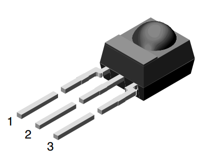

<!--- Copyright (c) 2013 Gordon Williams, Pur3 Ltd. See the file LICENSE for copying permission. -->
Infrared Remote Control Receiver Module
==================================

* KEYWORDS: Module,IR,Infrared,Received,Remote Control,TSOP34838,TSOP322,TSOP324,TSOP344,TSOP348,VS1838B

Remove controls are handled by the [[IRReceiver.js]] module.

Note that there are [several different types of protocol](http://en.wikipedia.org/wiki/Remote_control#Consumer_electronics_infrared_protocols) used by different manufacturers. This module currently only handles space-coded and pulse-length-coded protocols (such as Panasonic, Samsung and Humax). You may find that you need to look at the [[Infrared Remote Control]] tutorial and make your own decoder if you have a different type of remote control.

Wiring Up
--------



Just wire up as follows:

| TSOP348, TSOP344, VS1838B | TSOP322, TSOP324 | Espruino |
|--|--|--|
| 1 (OUT) | 1 (OUT) | A0 |
| 2 (GND) | 3 (GND) | GND |
| 3 (VS) | 2 (VS) | 3.3 |

**Note:** You can use any GPIO pin instead of A0

Software
-------

Simply use it as follows and it will return a string representing the button pressed on the Remote Control.

```
require("IRReceiver").connect(A0, function(code) {
  if (code=="100000000000010001100001000111101") ...
  if (code=="100000000000010000010100011010111") ...
});
```

To find the code, just put a `console.log` statement in the callback that prints the code, and point your remote at the Espruino board!

If nothing is being reported, it may be that your remote control transmits by varying the pulse length rather than the gap between pulses (small remote control helicopters do this). If this is the case, specify `{usePulseLength:true}` as a third argument:

```
require("IRReceiver").connect(A0, function(code) {
  console.log(code);
}, {usePulseLength:true});
```

Using 
-----

* APPEND_USES: IRReceiver

Buying
-----

* [eBay](http://www.ebay.com/sch/i.html?_nkw=TSOP34838)
