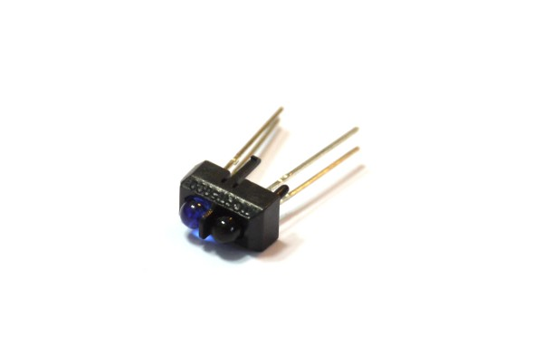

<!--- Copyright (c) 2013 Gordon Williams, Pur3 Ltd. See the file LICENSE for copying permission. -->
Infrared Proximity Sensor
=========

:warning: **Please view the correctly rendered version of this page at https://www.espruino.com/InfraredProximity. Links, lists, videos, search, and other features will not work correctly when viewed on GitHub** :warning:

* KEYWORDS: IR,Infrared,Proximity,Light,Sensor,Phototransistor,TCRT5000

[TCRT5000 Datasheet](/datasheets/TCRT5000.pdf)

The Infrared Proximity Sensor is a simple reflective sensor containing an Infrared LED (blue) and an Infrared Phototransistor (black). When Infrared light from the LED starts to get reflected back to the sensor, the phototransistor starts to conduct.

Using 
-----

* APPEND_USES: TRCT5000

Buying
-----

* [eBay](http://www.ebay.com/sch/i.html?_nkw=TCRT5000)
