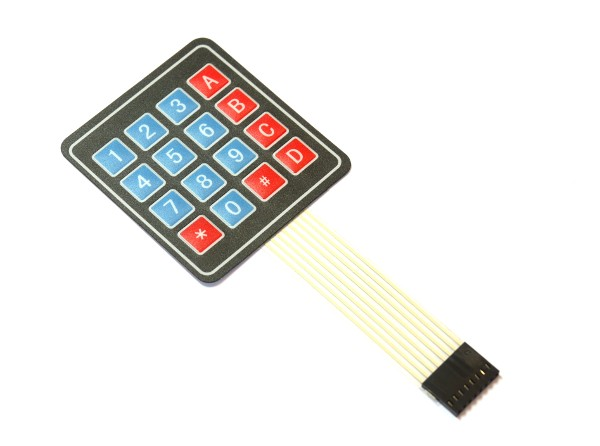
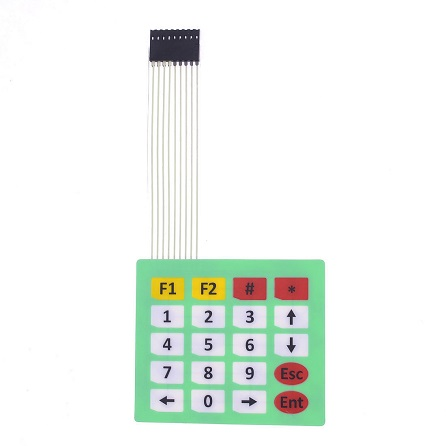

<!--- Copyright (c) 2013 Gordon Williams, Pur3 Ltd. See the file LICENSE for copying permission. -->
KeyPad Matrix
=============

<span style="color:red">:warning: **Please view the correctly rendered version of this page at https://www.espruino.com/KeyPad. Links, lists, videos, search, and other features will not work correctly when viewed on GitHub** :warning:</span>

* KEYWORDS: Module,KeyPad,Key pad,matrix,buttons,button,switch

 


A [KeyPad Matrix](http://en.wikipedia.org/wiki/Keyboard_matrix_circuit) is a selection of switches arranged in a grid. One side of each switch is connected with horizontal wires (rows) and one side is connected with vertical wires (columns). By putting a signal on one side (for example the rows) and reading the other side (the columns), you can determine which key is pressed down.


KeyPads are handled by the [[KeyPad.js]] module. 

Simply supply two arrays, one of wires connected to columns,
one of wires connected to rows.

If a third argument (a callback function) is supplied, watches will be set up, and the callback
will be called automatically as soon as a button is pressed. If it isn't, it's up to the user to
use ```keypad.read()``` to find out what key is pressed. -1 will be returned if no key is pressed.

For example, you could connect the Key Pad in the Ultimate kit to B2,B3,B4,B5,B6,B7,B8 and B9 (they're one long row of pins). The wire nearest the ```D``` key could go to B2, and the wire nearest ```*``` could go to B9. You'd then use the module as follows:

```
require("KeyPad").connect([B2,B3,B4,B5],[B6,B7,B8,B9], function(e) {
  print("123A456B789C*0#D"[e]);
});
```

or

```
var keypad = require("KeyPad").connect([B2,B3,B4,B5],[B6,B7,B8,B9]);
print("123A456B789C*0#D"[keypad.read()]);
```

With the 4x5 KeyPads (readily availble on ebay), the four wires nearest the ```F1``` key are the columns. For example, it might be hooked up like this: 

```
require("KeyPad").connect([B2,B3,B4,B5],[B6,B7,B8,B9,B12], function(e) {
  print("AB#*123U456D789CL0RE"[e]); //A=F1, B=F2, U/D/L/R = Up/Down/Left/Right, C=ESC, E=Enter
});
```

This example uses B12, which also has BTN1 on it - this is fine, though pressing BTN1 will result in spurrious keypresses being recorded. 


Caveats
-----

* This module sets watches on the *columns*. The STMF103 chip (used in the Espruino board) does not allow a watch to be put on two pins with the same number at the same time (for example, A0 and C0). This must be taken into account when choosing pins to use, particularly with regards to other modules which set watches. Watches are not set on the *rows*, so there are no special restrictions on those. 

* It is impossible to reliably detect multiple simultaneous keypresses on a switch matrix (without including a diode for each switch, which most keypads don't have). This modules does not try to handle multiple key-presses. 


Using 
-----

* APPEND_USES: KeyPad

Buying
-----

* [eBay](http://www.ebay.com/sch/i.html?_nkw=matrix+membrane+keypad)
* [digitalmeans.co.uk](https://digitalmeans.co.uk/shop/index.php?route=product/search&tag=membrane-button)

