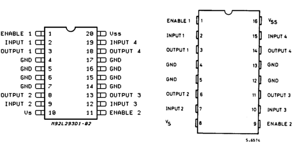
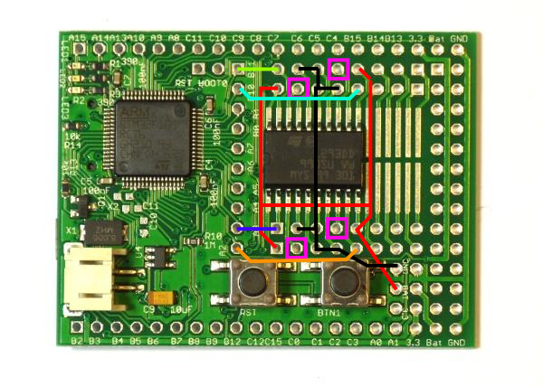

<!--- Copyright (c) 2013 Gordon Williams, Pur3 Ltd. See the file LICENSE for copying permission. -->
L293D Motor Driver IC
=====================

<span style="color:red">:warning: **Please view the correctly rendered version of this page at https://www.espruino.com/L293D. Links, lists, videos, search, and other features will not work correctly when viewed on GitHub** :warning:</span>

* KEYWORDS: L293D,L293DD,293,IC,Motor Driver,Half-H

([Datasheet](/datasheets/L293D.pdf)) and [product at RS Components](http://uk.rs-online.com/web/p/motor-driver-ics/7140625/)

The L293D has four outputs that can sink 600mA, each of which can pull up to a voltage as well as down to 0v. This makes it ideal for driving motors in forwards and reverse, as each side of the motor can be connected to an output. Outputting 0 and 1 will make it turn one way, and outputting 1 and 0 will make it turn the other.

It's available in a few different types, but we're interested in:

* 16 pin DIP package : This is great for [[BreadBoard]] or making your own PCBs
* 20 pin SOIC: This can be soldered directly onto the Espruino board

Connections
---------



To use, simply connect as follows:

| Pin | Function | Connect To |
|-----|----------|------------|
| VS  | Supply Voltage | Battery Positive, or Bat on the Espruino |
| VSS | Logic Supply Voltage | Bat on the Espruino |
| GND | Ground | Ground on Espruino and Battery |
| ENABLE 1/2 | Enable Outputs | Bat on the Espruino (if you always want them on) |
| INPUT 1/2/3/4 | Logic Inputs | Any logic pin on the Espruino board |
| OUTPUT 1/2/3/4 | Power Outputs | Your Motors/etc |

If you're soldering the 20 pin SOIC onto the board, we'd suggest that you connect as follows:



| L293D | Espruino |
|---------|----------|
| 1 - ENABLE 1 | BAT |
| 2 - INPUT 1  | A3 |
| 3 - OUTPUT 1  | Connect to pin strip |
| 4 - GND  | GND |
| 5 - GND  | GND |
| 6 - GND  | GND |
| 7 - GND  | GND |
| 8 - OUTPUT 2  | Connect to pin strip |
| 9 - INPUT 2  | A2 |
| 10 - VS  | BAT |
| 11 - ENABLE 2 | BAT |
| 12 - INPUT 3  | B10 |
| 13 - OUTPUT 3  | Connect to pin strip |
| 14 - GND  | GND |
| 15 - GND  | GND |
| 16 - GND  | GND |
| 17 - GND  | GND |
| 18 - OUTPUT 4  | Connect to pin strip |
| 19 - INPUT 4 | B11 |
| 20 - VSS  | BAT |

That way, every output can have [[PWM]].

Software
-------

To use this, you just need to send a 1 or a 0 out of Espruino. If you've wired up as suggested, the simplest code to turn output 1 on is `digitalWrite(A3,1)`.

However with multiple outputs it's often easier to reference them by number:

```
var outputs = [A3,A2,B10,B11];

digitalWrite(outputs[0],1); // output 1
digitalWrite(outputs[3],1); // output 4
```

You can also use analogWrite (using [[PWM]]) to turn an output on for half of the time:

```
var outputs = [A3,A2,B10,B11];

analogWrite(outputs[1], 0.5, { freq: 100 }); // Turn output 2 on, 50% of the time, at 100 Hz
```

Using 
-----

* APPEND_USES: L293D
