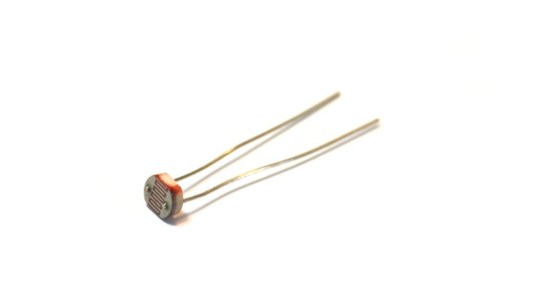

<!--- Copyright (c) 2013 Gordon Williams, Pur3 Ltd. See the file LICENSE for copying permission. -->
Light Dependent Resistor
=====================

<span style="color:red">:warning: **Please view the correctly rendered version of this page at https://www.espruino.com/LDR. Links, lists, videos, search, and other features will not work correctly when viewed on GitHub** :warning:</span>

* KEYWORDS: LDR,Light,Light Dependent Resistor,Photoresistor,Light,Sensor,GL5537

[Datasheet](/datasheets/GL5537.pdf)



An LDR is a resistor that varies resistance with the amount of light shining on it. The GL5537 changes resistance from 25k in darkness to around 200 Ohms when lots of light shines on it.

Connect as follows:

| 10k Resistor | Sensor  | Espruino   |
| ------- | ------- | ------- |
|         | 1st pin | 3.3v    |
| 1st Pin | 2nd pin | A1      |
| 2nd Pin |         | GND     |

**Note:** any Analog pin will do.

You can then easily read the analog value. Because of the way the sensor is wired, the value you'll get will be near 0.5 in darkness, and 1 when there is a lot of light.

```
var light = analogRead(A1);
console.log(light);
```

Using 
-----

* APPEND_USES: LDR

Buying
-----

* [eBay](http://www.ebay.com/sch/i.html?_nkw=GL5537)
