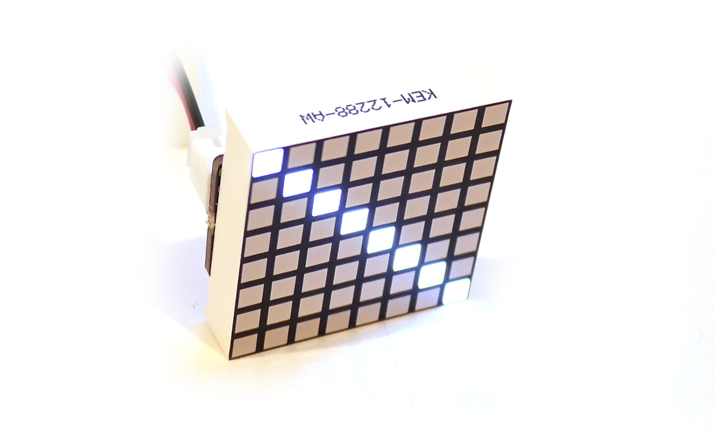
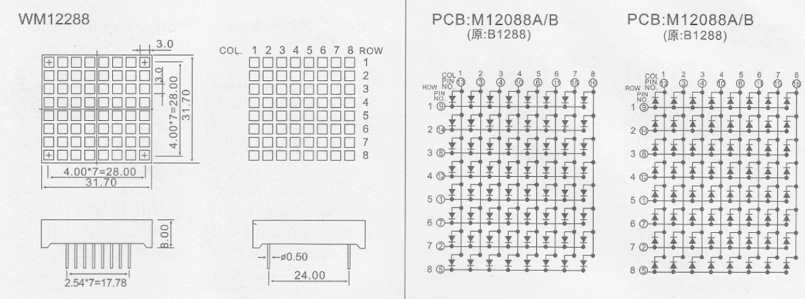

<!--- Copyright (c) 2019 Gordon Williams, Pur3 Ltd. See the file LICENSE for copying permission. -->
LED Matrices
==============

<span style="color:red">:warning: **Please view the correctly rendered version of this page at https://www.espruino.com/LED+Matrix. Links, lists, videos, search, and other features will not work correctly when viewed on GitHub** :warning:</span>

* KEYWORDS: 8x8,LED,Matrix,LED Matrix



8x8 LED matrices are modules with 64 LEDs arranged in an 8x8 grid. Rows and
columns are connected together such that the whole matrix can be controlled
with 16 pins (although the matrix has to be 'scanned').

Wiring
------

You just need to connect every pin to a free IO pin on an Espruino board.
It is good practice to connect current limiting resistors to either every
row or every column, but because we are scanning the matrix each LED will
only be on for a short period of time so it will not cause any major problems
if you don't.

While most LED matrices seem to have the same pin connections, they are
extremely non-obvious and even finding Pin 1 can be a bit of a nightmare,
and sometimes isn't even marked on the datasheet - for example:



To work around this, upload this script to your Espruino board, with
the pin names you've used filled in at the top:

```
// List all of your pins here - in any order.
// For an 8x8 matrix there should be 16 pins
var PINS = [D3,D31,D30,D29,D28,D27,D26,D25,
            D22,D20,D19,D18,D17,D16,D15,D14];


function startTest() {
  var T = eval(process.env.CONSOLE);
  LoopbackA.setConsole();

  function ask(callback) {
    T.println("("+n+"/"+PINS.length+") Is a line of pixels lit?");
    T.println("1..8 or any other key for no light");
    T.on('data',function(d) {
      T.removeAllListeners('data');
      callback(d);
    });
  }
  function done() {
    T.setConsole();
  }

  var n = 0;
  var ANODES = [];
  var CATHODES = [];

  function doTest1() {
    if (n>=PINS.length) { n=0; return doTest2(); }
    digitalWrite(PINS,~(1<<n));
    ask(function(d) {
      d = parseInt(d,10);
      if (d) CATHODES[d-1]=PINS[(PINS.length-1)-n];
      n++;
      doTest1();
    });
  }

  function doTest2() {
    if (n>=PINS.length) {
      T.println("Complete!");
      T.println("const ANODES = "+JSON.stringify(ANODES.reverse())+";");
      T.println("const CATHODES = "+JSON.stringify(CATHODES.reverse())+";");
      done();
      return;
    }
    digitalWrite(PINS,(1<<n));
    ask(function(d) {
      d = parseInt(d,10);
      if (d) ANODES[d-1]=PINS[(PINS.length-1)-n];
      n++;
      doTest2();
    });
  }

  doTest1();
}
```

Once uploaded, type `startTest()` on the left-hand side of the IDE.

The board will ask you a 32 questions of the form:

```
(0/16) Is a line of pixels lit?
1..8 or any other key for no light
```

Reply by pressing a single key. If the screen is dark, press `Space` (or any
  non-numeric key). If a row or column lights up, press a number 1 to 8 for the
  number of that column, starting from the top left.

Once complete, Espruino will output something like:

```
Complete!
const ANODES = [ D28, D19, D18, D31, D16, D30, D26, D25 ];
const CATHODES = [ D3, D27, D14, D29, D22, D15, D20, D17 ];
```

The two arrays are the arrays that Espruino has determined are the anodes (postive connections)
and cathodes (negative connections) of the LED display.

Software
--------

Now you have the list of pins, you can write some JS code to scan out the display:

```
const ANODES = [ D28, D19, D18, D31, D16, D30, D26, D25 ];
const CATHODES = [ D3, D27, D14, D29, D22, D15, D20, D17 ];
var g = Graphics.createArrayBuffer(8,8,1);
g.drawString("Hi");

// Start scanning out the LED display
function startScanning() {
  var b = new Uint8Array(g.buffer);
  // Pre-bind digitalWrites to make things faster
  var a = digitalWrite.bind(undefined,ANODES);
  var c = digitalWrite.bind(undefined,CATHODES.concat(ANODES));
  return setInterval(function() {
    b.map((d,i)=>{c(65280^(256<<i));a(d);});c(65280);
  },10); // 100 Hz
}
```

When called, this will create an Interval that scans the display out 100
times a second. Any changes to the 8x8 graphics buffer stored in `g` will
be updated immediately, and you can stop scanning by clearing the interval:

```
var scanInterval = startScanning(); // start
...
clearInterval(scanInterval); // stop
```

Scanning wakes Espruino up 100 times a second, which will increase
the power usage significantly compared to when it is idle.

**NOTE:** When you run JavaScript functions that take a while to execute
they will interfere with the scanning of the display, causing it to go dark
momentarily.

An interrupt-based display scanning library may be built into Espruino to
fix this in the future, but it isn't available yet.


Buying
------

You can get these displays from many places:

* [eBay](http://www.ebay.com/sch/i.html?_nkw=8x8+led+%28cathode%2Canode%29)
* [Pimoroni](https://shop.pimoroni.com/products/1-2-8x8-square-led-matrix)

However ensure that you are getting a single color matrix without a driver PCB.
It should have 16 pins on the back of it.

Displays also come in 2 colors, RGB, with [MAX7219](/MAX7219) drivers or as
a PCB of neopixels [Neopixel](/W2811) - while these won't work
with the code given here they can be made to work using the links above.
