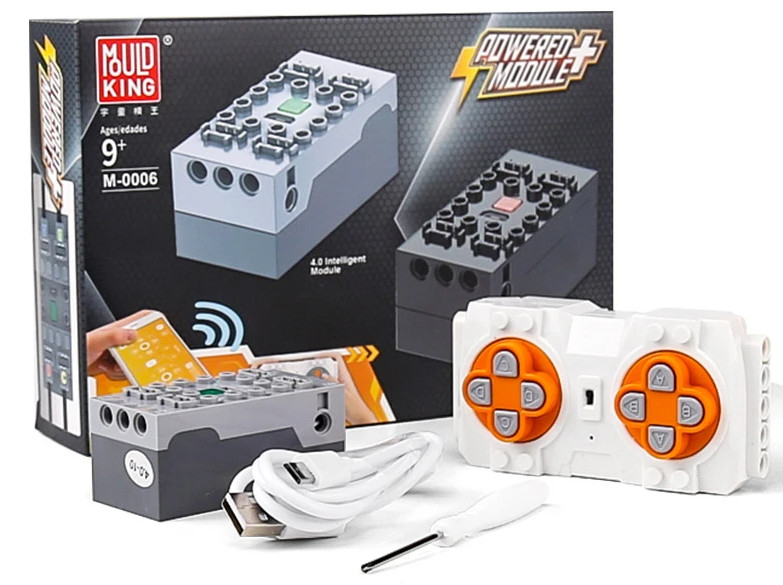

<!--- Copyright (c) 2023 Gordon Williams. See the file LICENSE for copying permission. -->
LEGO Power Functions Clone Remote Control (Mould King M-0006 / Kaiyu / Bandra / AKOGD / MayD / etc)
=====================================================================

<span style="color:red">:warning: **Please view the correctly rendered version of this page at https://www.espruino.com/LEGO+Power+Functions+Clone. Links, lists, videos, search, and other features will not work correctly when viewed on GitHub** :warning:</span>

* KEYWORDS: Module,Bluetooth,LEGO,Power Functions,Lego Power Functions,Mould King,MouldKing,M-0006,M0006,Kaiyu,Bandra,AKOGD,MayD
* USES: BLE,Only BLE



[LEGO]](https://www.lego.com) Power Functions (eg [LEGO set 8293](https://www.lego.com/en-gb/product/power-functions-motor-set-8293)) is
a now-retired LEGO motor and light system.

However, the connectors and motor design appear to have been picked up and used
by a variety of other manufacturers to add motor functionality to lego-ish kits.
They're known by various names, but the exact model that has been tested is the Mould King M-0006.

The Mould King M-0006 is a 4 output, LiPo rechargeable control box that can be controlled
by a remote control but also by bluetooth from a phone app. The remote control
is only on/off but the box itself can output differing speeds.

It will control official LEGO motors, but also clone Power Functions motors
as well.

The remote control works by listening for Bluetooth LE Advertising packets
which are crafted in a particularly strange way. We've reverse engineered
the code into a library here which you can use.


How to use
-----------

You just use the [[mouldking.js]] module on any Bluetooth LE capable
[Espruino device](/Order). First you must call `.start()` - this
advertises what appears to be a 'pairing' packet.

After a second or so the remote control will notice your device, and you can
then call `.set({})`. In the argument, you can specify the 4 outputs `a/b/c/d`
each of which can have a value from -7 (full reverse) to 0 (off) to 7 (full forward).

Leaving a value out will set it to 0.

```
var lego = require("mouldking");
lego.start();
// You must leave one second after 'start' to allow the remote to be paired

setTimeout(function() {
  lego.set({a:1 }); // motor a = slow
  setTimeout(function() {
    lego.set({c:7}); // motor c = fast
    setTimeout(function() {
      lego.set(); // all off
    }, 1000);
  }, 1000);
}, 1000);
```

Reference
---------

* APPEND_JSDOC: mouldking.js

Buying
-------

These appear to be available from a variety of places, but be careful as there
seem to be a variety of different options.

* [mouldking.co.uk](https://www.mouldking.co.uk/collection/products/technic/mould-king-m-0006-motorized-car-parts-the-app-remote-controller-4-0-intelligent-module-motor-model-building-blocks-bricks-battery-box/)
* [mouldking.store](https://mouldking.store/themes/mould-king-m-0006/)
* [Amazon](https://www.amazon.com/s?k=power+functions+bluetooth) - search for 'Power Functions Bluetooth'
* [eBay](http://www.ebay.com/sch/i.html?_nkw=power+functions+bluetooth) - search for 'Power Functions'

Notes
------

While right now this library handles the control box, a combined motor+control box is available
which is included in kits such as [KAIYU 561PCS 4WD City Remote Control Rotating Drift Racing Car](https://www.aliexpress.com/item/1005001659998952.html).

It would appear that this uses the same control code but with different magic
numbers in `commandData` and a different BLE UUID. It may be possible to use this same module to make those
work, once the correct numbers are found.

For instance you can scan for Mould King packets from the app with UUID `65280` / `0xFF00`:

```
NRF.setScan(d => print(new Uint8Array(d.manufacturerData).join(",")), {filters : [{ manufacturerData:{65280:{}} }] });
```

But for Kaiyu you need to use UUID `49664` / `0xC200`:

```
NRF.setScan(d => print(new Uint8Array(d.manufacturerData).join(",")), {filters : [{ manufacturerData:{0xC200:{}} }] });
```
