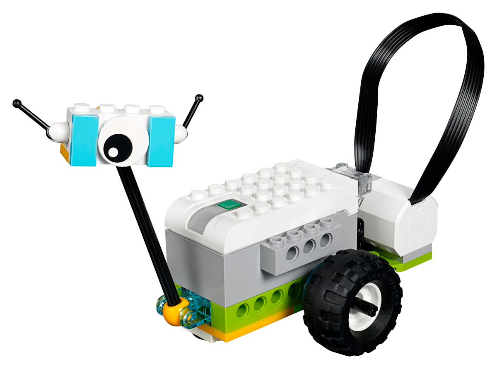

<!--- Copyright (c) 2025 Gordon Williams. See the file LICENSE for copying permission. -->
LEGO WeDo 2.0
==============

<span style="color:red">:warning: **Please view the correctly rendered version of this page at https://www.espruino.com/LEGO+WeDo+2.  Links, lists, videos, search, and other features will not work correctly when viewed on GitHub** :warning:</span>

* KEYWORDS: Module,Bluetooth,LEGO,WeDo,WeDo2,We Do
* USES: BLE,Only BLE



[LEGO](https://www.lego.com) [WeDo 2.0](https://education.lego.com/en-gb/product-resources/wedo-2/downloads/building-instructions/)) is
a simple LEGO Bluetooth robotics platform with two ports for input/output.

It no longer appears to be sold by LEGO but Chinese clones are readily available
for around £15 (including a motor and 2 sensors).


How to use
-----------

All you need is some code like this:

```JS
var wedo;
require("WeDo2").connect().then(w => {
  wedo=w;
  wedo.on("port", (port,dev) => print("Port",port,dev));
  wedo.on("sensor", (port,dev) => print("Sensor",port,dev));
  wedo.on("button", (b) => {
    print("Button",b);
    if (b) { // if button set
      wedo.setMotor1(100).then(() => { // set motor 1 max forward
        setTimeout(function() { // in 1 second
          wedo.setMotor1(0); // set motor 1 stopped
        }, 1000);
      });
    }
  });
});
```

You can also connect to more than one WeDo device if you wish to. If you want to connect
to specific devices you can use `NRF.connect` and then `require("WeDo2").attachDevice(device)` with the
connected device.


Reference
----------

The WeDo class itself contains the following:

* APPEND_JSDOC: WeDo2.js

All the methods return promises which resolve when the write is complete.

It also fires the following events:

```JS
/** emitted when the button is pressed or released */
wedo.on("button", function(pressed) { ... });

/** emitted when a port is plugged in or not (device = unknown/motor/distance/tilt) */
wedo.on("port", function(portNo, device) { ... });

/** emitted when data comes from a sensor */
wedo.on("sensor", function(portNo, value) { ... });
```


Buying
-------

These appear to be available from a variety of places, but sadly the original
LEGO version no longer seems to be made.

* [Aliexpress (clone)](https://www.aliexpress.com/item/1005008315297384.html)
* [eBay](https://www.ebay.com/sch/i.html?_nkw=lego+wedo+2.0) - search for 'LEGO WeDo 2.0'

Note
-----

Right now the tilt sensor doesn't appear to send any readings when it's connected. The distance sensor works fine though.


Related
--------

* [LEGO Power Functions Clone Remote Control](/LEGO+Power+Functions+Clone) is a module that allows your Espruino to control LEGO Power Functions clone devices
* [Jolt.js LEGO Control](/Jolt.js+LEGO) shows how to connect LEGO Power Functions directly to a Jolt.js