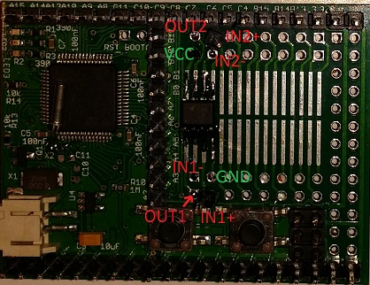
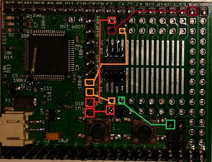

<!--- Copyright (c) 2013 Spence Konde. See the file LICENSE for copying permission. -->
LM339/393 Comparator (set watch on analog voltage)
=====================

<span style="color:red">:warning: **Please view the correctly rendered version of this page at https://www.espruino.com/LM393. Links, lists, videos, search, and other features will not work correctly when viewed on GitHub** :warning:</span>

* KEYWORDS: LM339,LM393,Comparator,Analog,Voltage,Watch

One limitation of most microcontrollers, including those used in the Espruino board, is that there is no way to set an watch/interrupt based on the analog value of a pin. Without external components, all you can do is periodically poll the pin with analogRead(). This means that the Espruino must wake periodically if in sleep mode to save power, and if the Espruino must respond within a few seconds, the polling would need to be so frequent that sleep could not be used at all. 

Luckily, there is a readily available and inexpensive solution in the form of LM393/339 dual/quad comparators. Each of the 2 or 4 comparators on these parts has a non-inverting input (+), an inverting input (-), and an output. If the non-inverting input is lower than the inverting input, the output will be pulled low. Now, if you want to trigger a callback when the voltage goes above a certain voltage, you need only connect one of the inputs to a reference voltage, and the output to a pin on the Espruino, and setWatch() on that. 

If the voltage of interest is between 0 and 3.3v, you can generate a voltage reference using the Espruino's DAC. If you need a higher voltage, you'll need to get it through other means. The LM339/393 can be used with voltages up to 30v, but when comparing higher voltages, note that at least one of the inputs must be within the "common mode voltage range", between 0V and Vcc-1.5v, in order to provide correct results. 


Connections
----------------------

The connections are simple:

| Pin  | Connect to  |
|------|-------------|
| Vcc  | BAT (not 3.3v - see above) |
| Gnd  | Gnd |
| Out  | Any IO pin (to set watch on)|
| In+  | Input, non-inverting |
| In-  | Input, inverting |



The LM393 can be soldered into the SMD prototyping area on the Espruino. 


Example
--------------------

Here, a light-dependent resistor is used as the input to both comparators on an LM393. The LDR is placed in series with a 10k resistor, and the whole thing connected between 3.3v and GND. The inputs of the comparator, as well as espruino pin A6 are connected between the LDR and 10k resistor. See the [LDR](LDR) page for more details. 

| Pin  | Connect to  |
|------|-------------|
| Vcc  | BAT |
| Gnd  | Gnd |
| Out1 | A2 |
| In+1 | LDR |
| In-1 | A4 |
| Out2 | A3 |
| In+2 | LDR |
| In-2 | A5 |
| LDR  | Both non-inverting inputs & A6 |



```
var watch1;
var watch2;
var x;
pinMode(A2,"input_pullup");
pinMode(A3,"input_pullup");

function start() {
  x = analogRead(A6);
  analogWrite(A4,Math.max(x-0.1,0));
  analogWrite(A5,Math.min(1,x+0.1));
  watch1=setWatch(function (a){clearWatch(watch2);setTimeout("onWatch(1)",1000);},A2); //clear the other watch
  watch2=setWatch(function (a){clearWatch(watch1);setTimeout("onWatch(0)",1000);},A3); //timeout allows the value to stabilize, since LDRs do not instantly respond to changes
}

function onWatch(a) {
 var s=a?"brighter":"darker";
 var n=analogRead(A6);
 console.log("Light level changed - it got "+s+". Old: "+x+"  New: "+n+". Resetting watches now");
 start();
}
```


Higher-voltage example
--------------------

Pinball machines (from 1991 and later) use a switch matrix, pulling columns low and watching rows to detect switch closures. The switch matrix works at ~12v, and due to a combination of factors, even when they are pulled "low" they are still at a few volts above ground, so a comparator is needed to read them. Here, we watch both a row and a column, connected to the same switch - if they both go low at the same time, the switch must be closed. 

We generate a reference voltage by dividing the +12v in half with a pair of 10k resistors. 


| Pin  | Connect to  |
|------|-------------|
| Vcc  | +12V |
| Gnd  | Gnd of Espruino and gnd of pinball machine |
| Out1 | A2 |
| In+1 | Reference (~6v) |
| In-1 | Switch Column |
| Out2 | A2 |
| In+2 | Reference (~6v)  |
| In-2 | Switch Row |

Here, we have both outputs tied to the same pin. That way, if either output is pulling low, the output will be 0. So, only when both row and column are lower than reference, neither output will pull low, so when it goes high, you know the switch has been pressed. 

```
pinMode(A2,'input_pullup');

setWatch(function(e) { if (e.state) {lastswitch=e.time}, A2, { repeat:true, edge:'rising' });

function getSwitchState() {
  if (getTime() - lastswitch > 0.1) {
    return 1; 
  } else {
    return 0;
  }
}
```

