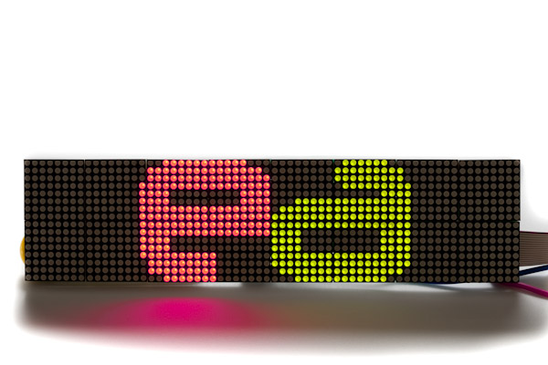

<!--- Copyright (c) 2013 Gordon Williams, Embedded Adventures, Pur3 Ltd. See the file LICENSE for copying permission. -->
LPD-6416 LED Matrix Display
========================

<span style="color:red">:warning: **Please view the correctly rendered version of this page at https://www.espruino.com/LPD6416. Links, lists, videos, search, and other features will not work correctly when viewed on GitHub** :warning:</span>

* KEYWORDS: Module,LPD6416,LED,LEDs,Display,Matrix,Light,Graphics,Graphics Driver



The LDP-6416 is a dual-LED, tri-colour 64 pixel by 16 pixel LED matrix display. Each pixel consists
 of a red and green LED (commonly referred to as `1R1G`). There are 1024 pixels and 2048 individually
 addressable LED elements. It includes shift-register circuitry such that all 2048 LEDs can be 
controlled with only 10 microcontroller I/O lines. Pixels can show as black (that is, completely
 unlit), red, green or orange (red+green).

**Note:** This display doesn't refresh itself automatically - Espruino has to scan out every line manually.
While Espruino can handle this fine, be aware that any calculations you do that take a long time will cause
the display to flicker off.

Wiring
-----

For the best information, see [Embedded Adventures' datasheet](http://www.embeddedadventures.com/datasheets/LDP-6416.pdf).

You need to connect to the **input** header on the left-hand side of the back of the display. It'll have `INPUT` written on the silk-screen next to it.

Viewed from the top, the wiring is:

| Left | | | Right |
|------|-|-|-------|
| GND | 1 | 2 | A |
| GND | 3 | 4 | B |
| GND | 5 | 6 | C |
| nEN | 7 | 8 | D |
| nR | 9 | 10 | nG |
| NC | 11 | 12 | NC | 
| GND | 13 | 14 | L | 
| GND | 15 | 16 | S | 

You must wire up VCC separately to 5V via the terminals in the middle of the display, and you just 
need to connect GND and all the signal wires except the no-connect (`NC`) ones to your Espruino. Any 
GPIO pins can be used.

Software
-------

Then, you just need to initialise the module with each pin name:

```
var g = require("LPD6416").connect({A:B15, B:B14, C:B13, D:B10,
                                    nG:B1, L:A6, S:A5, nEN:A8, nR:A7});
```

A `Graphics` instance 64x16 pixels will be returned.

Because the display needs refreshing, rather than doing it automatically we've provided a `g.scan()` 
function which you'll have to call 50 times a second or more to avoid noticeable flicker. Ideally
you would have an 'animation' loop, which calls `scan` after each frame of animation.

For instance:

```
g = require("LPD6416").connect({A:B15, B:B14, C:B13, D:B10,
                            nG:B1, L:A6, S:A5, nEN:A8, nR:A7});

function animate() {
  var t = getTime();
  g.clear();
  g.setColor(1);
  g.drawString("Hello World",32+Math.sin(t)*32,0);
  g.setColor(2);
  g.drawString("World Hello",32+Math.cos(t)*32,8);
  g.scan();
}

setInterval(animate,10);
```

**Note:** in order to get the maximum speed of updates, we haven't un-inverted the colours. This means that for `g.setColor` and `g.setBgColor`:

|   |   |
|---|---|
| `g.setColor(0)` | Orange |
| `g.setColor(1)` | Green |
| `g.setColor(2)` | Red |
| `g.setColor(3)` | Black |

Using 
-----

* APPEND_USES: LPD6416

Buying
-----

* [Embedded Adventures 4mm pitch](http://www.embeddedadventures.com/LED_matrix_display_LDP-6416.html)
* [Embedded Adventures 7.62mm pitch](http://www.embeddedadventures.com/LED_matrix_display_LDP-6416-P7.62.html)

