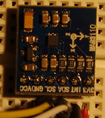

<!--- Copyright (c) 2016 Luwar. See the file LICENSE for copying permission. -->
MAG3110 3-axis magnetometer
===========================

<span style="color:red">:warning: **Please view the correctly rendered version of this page at https://www.espruino.com/MAG3110. Links, lists, videos, search, and other features will not work correctly when viewed on GitHub** :warning:</span>

* KEYWORDS: Module,I2C,Sensor,MAG3110,Compass,Magnetometer



The MAG3110 from NXP/Freescale is a small, low-power, digital 3-axis magnetometer with a wide dynamic range to allow operation in PCBs with high extraneous magnetic fields.
The MAG3110:

* Features a standard [[I2C]] serial interface.
* is capable of measuring local magnetic fields up to 10 Gauss with output data rates up to 80 Hz (12.5ms).
* Measures the components of the local magnetic field, the sum of the geomagnetic field and the magnetic field created by components on the circuit board
* Can be used in conjunction with a 3-axis accelerometer so that orientation-independent accurate compass heading information may be achieved

The sensor is build into the [BBC micro:bit](/MicroBit). 

Use the [MAG3110](/modules/MAG3110.js) ([About Modules](/Modules)) module for it.


Wiring
------

You can use any I2C port, e.g. I2C1:

| Device Pin | Espruino | 
| ---------- | -------- | - |
| GND        | GND      |   |
| VCC        | 3.3      |   |                                                 
| SDA        | B7       | Don't forget I²C pullup if not available on the breakout.   |
| SCL        | B6       | Don't forget I²C pullup if not available on the breakout.   |
| INT        | A8       | Any input pin (connection not required), see section Timing |
  
It's not required to connect INT but is useful if you want to be notified when a new measurement value is available.
A transition from 0 to 1 indicates the presence of new measurement data.


Usecases
--------

### Initialisiation

```
I2C1.setup( { scl: B6, sda: B7 } );
var mag = require('MAG3110').connect( I2C1 );
```

There exists a similar sensor with a different part number *FXMS3110CDR1* with different I2C slave address 0x0f

```
I2C1.setup( { scl: B6, sda: B7 } );
var mag = require('MAG3110').connect( I2C1, { address: 0x0f } );
```


### Operation Modes

MAG3110 supports three operation modes:

* 0 → Standby … very less power consumption; no measuring, but last measurement still readable
* 1 → Active (RAW data) … measuring and getting the raw sensor values
* 2 → Active (Offset-corrected data) … measuring and reading the raw sensor values subtracted be a previously configured offset

```JavaScript
I2C1.setup( { scl: B6, sda: B7 } );
var mag = require('MAG3110').connect( I2C1 );
console.log( mag.getMode() ); // outputs 0 = standby (default after power-up)
mag.setMode( 1 ); // bring sensor in Active/Raw-mode → sensor begins to measure
console.log( mag.getMode() ); // outputs 1 (active/raw)
```


### Reading magnetic value

```JavaScript
I2C1.setup( { scl: B6, sda: B7 } );
var mag = require('MAG3110').connect( I2C1 );

// We are in standby mode → read() will return always the same value.
console.log( mag.read() ); // outputs { "x": 0, "y": 0, "z": 0 }
console.log( mag.read() ); // outputs { "x": 0, "y": 0, "z": 0 }

// Switching to raw mode → Rotating the sensor position will result in different measurement. 
mag.setMode( 1 );
console.log( mag.read() ); // outputs { "x": -130, "y": 346, "z": 743 }
console.log( mag.read() ); // outputs { "x": -125, "y": 334, "z": 735 }

// Offset-corrected mode will return nearly the same result because didn't configured any offset.
mag.setMode( 2 ); 
console.log( mag.read() ); // outputs { "x": -123, "y": 341, "z": 730 }
```

### Using offset-corrected mode

```JavaScript
I2C1.setup( { scl: B6, sda: B7 } );
var mag = require('MAG3110').connect( I2C1 );

// Configuring offset is only possible in standby mode!
mag.setOffset( { x : -123, y: 341, z: 730 } );
mag.setMode( 2 ); // offset-corrected mode
 
console.log( mag.read() ); // outputs { "x": -2, "y": 6, "z": 3 }

// For comparison
mag.setMode( 1 ); // raw mode
console.log( mag.read() ); // outputs { "x": -125, "y": 341, "z": 735 }
```

### Measuring in standby mode

The sensor is not measuring in standby mode but you can trigger one explicit measurment cycle in standby mode.

```JavaScript
I2C1.setup( { scl: B6, sda: B7 } );
var mag = require('MAG3110').connect( I2C1 );

// We are in standby mode after POR, otherwise use setMode(0)
console.log( mag.read() );    // outputs { "x": 0, "y": 0, "z": 0 }

mag.triggerMeasurement();
console.log( mag.read() );    // outputs { "x": -123, "y": 346, "z": 726 }
console.log( mag.getMode() ); // 0 - We are still in standby mode.
```

### Customize sampling parameters
 
The sensor can work with different ADC Rate. More ADC Rate means higher power consumption but higher output rate. 
The Over Sample Ratio is the number of samples which will be averaged before a new measurement is available.

| Sampling | Output Rate | Over Sample Ratio | Current  |
|---------:|------------:|------------------:|---------:|
|        0 |    80.00 Hz |                16 | 900.0 µA |
|        1 |    40.00 Hz |                32 | 900.0 µA |
|        2 |    20.00 Hz |                64 | 900.0 µA |
|        3 |    10.00 Hz |               128 | 900.0 µA |
|        4 |    40.00 Hz |                16 | 550.0 µA |
|        5 |    20.00 Hz |                32 | 550.0 µA |
|        6 |    10.00 Hz |                64 | 550.0 µA |
|        7 |     5.00 Hz |               128 | 550.0 µA |
|        8 |    20.00 Hz |                16 | 275.0 µA |
|        9 |    10.00 Hz |                32 | 275.0 µA |
|       10 |     5.00 Hz |                64 | 275.0 µA |
|       11 |     2.50 Hz |               128 | 275.0 µA |
|       12 |    10.00 Hz |                16 | 137.5 µA |
|       13 |     5.00 Hz |                32 | 137.5 µA |
|       14 |     2.50 Hz |                64 | 137.5 µA |
|       15 |     1.25 Hz |               128 | 137.5 µA |
|       16 |     5.00 Hz |                16 |  68.8 µA |
|       17 |     2.50 Hz |                32 |  68.8 µA |
|       18 |     1.25 Hz |                64 |  68.8 µA |
|       19 |     0.63 Hz |               128 |  68.8 µA |
|       20 |     2.50 Hz |                16 |  34.4 µA |
|       21 |     1.25 Hz |                32 |  34.4 µA |
|       22 |     0.63 Hz |                64 |  34.4 µA |
|       23 |     0.31 Hz |               128 |  34.4 µA |
|       24 |     1.25 Hz |                16 |  17.2 µA |
|       25 |     0.63 Hz |                32 |  17.2 µA |
|       26 |     0.31 Hz |                64 |  17.2 µA |
|       27 |     0.16 Hz |               128 |  17.2 µA |
|       28 |     0.63 Hz |                16 |   8.6 µA |
|       29 |     0.31 Hz |                32 |   8.6 µA |
|       30 |     0.16 Hz |                64 |   8.6 µA |
|       31 |     0.08 Hz |               128 |   8.6 µA |


```JavaScript
I2C1.setup( { scl: B6, sda: B7 } );
var mag = require('MAG3110').connect( I2C1 );

// Default is sample = 0
console.log( mag.getSamplingParams() ); // → 0

mag.setSamplingParams( 11 ); // 4 Measurements per second
console.log( mag.getSamplingParams() ); // → 11

mag.read(); // Over Sample Ratio = 128 → Results are smoother.
```


### Timing

It's alway possible to read the last measured data but sometimes you want to know whether
new data is available or not.

```JavaScript
I2C1.setup( { scl: B6, sda: B7 } );
var mag = require('MAG3110').connect( I2C1 );

mag.setMode( 0 ); // standby mode
mag.setSamplingParams( 31 ); // low power consumption (8.6µA) but 12 seconds (0.08 Hz) per measurement 

console.log( mag.isNewDataAvailable() ); // → false
mag.setMode(1); // raw mode + start measuring
var start = getTime();
setInterval( function() {
    if (mag.isNewDataAvailable()) {
        mag.read(); // reading the measurement will reset the "new data available" flag
        console.log( "New data available after " + (getTime()-start).toFixed(1) + " seconds" );
    }
}, 300 );
```

This program snippet will output:

```
New data available after 1.8 seconds
New data available after 13.5 seconds
New data available after 25.2 seconds
New data available after 36.9 seconds
New data available after 48.6 seconds
```

**Bug?** The first availability after 1.8 seconds looks like a sensor bug. Maybe NXP/Freescale can explain the behavior?

Instead of pooling you can use the INT pin to detect new data. Assuming INT is connected with A8 the same program looks like:

```JavaScript
I2C1.setup( { scl: B6, sda: B7 } );
var mag = require('MAG3110').connect( I2C1 );

mag.setMode( 0 ); // standby mode
mag.setSamplingParams( 31 ); // low power consumption (8.6µA) but 12 seconds (0.08 Hz) per measurement 

console.log( mag.isNewDataAvailable() ); // → false
mag.setMode(1); // raw mode + start measuring
var start = getTime();

setWatch( function() {
    mag.read(); // reading the measurement will reset the "new data available" flag
    console.log( "New data available after " + (getTime()-start).toFixed(1) + " seconds" );
}, A8, { repeat: true, edge: 'rising' } ); 
```

A transition from 0 to 1 on INT indicates the presence of new measurement data.

### Magnetic Reset

A magnetic reset is required after exposure to an excessive magnetic field which exceeds the
Full Scale Range of +/-1000µT, e.g. near a speaker magnet. There are two possibilities:
manual magnetic sensor reset (One-Shot) or automatic magnetic reset before each data acquisition.

```JavaScript
I2C1.setup( { scl: B6, sda: B7 } );
var mag = require('MAG3110').connect( I2C1 );
mag.magneticReset(); // one manual magnetic reset after por
```

Another option is to enable automatic magentic sensor reset:

```JavaScript
I2C1.setup( { scl: B6, sda: B7 } );
var mag = require('MAG3110').connect( I2C1 );
mag.setAutomaticMagneticReset( true );
```
 
 
### Measuring Temperature

It's possible to measure the dia temperature of the MAG3110. This is used internally for removing temperature dependency. The sensitivity of the temperature is 1°C/LSB but the offset is not factory trimmed, e.g. my sensor say -7°C while 21°C in reality.

```JavaScript
I2C1.setup( { scl: B6, sda: B7 } );
var mag = require('MAG3110').connect( I2C1 );
mag.setMode( 1 ); // Measuring only works in the active modes - also for temperature 

console.log( "Temperature = " + mag.readTemperature() + " °C" ); // → -7 °C
```


Buying
------
* [SparkFun Triple Axis Magnetometer Breakout - MAG3110](https://www.sparkfun.com/products/12670)
* .. or from [EBay](http://www.ebay.com/sch/i.html?_nkw=mag3110+breakout)


Links
-----
* [Datasheet](http://www.nxp.com/files/sensors/doc/data_sheet/MAG3110.pdf)


Alternatives
------------
* [HMC5883](/HMC5883) 
* [MMC212xMG](MMC212xMG) but it has only two axis and a low resolution.


Reference
---------

* APPEND_JSDOC: MAG3110.js