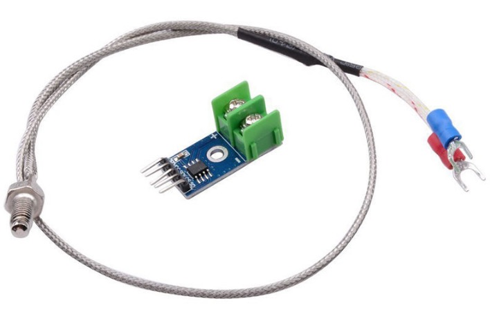

<!--- Copyright (c) 2018 Espruino, based on MAX31855. See the file LICENSE for copying permission. -->
MAX6675 Thermocouple Controller
========================

<span style="color:red">:warning: **Please view the correctly rendered version of this page at https://www.espruino.com/MAX6675. Links, lists, videos, search, and other features will not work correctly when viewed on GitHub** :warning:</span>

* KEYWORDS: Module,Thermocouple K-Type,Temperature,Sensor



Overview
------------------

This module interfaces to a MAX6675-series thermocouple controller and is the previous model of MAX31855.

* Works with any K type thermocouple
* 0 to 1024 degree C output in 0.25 degree increments
* 3.3 to 5v power supply and logic levels


Wiring
-------------------

| Pin     | Connect to |  Example |
|----------|-------------|---------|
| 1   | GND          |     GND |
| 2  | Thermocouple -  | Thermocouple |
| 3  | Thermocouple +  | Thermocouple |
| 4 | 3.3v         | 3.3v |
| 5 | SPI SCK     | B3 |
| 6 | CS (Any GPIO) | C0| 
| 7 | SPI MISO         | B4|

Note : Add a 0,01 uF tental capacitor parallel to the thermocoule as noice filter.

Usage
-------------------

Usage is very simple. Using the example pins shown above:

```JavaScript 
MISO = B4; SCK = B3; CS = C0;    // Espruino 
//MISO = A6; SCK = A5; CS = A7;    // PICO or Espruino WiFi
//MISO = NodeMCU.D6; SCK = NodeMCU.D5; CS = NodeMCU.D7; // NodeMCU
//MISO = D12 ;SCK = D14; CS = D13; // ESP8266 >= ESP12

SPI1.setup({ miso:MISO, sck:SCK, baud:1000000 });  
var max=require("MAX6675").connect(SPI1,CS);
setInterval(function(){console.log(max.getTemp());},2000);
```

`getTemp()` returns an object with either property `temp`, the temperature in C, or `fault` containing an error code, and for common errors, `faultstring` which contains a short discription of the error condition.


Buying
-----


* [eBay](https://www.ebay.com/sch/i.html?_nkw=MAX6675)

