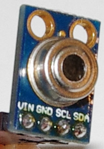

<!--- Copyright (c) 2016 Luwar. See the file LICENSE for copying permission. -->
MLX90614 Infra Red thermometer
==============================

<span style="color:red">:warning: **Please view the correctly rendered version of this page at https://www.espruino.com/MLX90614. Links, lists, videos, search, and other features will not work correctly when viewed on GitHub** :warning:</span>

* KEYWORDS: Module,I2C,Sensor,temperature,infrared

The MLX90614 is an calibrated Infra Red thermometer for non contact temperature measurements. The sensor can be configured output to I2C or PWM. This module only supports an I2C (10kHz - 100kHz) connection. 



Wiring
------

| Device Pin | Espruino | Note                                              |
| ---------- | -------- | ------------------------------------------------- |
| GND / -    | GND      |                                                   |
| PWR        | 3.3      | Available in 3V (2.6 to 3.6V) or 5V (4.5 to 5.5V) |
| SCL        | B10      | or any other SCL pin                              |
| SDA        | B3       | or any other to SCL corresponding SDA pin         | 

Don't forget the I2C pullups. The common GY-906 breakout does not have pullups on the board. 

Usecases
--------

### Initialisiation

The maximum I2C bitrate is 100 kHz and the minimum is 10 kHz.

```JavaScript
I2C2.setup( { scl: B10, sda: B3 } );
var mlx = require('MLX90614').connect( I2C2 );
```

The sensor does not work with I2C1 on an Espruino Pico, (http://forum.espruino.com/conversations/280634/). Any help is welcome. I2C2 and I2C3 work without a problem. I2C1 works with an original Espruino board.


### Read Ambient (chip) temperature and object (IR) temperatures

```JavaScript
I2C2.setup( { scl: B10, sda: B3 } );
var mlx = require('MLX90614').connect( I2C2 );

console.log( "Chip = " + mlx.readAmbientTemperature() + "°C" );
console.log( "IR   = " + mlx.readObject1Temperature() + "°C" );
```


### Power Supply Voltage Compensation

The measured temperature is dependent from the power supply voltage (0.6°/Volt). If you have a voltage other than 3.3V you can compansate this dependency:

```JavaScript
I2C2.setup( { scl: B10, sda: B3 } );
var mlx = require('HTU21D').connect( I2C2 );
mlx.voltage = 3.0;
// ...

```

Many breakout boards have a voltage regulator to 3.3v and use the 3V-version of the MLX90614. Don't change mlx.voltage even if the power supply of the breakout is higher e.g. 5V. 


### Configure object emissivity

As a standard, the MLX90614 is calibrated for an object emissivity of 1 (black body). If you want to measure the temperature of objects with other emissivity you have to configure the sensor with their emissivity first. Otherwise you will not get the right temperature:

```JavaScript
I2C2.setup( { scl: B10, sda: B3 } );
var mlx = require('HTU21D').connect( I2C2 );
mlx.setEmissivity( 0.8 ); // Emissivity of snow → 0.8, Aluminium → 0.18, plastics → 0.84 … 0.95
```

The emissivity will be stored in EEPROM cells. It's not necessary to set the emissivity after every POR but it's not dangerous: Only a changed value will be stored.


### Enter Sleep Mode

The MLX90614 can enter in Sleep Mode (typ. 2.5µA). The mode is not available for the 5V supply version.

```JavaScript
I2C2.setup( { scl: B10, sda: B3 } );
var mlx = require('HTU21D').connect( I2C2 );

mlx.enterSleepMode();
```

There are two ways to put MLX90614 into power-up default mode:

* POR
* By Wake up request → SCL pin high and then SDA pin low for at least 33ms.

After wake up the first data is available after 0.25 seconds (typ).


Links
-----
* Datasheet https://www.adafruit.com/datasheets/MLX90614.pdf


Buying
------
* Adafruit https://www.adafruit.com/products/1747
* Ebay http://www.ebay.com/sch/i.html?_nkw=MLX90614


References
----------

* APPEND_JSDOC: MLX90614.js


ToDos
-----

The following features are currently not supported:

* Work with I2C1 on a pico
* Wakeup from Sleep mode
* Configure FIR and IIR parameter
* Read chip id
