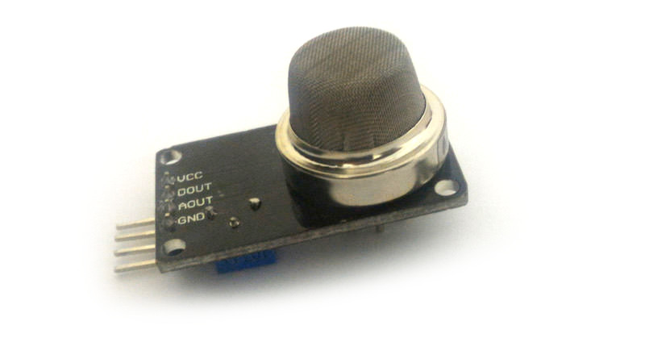

<!--- Copyright (c) 2015 Nic Marcondes -->
MQ135 Air Quality Sensor
=====================

<span style="color:red">:warning: **Please view the correctly rendered version of this page at https://www.espruino.com/MQ135. Links, lists, videos, search, and other features will not work correctly when viewed on GitHub** :warning:</span>

* KEYWORDS: Module,MQ135,air quality,CO2,NH3,NOx,alcohol,smoke




Overview
-----------------

This module interfaces with the MQ135, They are used in air quality control equipments for buildings/offices, are suitable for detecting
 of NH3,NOx, alcohol, Benzene, smoke, CO2, etc. Support is included in the [[MQ135.js]] module.

### Key Specifications:

  |                       |          |
  |-----------------------|----------|
  | Voltage               | 5V       |
  | Consumption           | < 800mW  |
  | Preheat time          | over 24h |

Note that the "warning-up" time of this class of Sensor is over 24 hours to get trusted data.

Wiring
-----------------

  | Device Pin | Espruino |
  |------------|----------|
  | 1 (Vcc)    | VBat (5V)|
  | 2 (DOUT)   | N/C      |
  | 3 (AOUT)   | A7*      |
  | 4 (GND)    | GND      |

*You can use any GPIO with ADC support. [See in board pin references](http://www.espruino.com/Reference)


Usage
-----------------

call `require("MQ135").connect(pin)` to get a MQ135 object. Take use of this object call getPPM method

For example:

```JavaScript
  var mq = require("MQ135").connect(A7);
  console.log(mq.getPPM());
```

You can also use the ambient temperature/humidity correction factor:

For example:

```JavaScript
  var mq = require("MQ135").connect(A7);
  var temperature = 25;
  var humidity = 80;
  console.log(mq.getCorrectedPPM(temperature, humidity));
```

Its recommended to get this ambient data to get more precise PPM value.
You can use [DHT11](http://espruino.com/DHT11) Espruino Module for this propose.


Buying
-----

MQ135 parts and modules can be purchased from many places:
* [eBay](http://www.ebay.com/sch/i.html?_nkw=MQ135&_sacat=92074)


Reference
---------
* [Technical Data](https://www.olimex.com/Products/Components/Sensors/SNS-MQ135/resources/SNS-MQ135.pdf)
