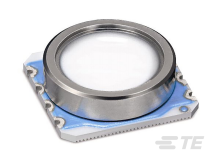

<!--- Copyright (c) 2018 Gordon Williams, Pur3 Ltd. See the file LICENSE for copying permission. -->
MS5803 Pressure Sensor
=====================

<span style="color:red">:warning: **Please view the correctly rendered version of this page at https://www.espruino.com/MS5803. Links, lists, videos, search, and other features will not work correctly when viewed on GitHub** :warning:</span>

* KEYWORDS: Module,I2C,MS5803,pressure,temperature,altitude,sensor



The MS5803 is a new generation of high resolution
pressure sensors from TE Connectivity with [[SPI]] and [[I2C]] bus
interface. The sensor module includes a high linearity
pressure sensor and an ultra-low power 24 bit ADC with
internal factory calibrated coefficients.

The module [[MS5803.js]] for interfacing with this sensor
will only connect via the [[I2C]] interface.


Usage
------

```
var sensor = require("MS5803").connectI2C( I2C1 );
sensor.reset().then(() => {
  sensor.begin();
  sensor.read(sensor.PRECISION.ADC_512).then((result) => {
    console.log("Temperature: " + result.temperature + " °C");
    console.log("Pressure: " + result.pressure.toFixed(2) + " mBar");
  });
});
```

Available precision values: `ADC_256`, `ADC_512`, `ADC_1024`, `ADC_2048`, `ADC_4096`


Buying
-------

Modules are available with the MS5803 pre-soldered. The MS5803 also
comes in different part numbers designed for different pressure
ranges.

* [eBay](http://www.ebay.com/sch/i.html?_nkw=MS5803)
* [Sparkfun](https://www.sparkfun.com/products/12909)
