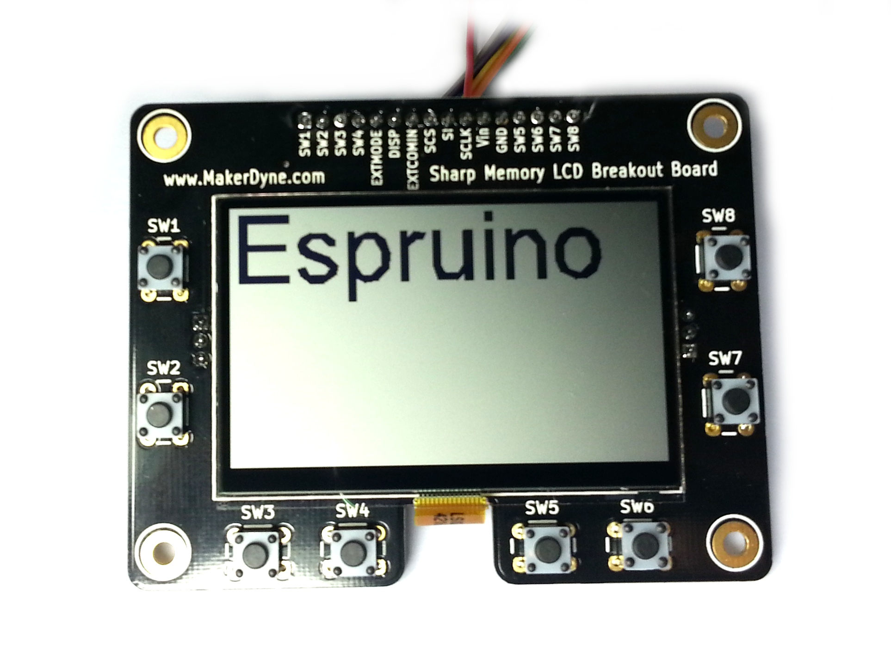

<!--- Copyright (c) 2013 Gordon Williams, Pur3 Ltd. See the file LICENSE for copying permission. -->
Sharp Memory LCD
================

<span style="color:red">:warning: **Please view the correctly rendered version of this page at https://www.espruino.com/MemoryLCD. Links, lists, videos, search, and other features will not work correctly when viewed on GitHub** :warning:</span>

* KEYWORDS: Module,SPI,Graphics,Graphics Driver,LCD,Monochrome,LS013B7DH03,LS027B7DH01,Memory LCD,PNLC,HR-TFT



[Sharp Memory LCDs](http://www.sharpmemorylcd.com/aboutmemorylcd.html) are high pixel density, low power displays that don't need backlights. They draw in the region of 100uA while idle, so are perfect for always-on, battery-powered applications.

Wiring Up
--------

| Display | Espruino | Function |
|---------|----------|----------|
| GND     | GND      | GND      |
| Vin     | 3.3      | Power In  (Supposedly the 2.7" LCD needs 5v, but it appears to work off 3.3v) |
| SCLK    | B3       | SPI SCK  |
| SI      | B5       | SPI MOSI |
| SCS     | B4       | Chip Select (active high) |
| EXTCOMIN | B6     | VCOM (refresh) |
| DISP    | 3.3     | Display Enable (active high) |
| EXTMODE | 3.3     | On the breakout boards this is normally not connected to anything, and instead a jumper on the board should be set to 'H' |

Example Software
--------------

Just use the [[MemoryLCD.js]] module as follows:

```
SPI1.setup({ sck:B3, mosi:B5, order: "lsb", baud: 4000000 });

var g = require("MemoryLCD").connect(SPI1, B4/*SCS*/, B6/*EXTCOMIN*/, 128/*width*/, 128/*height*/, function() {
  g.clear();
  g.drawString("Hello",0,0);
  g.drawLine(0,10,g.getWidth(),10);
  g.drawString(getTime(), 0, 20);
  g.flip();
});
```

More details on how to draw are in [[Graphics]].

Notes
-----

* SPI must be set up with `order : 'lsb'` (the default is 'msb'), and the baud rate shouldn't be above 4000000
* Make sure you specify the correct width and height (either 96x96, 128x128, or 400x240 )
* Espruino toggles the VCOM pin (if specified) every 5 seconds. Sharp recommend 1 second but the longer time period allows Espruino to enter Deep Sleep and save a lot of power.

Buying
-----

The LCDs come with a ~0.5mm ribbon on them so they're hard to connect to directly and you'll probably need a breakout board. 

Sellers of LCDs on breakout boards are:

* [MakerDyne 1.3" and 2.7"](http://www.makerdyne.com/blog/shop/)
* [AdaFruit 1.3"](https://www.adafruit.com/products/1393)
